# Intelligent Data Analysis & Machine Learning

## 목차

- [Intelligent Data Analysis \& Machine Learning](#intelligent-data-analysis--machine-learning)
  - [목차](#목차)
  - [Supervised Learning](#supervised-learning)
    - [Classification](#classification)
    - [Regression](#regression)
    - [Ordinal Regression](#ordinal-regression)
    - [Metric Learning](#metric-learning)
    - [Taxonomy Classification](#taxonomy-classification)
    - [Rankings](#rankings)
    - [Recommendations](#recommendations)
    - [Taxonomy of Learning Problems: Supervised](#taxonomy-of-learning-problems-supervised)
  - [Unsupervised Learning](#unsupervised-learning)
    - [Taxonomy of Learning Problems: Unsupervised](#taxonomy-of-learning-problems-unsupervised)
  - [Reinforcement Learning](#reinforcement-learning)
    - [Learning to Control a System](#learning-to-control-a-system)
    - [Example: Advertisement placement](#example-advertisement-placement)
    - [Taxonomy of Learning Problems: Reinforcement](#taxonomy-of-learning-problems-reinforcement)
  - [Model or Parameter Space](#model-or-parameter-space)
    - [Loss Function](#loss-function)
    - [Uncertainty](#uncertainty)
    - [Regularizer](#regularizer)
    - [Optimization](#optimization)
      - [Criterion](#criterion)
      - [Problem](#problem)
      - [Regularized Empirical Risk Minimization](#regularized-empirical-risk-minimization)
    - [Evaluation of Models](#evaluation-of-models)
  - [Problem Analysis](#problem-analysis)
    - [Understanding Requirements](#understanding-requirements)
    - [Taxonomy of Learning Problems](#taxonomy-of-learning-problems)
    - [Data](#data)
      - [Data Availability](#data-availability)
      - [Data Properties](#data-properties)
      - [Data Dependencies](#data-dependencies)
    - [Example!](#example)
      - [Campaing Discovery](#campaing-discovery)
      - [Creating a regular expression for each campaign](#creating-a-regular-expression-for-each-campaign)
      - [Evaluation and Testing](#evaluation-and-testing)
  - [Data Preprocessing](#data-preprocessing)
    - [Data Integration](#data-integration)
    - [Feature Representation](#feature-representation)
    - [Attribute with Missing Values](#attribute-with-missing-values)
    - [Attribute with Erroreous Values](#attribute-with-erroreous-values)
    - [Feature Selection](#feature-selection)
  - [Decision Trees](#decision-trees)
    - [Decision Trees - Classification](#decision-trees---classification)
    - [Decision Trees - Regression](#decision-trees---regression)
    - [Decision Trees](#decision-trees-1)
    - [Small Decision Trees](#small-decision-trees)
  - [ID3](#id3)
    - [Information](#information)
    - [Entropy](#entropy)
      - [Entropy of Class Labels in Training Data](#entropy-of-class-labels-in-training-data)
      - [Conditional Entropy](#conditional-entropy)
    - [Information Gain of an Attribute](#information-gain-of-an-attribute)
      - [Information Gain Ratio](#information-gain-ratio)
    - [ID3 Algorithm](#id3-algorithm)
  - [Continuous Attributes - C4.5](#continuous-attributes---c45)
  - [Pruning](#pruning)


## Supervised Learning

### Classification
강의 1 초반부, 채워야함
### Regression

### Ordinal Regression

### Metric Learning

Metric Learning은 간략하게, 데이터 간의 유사도를 잘 수치화하는 거리 함수(metric function)를 학습하는 것이다. 여기에 쓰일 수 있는 metric으로는 유클리디언 다스탠스가 있겠지만, 몇가지 단점 때문에 고차원에서는 사용하기 어렵다. 유클리드 거리는 클래스 간의 상관관계를 고려하지 않고 isotropic(모든 방향에서 동일) 하다.이에 우리는 차원 간 관계를 캡처하는 non-isotropic 거리를 사용할 수 있다.

미리 정의한 Distance Metric들은 데이터와 task에 대한 고려가 적기 떄문에 우리 용도에 적합하지 않다.(Mahalanobis Distance조차도 공분산을 고려한 Linear Transformation을 한 것일 뿐이다)

이러한 이유로 데이터에 적합한 거리 함수를 기계학습으로 직접 만드는 것이 Metric learning이며, 기계학습 중에서도 딥러닝을 활용하는 경우가 Deep Metric Learning이다.

Metric Learning의 목표는 데이터로부터 Metric function을 학습하는 것이다.

이를 달성하고자 보통 우리는 original feature space를 거리 계산하기 쉬운 embedding space로 mapping하는 embedding 함수 f를 학습한다. 이때 학습된 metric function은 아래에서 보이듯이 similiarity를 나타내는 s일수도 있고, distance를 나타내는 d일수도 있다.

Metric Learning은 Classification 문제에서 새로운 클래스를 식별하는 것을 목표로 하는 방법 중 하나이다. 일반적으로 Classification problem에서는 training time에 이미 정의되고 고정된 classes가 있다.    
그러나 일부 model에서는 이전에 본 적 없는 클래스를 식별할 수 있어야 한다. 예를 들어, 생체 인식에서는 모든 개인의 얼굴 이미지, 지문 스캔, 홍채 스캔을 하나의 클래스로 볼 수 있다. 새로운 개인은 그에 따라 인식되어야 한다. 이게 무슨 말이냐면, 이제 분류를 하려고 머신러닝을 시키는데, 매일 분류 대상이 바뀐다는 것이다. 이걸 해결한느 것이 metric learning이다.

또 다른 예시로는 object classification이 있다. 여기서는 새로운, 이전에 본 적이 없는 유형의 object image가 동일한 클래스에 속한다고 인식되어야 한다.

Metric learning은 **similarity metric s(z,z')**에 기반하여 데이터 인스턴스 x $\in X$를 embedding vector z로 매핑하는 방법이다. 메트릭 러닝에서 learner에서 제공되는 input은 다음과 같다:

- Training instances x with classes y.
- $T_n = \{(x_1,y_1),\dots,(x_n,y_n)\}$

이는 위의 classification에서 이미 봤던 것과 비슷하다.

그러나 output의 경우는 조금 다르다. 모델은 input instances를 embedding vector에 assign해야 한다.  함수 $f: x\mapsto z$로 표시되는 모델로써 이 모델은 입력데이터 x를 embedding vector z로 변환하는 역할을 한다.

이에 따라 learner는 다음과 같은 output을 생성해야한다. 

- 동일한 클래스 y에 속하는 모든 인스턴스 x, x'에 대해 similarity가 유지된다:
  - $s(f_{\Theta}(\mathbf{x}),f_{\Theta}(\mathbf{x'})) > \varepsilon$
  - 즉, 같은 클래스 내의 두 vector는 서로 similar properties를 가져야 한다는 것이다. 여기서 $f_{\Theta}$는 instance의 embedding이다.
  - 예를 들면, 비슷한 두 사람을 담은 두개의 사진이 있을 때, 그 둘에 대한 두 embedding vectors의 similarity는 $\varepsilon$보다, 즉 특정 값보다 커야한다는 것이다.
- 서로다른 클래스 y, y'에 속하는 인스턴스 x, x'는 서로 다른 클래스에 속한다는 것을 보장하기 위해 dissimilarity가 유지된다:
  - $s(f_{\Theta}(\mathbf{\tilde{x}}),f_{\Theta}(\mathbf{\tilde{x}'})) < \varepsilon$
  - 위에 틸드가 들어간 x는 dissimilarity를 나타내기  위해 사용된다.

Classification과 비교해서, metric learning은 장점을 가진다.

1. 일반적인 Classification은 학습한 이미지에 대해서만, 인식이 가능하다.

     - 반면, Metric Learning은 학습하지 않은 이미지도 DB로 구축만 해둔다면 인식 가능하다.

2. 일반적인 Classification은 Feature 간의 Decision Boundary를 찾도록 학습한다.(Learn separable features)

    - 반면, Metric Learning은 비유사한 Feature들을 멀리 떨어지도록 학습한다.(Learn Large-Margin features) Feature 공간을 더 잘 사용할 수 있음
### Taxonomy Classification

마찬가지로 input은 instance x $\in X$로 주어진다.

일반적인 classification처럼 discrete value $y \in Y$가 output으로 생성되지만, 여기선 일반적인 classification과는 달리, Y의 elements에 대해 트리 기반의 ordering이 주어진다. 

이러한 방식은 예측된 값과 실제 값 사이의 거리가 멀 수록 prediction이 나빠진다는 특징을 가진다. 이는 카테고리 간의 순서가 있기 때문에 발생한다. 

Parse natural languages 혹은 Protein folding의 prediction에 사용될 수 있다.

### Rankings

Ranking에서 input은 query $q$와 아이템 리스트 $I_1,\dots,I_n$으로 주어진다. output은 sorted item list이다. 

사용되는 Training data는 $q$로 쿼링 한 이후 유저가 $I_j$를 클릭한 것이다. 클릭된 아이템은 클릭되지 않은 아이템보다 높은 순위로 나열되어야 한다.  

이는 보통 검색 엔진에서 사용된다. 사용자의 피드백을 통해 아이템들을 정렬하고, 사용자가 선택한 아이템을 클릭한 후 해당 아이템의 순위를 높이는 것이 목표이다.

### Recommendations

- Input: users, items, contextual information
- Output: 사용자가 recommandation을 얼마나 좋아할지에 대한 prediction
- Training data: ratings, sales, page views 등에 대한 정보

사용자에게 관련성이 높은 아이템을 추천하여 사용자 만족도를 향상시키고, 아이템의 판매량을 증가시키는 것이 목표이다. 트레이닝 데이터는 사용자가 아이템에 대해 평가한 등급이나 실제 구매 행동 등을 기반으로 한다. 이를 통해 사용자의 취향과 관심사를 파악하고, 이에 맞춰서 개인화된 추천을 제공한다.

### Taxonomy of Learning Problems: Supervised

Supervised Learning에서는 Training data가 모델이 예측해야하는 변수의 값을 포함한다.

- **Classification**: categorial variable
- **Regression**: continuous variable
- Ordinal regression, finite, ordered set of values
- **Rankings**: ordering of elements
- **Structured prediction**: sequence, tree, graph, …
- **Recommendation**: Item-by-user matrix

## Unsupervised Learning

Unsupervised learning에서 사용되는 Training data는, supervised 에서와는 달리, input, 즉 set of instances $x \in X$ 뿐이다. 여기에는 target variable이 없다. instances만이 주어졌기 때문에 우리가 직접 데이터의 형성 과정에 대한 추가적인 assumption을 만들어야 한다. 예를 들어 무작위 변수들의 독립성이 있겠다.

이 unsupervised learning의 목표는 데이터에서 structure의 detection이다. 예를 들어, 특정 properties를 공유하는 인스턴스들의 클러스트로의 가장 가능성있는, 그러나 데이터에서 아직은 관찰되지 않은 grouping을 찾는다. 

일반적으로 군집화(clustering), 차원 축소(dimensionality reduction), 이상치 탐지(anomaly detection) 등의 작업에 사용된다.

### Taxonomy of Learning Problems: Unsupervised

Unsupervised에서는 데이터들의 structural properties를 발견하는것을 목표로 삼는다.

- Clustering
- Unsupervised feature learning: 데이터를 잘 설명할 수 있는 attributes를 찾는다.


## Reinforcement Learning

Reinforcement Learning은 시스템을 제어하고 원하는 목표를 달성하기 위해 시행착오를 통해 학습하는 방법이다. 여기서는 시스템의 현재 **statement**를 관찰하고 행동을 선택하여 시스템에 영향을 준다. 이후 시스템의 반응을 통해 얻은 보상을 기반으로 학습이 이루어진다.

강화 학습의 목표는 주어진 환경에서 최적의 정책(policy)을 학습하는 것이다. Policy는 주어진 상태에서 취해야 할 행동을 결정하는 전략을 의미한다. Reinforcement learning은 주어진 환경에서 policy를 향상시키기 위해 exploration과 exploitation 사이에서 균형을 유지한다. 

* 환경(Environment)에 대한 사전지식이 없는 상태로 학습을 진행합니다.
* 보상을 통하여 학습을 합니다.
* 컴퓨터가 선택한 행동(Action)에 대한 환경의 반응에 따라 보상이 주어집니다.
* 행동의 결과로 나타나는 것이 보상이며 이것을 통하여 학습을 진행합니다.
* 보상을 최대한 많이 얻도록 하는 행동을 유도하도록 학습을 진행합니다.

### Learning to Control a System

Reinforcement Learning은 다음과 같은 system control을 학습하는 작업을 수행한다.

- contrl parameters를 가지는 시스템이 있다고 가정한다.
- utility function은 desired system behavior를 의미한다.
- control paramters의 변화는 시간이 지나도록 영향을 미칠 수 있다.
- learner는 desired behavior를 달성하는 모델을 찾기 위해 시스템을 실험하여야 한다. 이를 Exploration이라 한다.
- 동시에 시스템은 가능한 best state를 유지하여야 한다. 이를 Exploitation이라 한다.

Exploration과 Exploitation의 균형을 유지하는 것이 중요하다. 새로운 행동을 시도하고 새로운 정보를 얻기 위해 Exploration을 하면서, 동시에 현재의 최적 상태를 유지하기 위해 Exploitation을 해야 한다. 이를 통해 시스템을 효율적으로 제어하고, 원하는 동작을 달성할 수 있다.     
예를 들어, 자율 주행 자동차의 경우, Exploration을 통해 새로운 환경에 대한 정보를 수집하고, Exploitation을 통해 안전하게 목적지에 도착할 수 있는 최적의 경로를 선택한다.

### Example: Advertisement placement

광고를 배치하는데 있어 reinforcement learning은 사용자들의 클릭을 최대화하기 위해 광고를 배치하는 최적의 전략을 학습하는 것을 의미한다. 이 예시에서, 사용자가 어떤 광고를 클릭하는지를 학습하기 위해 learner는 실험을 해야한다. 그러나 가장 인기 있는 광고 이외의 광고를 사용할 때 학습자가 실험을 하는 경우에는 판매량이 감소할 수 있다.

### Taxonomy of Learning Problems: Reinforcement

다이나믹한 시스템을 컨트롤 하는 방법을 학습한다.


## Model or Parameter Space

Model space 혹은 parameter space $\Theta$는 다음과 같은 특징을 가진다:

- Model space는 모든 가능한 모델 또는 Classifier의 집합을 의미한다.
- Classifier는 Parameter $\theta \in \Theta$를 가진다.
- $\Theta$는 learning methode에 적합한 모델(classifier)의 집합이다.
- model space는 maschine learning을 위한 자유도(degree of freedom)중 하나이고, 흔히 사용되는 많은 spaces가 있다.
- Language Bias라고도 한다.

Linear model의 예시를 보자면 다음과 같다.

$$
y_{\theta}(\mathbf{x})=
\begin{cases}
bad,& \text{if } \sum^{m}_{j=1}x_j\theta_j \geq \theta_0\\
good, & \text{otherwise}
\end{cases}
$$

머신러닝, 혹은 딥러닝은 어떻게 보면 x에서 y로의 함수관계를 찾는 문제로 볼 수 있다. 이 때 함수의 구조와 복잡도를 정하는 것이 모델링 과정이다. 모델이 정해지면 모델의 parameter가 정해지게 되는데, 딥네트워크에서는 input과 output사이에 존재하는 모든 weight들이 모델의 parameter가 된다. model parameter는 model에 종속되어 정해진다.

모델과 모델 parameter가 정해지면 이제 남은 일은 모델 파라미터의 값을 정하는 것이다. 주어진 input(x)에 대해 원하는 output(y)이 나오도록 모델 parameter 값을 조정하는 것이 목적이다. 수집된 관측값들이 (xi; yi), i = 1, 2, ..., n라면 각각의 i에 대해 최대한 yi = fw(xi)가 되도록 parameter 값을 찾게 되는데, 이 과정이 딥러닝의 학습과정 또는 parameter 추정 과정에 해당한다.

그런데, 파라미터 추정을 위해서는 먼저 파라미터의 좋고 나쁨을 판단하는 기준이 있어야 한다. 그것이 바로 **loss function**를 정하는 일이다. 앞서 과정에서 **모델과 모델 파라미터가 정해지면 일종의 파라미터 공간(parameter space)이 생성**된다. 이 공간의 **차원은 모델 파라미터의 개수와 동일**하며 아직은 차원만 정해진 빈 공간이다. 그런데, loss function가 정해지면 이 공간에 산맥이 생기고 골짜기가 생긴다. 즉, Loss 함수에 따라서 각 파라미터 값에 대한 score(or 손실)가 매겨지기 때문에 이 score에 따라서 파라미터 공간에 높고 낮음이 생성된다.

딥러닝 학습에 있어서 마지막 선택은 주어진 산맥과 골짜기의 파라미터 공간에서 어떻게 최적의 답을 찾아갈 것인가이다. 파라미터 공간이 정해지면 이미 최적의 답도 같이 정해진다. 하지만 무한한 파라미터 공간을 미리 다 evaluation 해볼 수는 없기 때문에 현실적으로는 시작 위치에서 조금씩 해를 찾아갈 수 밖에 없다. 즉, gradient descent 방법, Gauss-Newton 방법, LM 방법 등과 같은 최적화 기법(optimizer)이 필요하다.

이상의 내용을 정리해 보면 다음과 같다.

* 학습데이터: problem의 domain을 정의
* 네트워크 구조: 함수의 복잡도와 power를 정의, 모델 파라미터를 정의
* loss 함수: 파라미터에 대한 evaluation(cost)을 정의
* optimizer: 파라미터 공간에서의 탐색 방법을 정의
  
이중 어떤 요소가 더 중요할까? optimizer는 해 자체를 바꾸지는 못하지만 optimizer에 따라 해를 잘 찾을 수도 있고 못 찾을 수도 있다. 네트워크의 구조와 복잡도를 정하는 것은 비유컨데 닭 잡는데 소 잡는 칼을 쓸 것인지 아니면 소 잡는데 닭 잡는 칼을 쓸 것인지를 정하는 문제로 볼 수 있다. 물론 적당한 규격의 칼이 좋을 것이다. 학습데이터와 loss 함수는 선택된 칼의 규격 내에서 최적의 칼이 되기 위한 기준을 잡아준다.

Learning problem은 Optimization problem으로 정의될 수 있다. 이에 따라 다음과 같은 함수들이 중요하게 다뤄진다.

- **Loss function**: 우리의 모델이 observed training data에 대해 얼마나 적합한지 측정한다.
- **Regularization function**: 모델이 우리의 사전 지식에 따라 likely(적합)한지를 측정한다.
- **Optimization criterion**: training data와 regularizer의 Losses들의 합이다.

이 Optimization problem에서 우리는 이 기준을 최소화하는 모델을 찾게된다. 

### Loss Function

Loss는 영어 단어로는 상실, 손실을 의미한다. 그리고 기계학습에서의 Loss는 어떤 학습된 모델을 실제 데이터에 적용했을 때 모델의 추정 오차로 인해 발생하는 손실을 의미한다. 즉 loss function은 target variable의 실제 값이 $y_i$일 때, 모델이 값 $y_𝜃(x_i)$을 예측한다면 이 예측이 얼마나 나쁜지를 측정한다. 얼마나 나쁜지 이지만, 대충 생각해보면 그냥 모델이 실제 값을 얼마나 잘 예측하는가를 판단하는 기준이 될 수 있다는 것이다. 이를 수식으로 표현하면 다음과 같다.

$$ℓ(y_\theta(x_i),y_i)$$

예를 들어, 학습된 모델을 $f_w(·)$, 관측 데이터를 (xi; yi)라 하자. 이 때, 입력 xi에 대한 모델 추정값과 실제 관측값 사이의 오차를 residual이라 부르며 xi에 대한 residual은 ri = yi - fw(xi)로 계산된다. Residual이 단순히 모델 추정값과 참값(관측값) 사이의 차이를 말하는 반면에, **Loss는 이 차이로 인해 발생하는 실제 계산상의 손실을 의미**한다. 사실 Loss는 우리가 마음대로 정할 수 있으며 예를 들어 residual의 절대값을 Loss로 정하거나(L(xi) = ‖yi - fw(xi)‖), residual의 제곱을 Loss로 할 수도 있다(L(xi) = ‖yi - fw(xi)‖2). 이 외에도 문제나 응용에 따라서 focal loss, triplet loss 등 다양한 형태의 Loss 함수 정의가 가능하다.

암튼, 우리는 전체 트레이닝 데이터 $T_n$의 loss를 평균화하여 이를 표현할 수 있다.

$$\text{Empirical risk} = \hat{R}(\theta) = \frac{1}{n}\sum^{n}_{i=1}ℓ(y_\theta(x_i),y_i)$$

간단히, 위의 loss를 평균낸 것이 empirical risk이다.

예를 들어서, positive class(+1)와 negative class(-1)을 가지는 binary classification problem을 생각해 볼 수 있다. 이 경우 false positive와 false negative가 똑같이 동일하게 나쁘다. 이 경우, loss는 다음과 같이 표현될 수 있다.

- Zero-One Loss:
    
    $$
    ℓ_{0/1}(y_\theta(x_i),y_i)=
    \begin{cases}
    0,& \text{if } y_\theta(x_i)=y_i\\
    1, & \text{otherwise}
    \end{cases}
    $$

이번에는 false positive와 false negative의 가치가 다른, 또 다른 예시를 살펴보자. Diagnostic classification problem에서, false negative는 overlooked illness를 의미하고, false positive는 incorrectly diagnosed를 의미한다. 이 경우, 질병을 놓치는 것이 잘못 진단한 것 보다 더 안좋다. 

이런 경우, $ℓ_{C_{FP}/C_{FN}}(y_\theta(x_i),y_i)$의 Loss는 아래와 같이 cost matrix 형태로 표현될 수 있다.

|          | $y_i = +1$ | $y_i = -1$ |
|----------|--------------|--------------|
| $y_𝜃(x_i) = +1$ |      0       |     CFP      |
| $y_𝜃(x_i) = -1$ |     CFN      |      0       |


Loss function의 종류는 Problem의 종류에 따라 다르다. 즉, 우리의 Problem이 classification problem인지 regression problem인지의 형태에 따라 loss function의 종류도 나뉜다는 것이다. 이번에는, Regression problem의 Loss function을 알아보자. 

Regression Problem에 대한 Loss function은, 우리의 Target variable이 실제의 값과 가능한 가까워야 한다는 것을 고려해야 한다. 예시로는 Quadratic Error가 있다.

- Quadratic Error

    $$ℓ_2(y_\theta(x_i),y_i) = (y_\theta(x_i)-y_i)^2$$


### Uncertainty

모델을 찾는 예시를 하나 보도록 하자.

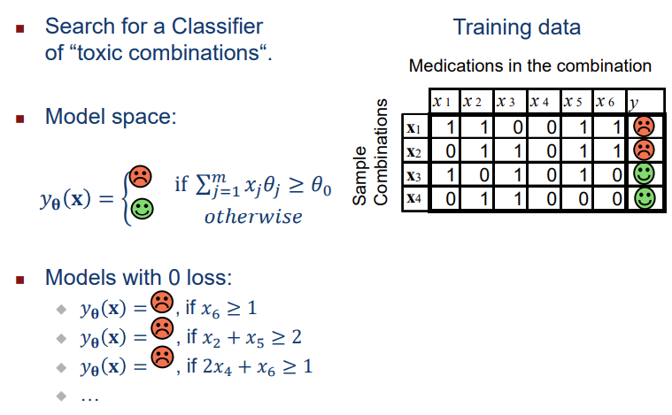

모델의 트레이닝 데이터에 대한 empirical risk가 0인 모델들은 version space를 형성한다. 그러나 만약 데이터셋이 모순되었다면, 그 모순된 데이터셋에 대해서는 version space가 비어있게 된다. version space의 모델들은 트레이닝 셋에서는 나타나지 않는 일부 인스턴스의 예측에 대해서 차이가 존재할 수 있다.

그러나 어떤 모델이 올바른지를 결정하는 것은 어려운 문제이다. 왜냐하면 버전 공간에 속하는 모든 모델은 훈련 데이터에 대해 완벽하게 일치하며, 새로운 데이터에 대한 일반화 능력은 보장되지 않기 때문이다.

따라서, 우리가 어떤 모델을 하나 선택을 했을 때, 우리가 올바른 모델을 찾았는지 확신 할 수 없다는 문제가 생긴다. 다음과 같은 세부적인 문제가 있다.

- 데이터가 모순 혹은 잘못된 경우가 있을 수 있다
- 비슷한 loss를 가지는 모델이 여러개이다
- 올바른 모델이 실제로 존재하지 않을 수 있다

이 부분은 엄청 방대한 내용인데, 강의에서는 별로 다루지 않으니 넘어가도록 하겠다.

### Regularizer

정규화(Regularization)란 머신 러닝에서 Overfitting을 방지하기 위해 사용되는 기법이다. Overfitting은 모델이 학습 데이터에 지나치게 잘 맞춰져 있어 새로운 데이터에 대한 일반화 능력이 떨어지는 현상을 말한다. 정규화는 모델의 복잡도를 제한하여 이러한 문제를 완화한다. 가장 일반적인 정규화 기법으로는 L1 정규화(Lasso)와 L2 정규화(Ridge)가 있다.

L1 정규화는 모델의 가중치에 대한 절대값의 합을 손실 함수에 추가하며, 이는 모델의 일부 가중치를 정확히 0으로 만들어 특성 선택의 효과를 낸다. 반면, L2 정규화는 가중치의 제곱의 합을 손실 함수에 추가하여, 모든 가중치가 0에 가까워지도록 만들지만 정확히 0이 되지는 않는다. 이러한 정규화 기법들은 모델이 데이터의 중요한 패턴을 학습하면서도 과도하게 복잡해지는 것을 방지한다.

여기서 Regularizer는 모델이 사전 확률 적으로 얼마나 가능성 있는지를 표현한다. 이는 모델이 얼마나 적합한지를 나타내는 loss function과는 별개다. 

Regularizer $\Omega(\theta)$는 모델 𝜃이 사전 확률적으로 어떤지에 대한 가정을 나타낸다. 
또한 $\Omega$는 트레이닝 데이터와 독립적이며, 모델의 Regularizer가 높을수록 해당 모델의 가능성은 낮아지게 된다. 일반적으로, 이러한 가정은 더 적은 수의 attributes가 적절한 모델을  나타내기에 충분하다는 것을 나타낸다.

$L_0$, $L_1$, $L_2$ Regularization 등이 있다.

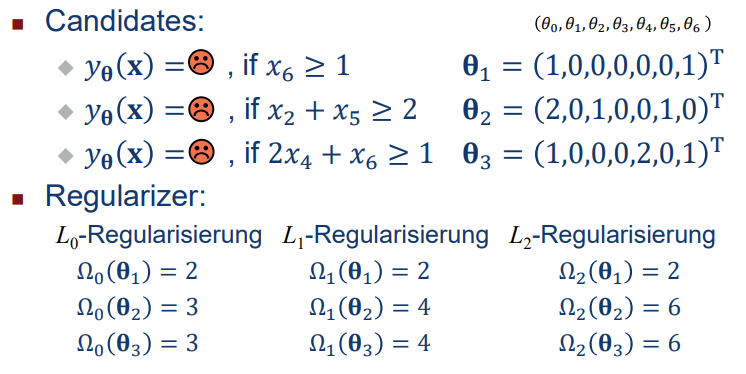

### Optimization

#### Criterion

Optimization Criterion은 average loss와 regularizer 사이의 균형을 맞추는 것으로 정의된다. 따라서, 이를 Regularized Empirical Risk라 한다.

- Regularized Empirical Risk

    $$\frac{1}{n}\sum^{n}_{i=1}ℓ(y_\theta(x_i),y_i)+\lambda\Omega(\theta)$$

여기서 parameter $\lambda>0$은 Loss와 Regularizer사이의 trade 비율을 조절한다. $\lambda$가 클수록 Regularizer의 중요성이 커지고, 작을수록 Loss의 중요성이 커진다. 

#### Problem

이 Optimization criterion(Regularized Empirical Risk)을 사용하는 이유가 있을까?

Regularized Empirical Risk를 criterion으로 사용하면 가장 가능성이 높은(posteriori) 모델(MAP-Model)을 얻을 수 있다. 또한 $|\theta|$에 따른 future data에 대한 error의 upperbound를 더 작게 설정할 수 있다. 이를 (SRM,Structural risk minimization)이라 할 수 있겠다. 

Regularization 없이 learning하는것은 _ill-posed_ Problem이다. 즉, 잘 정의되지 않은 문제라는 것이다. 이는 고유한 해가 없거나 데이터의 미세한 변경에 강력하게 영향을 받을 수 있다. 

Parameter $\lambda$는 어떻게 설정해야할까? 일단 evaluation을 보고, 그 뒤에 알아보자.

#### Regularized Empirical Risk Minimization

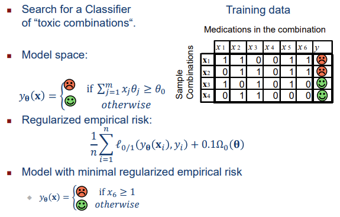

### Evaluation of Models


Evaluation은 미래에 모델이 얼마나 잘 작동할 것인가를 예측하는 것이다. Model은 보통 실제 값과 모델에 의해 예측된 값을 비교하여 두 값의 차이 혹은 오차를 구하는 방식으로 진행된다. 이 Evaluation과정은 Overfitting을 방지하고 최적의 모델을 찾기 위해 실시한다. 이는 결과변수(답안지)가 있어야 잘한건지 아닌지 확인할 수 있기 때문에, 지도학습에서만 사용할 수 있다.

Evaluation은 모델링의 목적, 혹은 target variable의 유형에 따라 다른 평가지표를 사용한다. 

Training과 validation 값이 거의 일치해야 좋은 모델이다. 만약 Training 데이터로는 성능이 좋게 나왔는데, validation 데이터를 사용했을 때 성능이 확연하게 떨어진다면 모델이 overfitting상태라고 볼 수 있다. 

Future instances는 알려지지 않은 어떤 확률 분포 $p(x,y)$에 따라 생성된다. 여기서 Risk는 분포 $p(x,y)$에 따른 예상 Loss를 의미하며, 수식으로 다음과 같이 나타낼 수 있다.

$$R(\theta) = \sum_{y}\intℓ((y_\theta(x_i),y))p(x,y)dx$$

트레이닝 데이터에 대한  Empirical Risk는 Risk를 추정하는데 유용하지 않다. version space의 모든 모델이 트레이닝 데이터에 대해 0의  Empirical Risk를 가지기 때문이다. 또한 Classifier는 각 트레이닝 instance를 단순히 테이블에 저장하고 쿼리될 때 저장된 레이블을 재생산하여 트레이닝 데이터에 대한 Empirical Risk를 0으로 만들 수 있다. 따라서 트레이닝 데이터에 대한 Empirical Risk는 Risk에 대한 매우 매우 낙관적인 estimator이다.

따라서, Risk는 Training에 사용되지 않은 instance를 사용하여 평가된다. 

위에 이어서, Parameter $\lambda$는 어떻게 설정해야할까?

1. avaliable data를 training data와 test data로 나눈다.
2. 가능한 $\lambda$ 값에 대해 다음을 반복한다(람다값 다 넣어보고 실제로 돌려봄)
   1. 트레이닝 데이터를 이용해서 모델을 찾기위한 훈련
   2. 테스트 데이터로 테스트
3. 이제 Loss가 최소화되는 값을 가진 $\lambda$를 선택한다.
4. 모든 데이터를 사용하여 최종 모델을 훈련한다.

## Problem Analysis

Problem Analysis을 위한 engineering approach는 다음과 같이 진행된다.

1. Understanding requirements
   - Application 목표 및 품질 지표를 이해한다.
   - 데이터와 데이터를 생성하는 프로세스의 properties를 이해한다
   - Application-specific requirment를 파악한다
   - 사용하는 방법의 기본 가정이 문제의 요구 사항과 일치하는지 확인한다
2. Developing solution
   - 문제 해결을 위한 알고리즘 또는 방법을 개발한다
   - 데이터를 처리하고 분석하는 방법을 개발한다
   - 문제 해결을 위한 적절한 모델 또는 시스템을 설계한다


### Understanding Requirements

여기서 알아보려는것은 방법의 첫번째, 요구사항을 파악하는 것이다.

requirements를 파악하는것은 각 industries의 culture에 따라 다르다. 예를 들어, 자동차 산업에서는 종종 10 ~ 20 페이지에 이르는 소프트웨어 요구 사항이 일반적이다. 그러나 이는 전체적으로는 일반적이지 않다.

더 일반적인 경우에는, 사용자 또는 고객이 좋은 솔루션의 특성에 대한 아이디어를 가지고 있다. 정확한 문제 설정과 요구 사항은 인터뷰를 통해 결정되어야 한다.

다음의 이메일 서비스 제공업체의 예시를 통해 더 자세히 알아보자.

**Problem**: 이메일 스팸이 하드 드라이브와 처리 용량을 고갈시킴.

서버 및 저장소는 따라서 거대한 cost factor이다.

**Legal requierments**: 딜리버리를 위해 수락된 메시지는 삭제되지 않아야 한다. 봇넷에 의해 배포된 개별 메일 캠페인은 엄청난 데이터 양을 생성한다.

관리자는 대규모 캠페인을 인지하고 해당 캠페인과 일치하는 정규 표현식을 작성한다.    
그런다음 이메일 서버는 이러한 정규 표현식과 일치하는 메시지를 수락하지 않는다.

여기서 추가적인 **Problem**: 캠페인은 제때 인지되어야 하며 관리자가 조치를 취해야 한다. 항상!

legitimate messages가 도착하지 않으면, 콜센터로 불만전화가 폭주한다.

이러한 문제를 해결하기 위해, 캠페인을 신속하게 인지하고 관리자가 조치를 취할 수 있는 자동화된 시스템이 필요한 것이다. 또한, 합법적인 메시지가 차단되지 않도록 신중한 처리가 필요하다.  시스템은 신속한 대응 및 관리자 행동을 지원하고, 합법적인 메시지의 배달을 보장하며, 사용자들의 불만을 최소화할 수 있어야 한다.

이 문제를 해결하기 위해 고려해야할 사항은 다음과 같다.

- 자동화된 솔루션에 대한 요구사항이 있는가?
- Evalutaion metric은 어떻게?
- Learning problem으로 모델링을 해야하나?
- 그렇다면 learning problem의 타입은?
- model space는?
- loss function은? regularizer는?

어휴

이쯤에서 learning problem의 taxonomy에 대해 다시 알아보자.

### Taxonomy of Learning Problems

- **Supervised Learning**
  - 훈련 데이터에는 모델이 예측해야 하는 변수의 값이 포함됩니다.
  - **Classification**: 범주형 변수를 예측합니다.
  * **Regression**: 연속 변수를 예측합니다.
  * **Ordinal Regression**: 유한하고 순서가 있는 값 집합을 예측합니다.
  * **Rankings**: 요소들의 순서를 예측합니다.
  * **Structured Prediction**: 시퀀스, 트리, 그래프 등의 구조를 예측합니다.
  * **Recommendation**: 항목별 사용자 행렬을 예측합니다.
- **Unsupervised Learning**
  - 데이터의 구조적 특성을 발견합니다.
  - **Clustering**: 비슷한 특성을 가진 데이터를 그룹화합니다.
  * **Unsupervised Feature Learning**: 데이터를 잘 설명할 수 있는 속성을 찾습니다.
  * **Anomaly Detection**: 이상한 데이터 포인트를 식별합니다.
- **Control / Reinforcement Learning**
  - dynamical system을 control하는 것을 학습한다.
  - 에이전트가 환경과 상호 작용하며 보상을 최적화하는 방법을 학습합니다.
- 기타 모델:
  * **Semi-supervised Learning**: 일부 레이블이 있는 데이터와 일부 레이블이 없는 데이터를 사용하여 모델을 훈련합니다.
  * **Supervised Clustering**: 레이블이 있는 데이터를 사용하여 클러스터링 모델을 훈련합니다.
  * 그 외의 다양한 모델들이 존재합니다.

### Data

이러한 Learning problem에 사용되는 데이터 또한 중요하다.

#### Data Availability

Batch learning의 경우, 모든 데이터를 사용할 수 있다. 전체 데이터셋을 사용할 수 있으므로 모델을 **한번에** 훈련시킨다. 그러나 Online learning의 경우, 데이터가 하나씩 들어오기 때문에, 점진적으로 모델을 훈련시킨다. Online learning은 데이터가 실시간으로 생성되는 경우에 유용하다.

이것 말고도, 다음과 같은 요소들이 중요하다.

* Number of data
  * 데이터가 매우 적은 경우
  * 데이터를 저장하고 처리하는 데 분산 시스템이 필요할 정도로 데이터가 많은 경우

* Number of attributes
  * attributes가 너무 적은 경우
  * attributes가 너무 많은 경우.
  * attributes가 sparse한 경우: 대부분의 항목이 0인 희소한 데이터를 다루는 경우
* Quality of data
  * 결측값이 있는 경우
  * 오류값이 있는 경우
  
#### Data Properties

데이터의 Representational Properties또한 중요하다. 

- 데이터의 epresentational Properties 중 첫번째는 클래스의 ratio이다. 클래스의 ratio가 균형적인지, 특정 클래스가 드물게 나타나는지, 혹은 특정 클래스가 다른것보다 훨씬 많아서 representative한지가 되겠다.

- 또한 Marginal distribution가 중요하다. 데이터의 Marginal distribution이 application의 실행시간의 분포와 동일한지 봐야한다. 만약 아니라면, 변량 이동(Covariate Shift)을 고려하여 학습하고 모델을 조정해야 한다. 즉, 입력 데이터의 분포가 학습 데이터와 테스트 데이터 사이에 차이가 있는 경우에 대비한 학습 방법을 적용해야 한다.

- 또한, target attribute의 값이 실제 타겟 분포에서 나오는지, 아니면 auxiliary distribution에서 나오는지 알아야 한다. 여기서 auxiliary distribution은 실험실 데이터 혹은 시뮬레이션 데이터를 의미한다.

- 데이터가 신선한지, 즉 최신 데이터인지 또한 알아야 한다. process가 바뀌었을 수도 있고, 시간에 따라 데이터가 변하는 경우도 있다.

- 데이터 소스가 단일인지 여러 소스가 있는지도 알아야 한다.

- 데이터의 신뢰성, 품질, 일관성 또한 당연히 중요하다. 

- 데이터의 Availability도 중요하다. 접근하지 못하는 데이터면 의미가 없다. 또한 데이터가 데이터 세트로 fixed하게 제공되는지, 아니면 데이터 수집을 위한 프로토콜을 따로 마련해야하는지 알아야 한다.

#### Data Dependencies

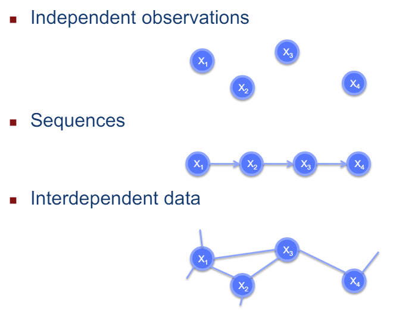

### Example!

다시 위의 이메일 서비스 제공자 예시로 돌아가보자. 

이 예시는 두 단계의 Learning problem으로 모델링 될 수 있다.

#### Campaing Discovery


봇넷에 의해 전달되는 대규모 캠페인을 발견하는 문제이다. 이 단계에서는 이메일 데이터에서 대규모 캠페인을 식별하기 위한 기계 학습 모델을 구축한다. supervised 또는 unsupervised learning methode를 사용하여 캠페인을 탐지할 수 있다.

- 일단 이 예시에서는 Unsupervised learning의 cluster analysis approach를 사용할 수 있겠다.     
- 또한 데이터가 실시간이고 계속 추가될 수 있기 때문에, 데이터 스트림에서 Online processing할 수 있다.    
- Optimizing criterium으로써는, 어떻게 데이터를 clustering을 하는게 적절한지를 찾아야겠다.
- Instance의 경우, 이메일의 header attributes와 word-occurrance attributes를 사용할 수 있다.

이제 이렇게 만들어진 모델을 evaluation해야한다. 

두가지 방법을 이용해 평가한다.

- Offline evaluation
  - 제한된 시간동안 발생한 모든 이메일을 저장하고, 수동으로 클러스터링 한다.
  - 수동 생성 클러스터와 자동 생성 클러스터 간의 일치도를 측정한다
  - FP 및 FN 비율과 같은 metric을 사용하여 성능을 평가한다.
- Online evaluation
  - 실제 정기 비즈니스 시간에 클러스터링을 해본다.
  - 캠페인 차단을 담당하는 관리자에게 표시한다.
  - 관리자의 피드백을 수렴하여 모델이 괜찮은지, 실제로 여러 캠페인을 처리할 수 있는지 등을 평가한다.
  - 캠페인을 차단해도 괜찮은지 여부를 결정하기 위해 관리자의 피드백을 사용할 수 있다.


#### Creating a regular expression for each campaign


캠페인을 식별하기 위한 정확한 패턴을 정의하는 데 사용되는 정규 표현식을 자동으로 생성하는 기계 학습 모델을 구축한다. 캠페인마다 다르게.

Regular expression을 찾는 방법을 제대로 알아보자.

- Instance x는 set of emails(sets of strings)가 될것이다.
- Target attribute y는 regular expression이다.
- 트레이닝 데이터 {(xi,yi)}는 sets of strings와 그에 상응하는, 어드민이 작성한 regular expression이 될 것이다. 
- Loss function $ℓ(y_\theta(x_i),y)$은 서로다른 expression들이 얼마나 다른지의 측정값일 것이다. 이는 syntax tree의 non-identical nodes의 proportion으로 찾을 수 있다.
- Regularization은 L2이다. 

이 경우, 트레이닝 데이터가 **올바른** regular expression을 포함하므로, **supervised learning**이다.

또한 target variable이 regular expression이기 때문에, 즉, **discrete, structured**이고, 따라서 **structured prediction**이다. structured output spaces를 학습하는 것이다. 

#### Evaluation and Testing

온라인 평가의 경우, 발견된 캠페인 및 생성된 정규 표현식을 관리자에게 제시하고, 관리자가 이 정보를 사용하여 캠페인을 차단할지 여부를 결정한다.

생성된 expression의 acceptance, acceptance+ editing, rejection에 대한 rates를 측정한다. 이는 평가의 척도로 사용된다.

불만신고 비율을 측정하여 생성된 expression이 실제로 이메일 서비스의 품질을 향상시키는지 여부를 확인할 수 있다.


## Data Preprocessing

데이터 프리프로세싱은 수집한 데이터를 분석하고 머신러닝에 사용할 형태로 변환시키는 단계이다. 즉, 기존의 데이터를 머신러닝 알고리즘에 알맞은 데이터로 바꾸는 과정이다. 크롤링이나 DB 데이터를 통해 수집된 데이터를 머신러닝에 학습시키기 위해서는 데이터 프리프로세싱 과정이 필요하다. 

데이터 전처리는 크게 3가지로 나뉜다. 
1. 머신러닝의 입력 형태로 데이터 변환(Feature engineering)
2. 결측값 및 이상치를 처리하여 데이터 정제 (Data Cleaning)
3. 트레이닝용 및 평가용 데이터 분리


### Data Integration

Data integration은 여러 데이터 소스를 일관되게 통합하는 프로세스를 의미한다. 여러군데에서 긁어온 데이터를 잘 사용하려면 이 통합과정이 필요하다. 

데이터 소스가 여러개인 경우, 이 데이터를 데이터 웨어하우스와 같은 단일 저장소에 일관되게 저장한다. 또한 가진 데이터들이 서로다른 형식을 가지고 있다면, 이 데이터의 형식을 통합하여 통일된 형식으로 변환해야한다. 

서로 다른 데이터들은 서로다른 attributes를 가지는 경우도 있지만, 같은 attiributes를 가지는 경우도 있다. 이렇게 관련된 attributes를 식별하여 통합해주는것이 중요하다. 

여러 소스에서 긁어온 데이터들 사이에는 충돌이 발생할 수 있다. 대표적으로 단위 충돌이 있다. 이를 일관되게 변경해야한다.

가끔 중복된 데이터가 있을 수 있다. 자료 크기가 방대해지면 이 중복 데이터는 큰 문제가 될 수 있기 때문에 적절하게 제거해줘야 한다.

### Feature Representation

위에서 말했듯, 우리가 가진 모델의 구조에 따라 attribute를 변환해야한다. 알고리즘에 맞는 데이터로 변환시키는 단계이다. 

예를 들어, attribute와 model parameter의 inner product를 계산하는 linear model이 있다고 해보자. 이 경우, 모든 attributes는 numeric이여야 하며, 큰 attribute values는 큰 innerproduct를 계산한다. categorical data는 모두 numerical로 변환되어야 하며, attribute에는 order가 없을 것이다.    
또한 텍스트는 TF- or TFIDF- representation으로 변환될 수 있을 것이다. 

텍스트 표현을 위한 TF- or TFIDF- representation는 뭘까? 자세히 알아보도록 하자. 

TF- or TFIDF- representation는 정보 검색과 텍스트 마이닝에서 이용하는 가중치로, 여러 문서로 이루어진 문서군이 있을 때 어떤 단어가 특정 문서 내에서 얼마나 중요한 것인지를 나타내는 통계적 수치이다. 문서의 핵심어를 추출하거나, 검색 엔진에서 검색 결과의 순위를 결정하거나, 문서들 사이의 비슷한 정도를 구하는 등의 용도로 사용할 수 있다.

**이중 TF-IDF는 두 요소의 곱으로 계산되게 되는데, TF는 Term Frequency, 즉 단어 빈도, IDF는 Inverse Document Frequency, 즉 역문서 빈도를 의미한다.**

TF는 특정 문서 내에서 특정 단어가 얼마나 자주 나타나는지를 측정한 값이며 일반적으로 문서내에서 자주 나타나는 단어일수록 해당 단어의 TF값이 높으며, TF는 다음과 같이 계산된다.

    TF(d, w) = (특정 단어 w의 문서 d 내 등장 횟수) / (해당 문서 d 내 총 단어 수)

IDF는 특정 단어가 다른 문서에서 얼마나 자주 나타나는지를 측정한 값이며, IDF값은 특정 단어의 중요성을 반영하며, 다른 문서에서 자주 나타나는 단어일수록 IDF값은 낮으면 다음과 같이 계산된다.

    IDF(w) = log(총 문서 수 / 특정 단어 w를 포함한 문서 수)

이때, 로그 함수를 사용하여 IDF 값을 조절하고, 특정 단어가 전체 문서에 나타나지 않을 때 분모가 0이 되는 것을 방지한다.

TF-IDF는 TF와 IDF를 곱하여 계산된다.

    TF-IDF(w) = TF(w) * IDF(w)  

이 TFIDF 값을 벡터로 표현할 수 있다. 

$$ TFIDF(x) = \frac{1}{|x|}
\begin{pmatrix} 
TF(\text{term}_1) \cdot IDF(\text{term}_1)\\
\vdots \\
TF(\text{term}_n) \cdot IDF(\text{term}_n)
\end{pmatrix}$$


텍스트를 나타내는 또 다른 표현 방법은 N-Gram vector이다. TF-IDF representation에서는 term의 순서에 대한 정보가 손실된다. 그러나 N-gram은 연속적인 terms의 k-tuple마다 하나의 attribute를 만든다. 이는 모든 $k \leq N$에 대해 적용된다.

또한 N-Gram feature는 다양한 범위값을 가질 수 있다. 절대값이 큰 값은 decision function에 더 큰영향을 미친다. 때로는 이러한 범위를 정규화 할수도 있다. 범위를 정규화하면 해당 가중치에 더 강한 적용될 수 있다. 

normalization의 방법에는 여러가지가 있다.

- Min/Max normalization
  - 각 feature의 값을 최소값과 최대값 사이의 범위로 변환해서, 데이터를 0과 1 사이의 값으로 변환하여 일반화시킨다.

$$x^{new} = \frac{x-x_{min}}{x_{max}-x_{min}}(x^{new}_{max}-x^{new}_{min})+x^{new}_{min}$$

- Z-Score normalization
  - 각 특성의 값을 평균이 0이고 표준 편차가 1인 표준 정규 분포로 변환하고, 데이터 분포를 중심에 맞추고 스케일링한다.

$$x^{new}=\frac{x-\mu_{x}}{\sigma_x}$$

- Decimal Scailing
  - 각 특성의 값을 고정된 자릿수로 스케일링한다. 반적으로 0과 1 사이의 범위로 스케일링된다.

$$x^{new}=|x|\cdot 1-^a$$

$$a= max\{i \in \mathbb{Z}| |x|\cdot 10^i < 1\}$$

- Logarithmic Scaling
  - 값의 분포가 한쪽으로 치우쳐져있는 경우에 유용하고, 값에 로그를 취한다.

$$x^{new}= \log_a x$$


Feature representation은 모델이 학습하는데 중요한 역할을 한다. 때로는 모델이 찾지 못하는 복잡한 관계를 포함하는 특성을 직접 구성하는 것이 도움이 될 수 있다.

Feature construction에는 두가지가 있다. 

- Combinations of elementary features: 기본 features을 조합해서 새로운 feature을 만든다. 

$$(x_i,x_j) \to (x_j,\sqrt{x_ix_j},x_i+x_j)$$

- Mapping of elementary features: 본 특성들을 변환하여 새로운 특성을 만든다. 

$$x_i \to (x_i,\log x_i, x_{i}^{2})$$

### Attribute with Missing Values

Missing value가 발생하는 이유는 다양하다. 뭐 무작위로 누락이 될수도 있고, 어떤 값들은 systematically(체계적으로) 누락이된 경우도 있을 수 있다. 이 경우는 특정 클래스나 범주에 속하는 경우 누락된 값이 더 많은 수 있다.

또한 위의 Data integration과정에서 값의 불일치로 인해 값이 삭제되었을 수도 있다. 혹은, 개인정보 보호를 위해 데이터가 삭제될수도 있다.

이런 Missing value를 어떻게 처리할까?

먼저, 결측값이 적은 경우엔 그냥 인스턴스를 삭제해버릴수도 있다. 아니면 attribute가 있는지, 없는지를 나타내는 새로운 binary attribute를 도입할수도 있다. 아니면 그냥 결측치를 추정해서 때려 맞출수도 있다. 아니면 알고리즘이 누락된 값을 알아서 처리할 수 있는 경우 그냥 뭐 냅둘 수도 있다.

### Attribute with Erroreous Values

값이 잘못된 경우, 이를 먼저 식별할 수 있어야 한다. 그 뒤 처리한다.

식별 방법에는 Binning과 Clustering이 있다.

- Binning은 구간화라고도 하며, 동일한 간격으로 구간화하여 구간에 속하는 값들을 나눕니다. 이때 적은 인스턴스를 가진 구간은 이상값일 수 있다.
- Clustering을 통해 한 개 이상의 인스턴스를 가진 클러스터를 이상값으로 간주할 수 있다.
- Active learning/labeling: 데이터와 모델 간의 불일치로 인한 일관성 문제를 해결하기 위해 인간에게 올바른 레이블을 요청한다.

이렇게 식별된 오류값은 regression, 혹은 average를 이동하는 등 다듬거나, 뭐 삭제할수도 있다.

### Feature Selection

Feature Selection은 다수의 특징 중에서 중요한 특징을 선택하는 것을 말한다. 이를 통해 시스템을 운영하는 비용을 줄일 수 있으며, 변수를 적게 사용할 경우 시스템의 속도가 빨라지는 등 이점을 가질 수 있다. 데이터에 대한 해석력을 높여주며, 차원 축소를 통해 다중공성성 문제를 해결할 수도 있다. 또 간단한 모델로 예측력을 향상할 수 있어 bias나 overfitting 방지에도 효과적이다.

pearson, spearman correlation등을 이용해 계산한 상관계수를 척도로 사용할 수 있고, 평가는 n-fold 교차검증 등을 통해 feature selection을 평가할 수 있다. 

선형 모델에 대한 feature selection을 할때는 가장 작은 가중치를 가진 특성을 제거하는 방법을 사용한다.

## Decision Trees

결정 트리(Decision Tree, 의사결정트리, 의사결정나무라고도 함)는 분류(Classification)와 회귀(Regression) 모두 가능한 지도 학습 모델 중 하나이다. Decision Tree는 일련의 필터 과정 또는 스무고개라고 생각하면 된다. 이 디시젼 트리가 사용되는 많은 이유가 있지만, 그중에 첫번째는 해석의 유용성이다. 분류를 함과 동시에 그 이유를 논리적으로 설명할 수 있고, 인간이 쉽게 이해할 수 있기 때문에 해석하기가 쉽다. 

또한 디시젼 트리는 yes or no라는 간단한 절차이기 때문에, 프로세스가 빠르다. 특히, 이미지 처리에 주로 사용될 수 있다. 이런 특성 덕분에, 디시젼 트리는 간단하고 효율적이며, 확장또한 용이하다. 

디시젼 트리는 numerical과 categorical 변수에 대한 사전 처리가 필요하지 않으며, regression 혹은 classification에 모두 사용할 수 있다.

### Decision Trees - Classification

디시젼트리에서 classification은 다음과 같은 과정으로 이루어진다.

1. Input: $x \in X$,  각각의 인스턴스 x는 attributes vector로 표현되며, feature vector라고도 불린다. 

2. Output: classification의 결과로써, 각각의 인스턴스 x에 해당하는 클래스 y가 결정된다. 클래스는 유한한 집합 Y에 속한다. 예를들어, {accepted, rejected}나 {spam, not spam}과 같은 클래스들이 있다. 이는 target attribute라고도 불린다. 

classifier를 learning시키기 위해서는, 트레이닝데이터가 필요한데, 이 데이터는 n개의 인스턴스로 이루어져있다. 각각의 인스턴스는 위에 언급한대로 이루어져 있다.

학습에 대한 출력으로, 입력 space 공간 X에서 클래스 space Y로의 매핑을 수행한다. 즉, 학습 결과는 함수 $f: X \to Y$이다.

### Decision Trees - Regression

1. Input: 각각의 인스턴스 x는 input space X에 속하는 feature vector로 표현된다. 벡터 내 각각의 요소는 attribute를 나타낸다.

2. Output: 연속적인 실수 값 y로 표현된다. $y \in \mathbb{R}$

3. Learning Problem: Regressio model을 학습시키기 위해서는 연속적인 대상 값과 관련된 학습 데이터가 주어진다. 이 트레이닝 데이터는 n개의 인스턴스로 구성되며, 각각의 인스턴스는 input feature vector $x_i$와 해당하는 연속적인 target value $y_i$로 구성된다. 다음과 같은 형태를 띈다.

$$L = (x_1,y_1),\dots,(x_n,y_n)$$

이는 예를들어 $(x_1,3.5 , \dots , x_n,-2.8)$과 같은 형태로 주어진다. 

### Decision Trees

이 디시젼 트리는 Test node, Terminal node와 같은 특징을 가진다. 

- Test Nodes가 Discrete Attributes를 처리할때엔, 노드는 attribute를 포함하고, branch는 해당 attribute의 값들로 레이블링된다.

- Test nodes가 continuous attributes를 처리할땐, 노드는 "<"와 같은 비교를 포함하고, 가지는 yes 또는 no로 레이블링된다.

- Terminal nodes는 target attribute의 값이 포함된다. 

이 디시젼 트리는 decision rules로 표현될 수 있다. 각 terminal node는 rule에 해당한다.

예를 들어, "Rejected ← positive credit report ∧ employment duration ≤ 3 months ∧ unemployed." 는 뒤 조건을 충족하면 대출이 거부된다는 것을 의미한다. 

이런 디시젼 트리는, 다음과 같이 처리된다.

1. **Recursively, branch를 따라 내려감.** 
   - 각 노드를 통과하는 과정은 재귀적으로 수행된다.
2. **각 테스트 노드에서 테스트를 수행하고 적절한 가지를 선택**
3. **터미널 노드에서 값 반환**

### Small Decision Trees

다음과 같은 데이터가 주어졌다고 해보자.

|Loan|Credit report |Employment last 3 months|Collateral > 50% loan|Payed back in full|
|-|-|-|-|-|
|1|Positive|Yes|No|Yes|
|2|Positive|No|Yes|Yes|
|3|Positive|No|No|No|
|4|Negative|No|Yes|No|
|5|Negative|Yes|No|No|

디시젼 트리를 learning하는 방법은 주어진 트레이닝 데이터에 대해 올바른 클래스를 예측하는 트리를 찾는것이다. 가장 간단한 방법은 단순히 트레이닝 데이터를 재현하는 트리를 만드는 것이다. 이는 각각의 트레이닝 데이터 인스턴스에 대해 하나의 terminal node를 만드는 것이다. 이 터미널 노드에는 해당 인스턴스의 클래스가 포함된다. 

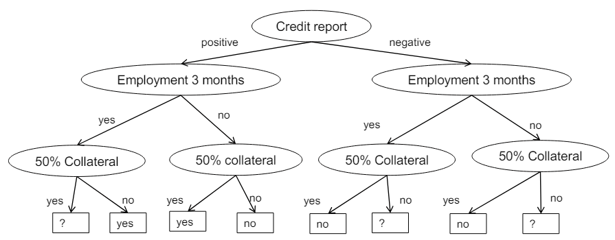

이 방법은 학습 데이터에 대해서는 완벽하게 작동하지만, 실제 데이터에서는 잘 일반화되지 않을 수 있다. 이러한 모델은 과적합(overfitting)되었다고 할 수 있다. 과적합은 트레이닝 데이터에 대해서는 매우 정확하게 작동하지만, 새로운 데이터에 대해서는 일반화하기 어려울 수 있다.

따라서, 보다 일반화된 의사 결정 트리를 찾기 위해서는 과적합을 피하기 위한 다양한 기법들을 적용해야 한다. 이러한 기법들에는 가지치기(pruning), 트리의 깊이 제한(depth limitation), 또는 정보 이득(Information Gain)을 최대화하는 특성 선택 등이 있다.

이런 trivial way말고도, 더 우아한 방법은 트레이닝 데이터와 일치하는 트리 중 **가능한한 가장 적은 노드**를 가지는 트리를 선택하는 것이다. 트리가 작을수록 각각의 분기점이 더 명확하게 나타나므로 결정 프로세스를 이해하기가 더 쉽다. 또한 트리가 작으면, 터미널 노드에 더 많은 트레이닝 인스턴스가 포함될 수 있다. 더 많은 인스턴스가 포함될수록 해당 클래스에 대한 통계적 신뢰도가 향상된다. 

smallest Tree를 만들기 위해, 알아야 할것들이 있다. 

- 기능적으로 다른 디시젼 트리가 몇개가 있을까?
  - m개의 이진 attribute와 두개의 클래스가 있다고 해보자.
  - 트리는 테스트 노드의 m개 레이어가 있으며, 즉, $2^m-1$개의 테스트 노드가 있다.
  - 따라서, $2^{(2^m)}$개의 터미널에 대한 클래스 할당이 있다.
- 그렇다면 이런 smallest tree를 찾는데 드는 시간은?
  - m개의 attribute가 있다고 할때, $2^m-1$개의 테스트 노드가 있으니, $O((m+1)^{2^m-1})$의 시간이 든다.. 존나김
  - 또, 터미널 노드에 클래스 레이블을 할당하는데 $O(2^{2^m})$의 시간이 든다.


## ID3

이런 smallest decision tree를 찾는 그리디 알고리즘을 알아보자. 

이 그리디 알고리즘은 Top-Down approach를 사용한다. ID3이라고도 하며, 디시젼 트리를 구축하기 위한 분류 알고리즘을 사용한다. 여기서는 optimal attribute를 선택하기 위해 엔트로피를 사용한다.

```
1. ID3(L)
   1. If all data in L have same class y, then return leaf
   node with class y.
   2. Else
      1. Choose attribute x𝑗 that separates L into subsets
      L1, … , L𝑘 with most homogenous class distributions.
      2. Let L𝑖 = {(x, y) ∈ L: x𝑗 = 𝑖}.
      3. Return test node with attribute x𝑗 and children
      ID3(L1,), …, ID3(L𝑘).
```

1. 만약 L의 모든 데이터가 동일한 클래스 y를 가지고 있다면, 해당 클래스를 가지는 터미널 노드를 반환한다.
2. 그렇지 않다면, 
   1. L을 가장 균일한 클래스 분포를 갖도록 분리할 수 있는 특성 $x_j$를 선택한다.
   2. L을 $x_j$에 대한 값 $i$에 따라 $k$개의 하위집합 $L_1,\dots,L_k$로 분할한다. 각각의 하위집합 $L_i$는 $x_j=i$를 만족하는 데이터들의 집합이다.
   3. $L_i$에 대한 재귀적 호출을 통해 각각의 하위 집합에 대한 디시젼트리를 생성한다.
   4. 결과 반환

### Information

Information 이론은 송신자(p(y)), 채널, 수신자 및 메시지(y)에 대한 확률 분포를 포함하는 모델을 사용한다. 여기서 information은 메시지의 attribute, bit 단위로 측정된다. **메시지 내의 information은 메시지를 최적으로 코딩하는데 필요한 bit의 수이다.** p(y)의 확률로 전동되는 메시지 y의 정보는 $-\log_2p(y)$이다. 

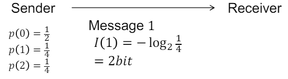

### Entropy

엔트로피는 메시지의 expected information이다. 엔트로피는 다음과 같이 정의될 수 있다.

$$H(y)=-\sum^{k}_{v=1}p(y=v)\log_2 p(y=v)$$

엔트로피는 Reciever가 메시지에 대한 불확실성(uncertainty) 혹은 불순도(Impurity)를 수치적으로 나타내는 척도이다. 즉, 엔트로피가 높을수록 수신자는 더 많은 정보를 필요로 하고, 낮을수록 메시지에 대한 예측이 더 쉬워진다.

엔트로피가 낮을수록 데이터의 섞임정도인 impurity가 높아지고, 즉 데이터들이 다양한 클래스에 나뉘어져 있다는 것을 의미한다. 무질서하게 정리되어있다고도 표현을 하고, 불확실하다고도 한다. 엔트로피는 0과 1사이의 값을 가진다.

실제 데이터 L에서 관측된 빈도수를 확률 대신에 사용하여 계산된 엔트로피를 Empirical Entropy $H_L$이라고 한다. 이는 다음과 같이 계산된다.

$$H_L=-\sum^{k}_{v=1}f(v)\log_2f(v)$$

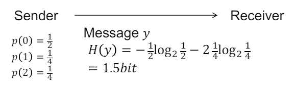


#### Entropy of Class Labels in Training Data

이쯤에서 아까 그 표를 다시 가져와보자.

|Loan|$x_1$ (Credit report) |$x_2$ (Employment last 3 months)|$x_3$ (Collateral > 50% loan)|$y$ (Payed back in full)|
|-|-|-|-|-|
|1|Positive|Yes|No|Yes|
|2|Positive|No|Yes|Yes|
|3|Positive|No|No|No|
|4|Negative|No|Yes|No|
|5|Negative|Yes|No|No|

학습 데이터의 클래스 레이블에 대한 엔트로피는 클래스 레이블에 대한 정보 또는 불확실성을 나타낸다. y의 엔트로피를 계산해보자.

$$H_L(y)=-\frac{2}{5}\log_2\frac{2}{5}-\frac{3}{5}\log_2\frac{3}{5}=0.97 bit$$

#### Conditional Entropy

특정 조건에 따른 클래스 레이블의 정보 또는 불확실성은 해당 조건이 주어졌을 때 클래스 레이블에 대한 예상 비트 수를 나타낸다.

$$H_L(y|x_1=n)=-\frac{2}{2}\log_2\frac{2}{2}-\frac{0}{2}\log_2\frac{0}{2}=0 bit$$

$$H_L(y|x_1=p)=-\frac{2}{3}\log_2\frac{2}{3}-\frac{1}{3}\log_2\frac{1}{3}=0.91 bit$$

### Information Gain of an Attribute

|Loan|$x_1$ (Credit report) |$x_2$ (Employment last 3 months)|$x_3$ (Collateral > 50% loan)|$y$ (Payed back in full)|
|-|-|-|-|-|
|1|'Positive'|'Yes'|'No'|'Yes'|
|2|'Positive'|'No'|'Yes'|'Yes'|
|3|'Positive'|'No'|'No'|'No'|
|4|Negative|No|Yes|No|
|5|Negative|Yes|No|No|

Attribute에 대한 information gain은 데이터를 해당 attribute를 기준으로 분할함으로써 엔트로피가 감소되는 양을 나타낸다.

$$G_L(x_j) = H_L(y) -\sum^{k}_{v=1}p_L(x_j=v)\cdot H_L(y|x_1=v)$$

여기서 $H_L(y)$는 원본 데이터의 클래스 레이블에 대한 엔트로피이고, $p_L$(x_j=v)는 attributre $x_j$가 $v$값으로 주어졌을때의 확률을 나타낸다. $H_L(y|x_1=v)$는 attribute $x_j$가 값 v로 주어진 상황에서의 클래스 레이블에 대한 조건부 엔트로피이다. 

따라서, 위 데이터에서 $x_1$에 대한 information gain은 다음과 같이 계산될 수 있다.

$$G_L(x_1) = H_L(y) -p_L(x_1=p)\cdot H_L(y|x_1=p)-p_L(x_1=n)\cdot H_L(y|x_1=n)\\
= 0.97-\frac{3}{5}0.91-\frac{2}{5}0=0.42\text{ bit}$$

즉, attribute $x_1$를 기준으로 데이터를 분할하는 것은 클래스 레이블 y에 대한 uncertainty를 0.42 bit 만큼 감소시킨다는 것을 의미한다.

따라서, **decision tree 알고리즘은 이 information gain을 최대화 하는 방향으로 학습이 진행된다.**

#### Information Gain Ratio

information gain ratio는 attribute의 information gain을 spliting 이후의 엔트로피로 나눈 값이다. 이것은 attribute의 스플리팅 이후 엔트로피가 증가할 수 있는 경우를 고려하여 information gain을 보정하는데 사용된다.

$$\text{Information Gain Ratio}=\frac{\text{Information Gain}}{\text{Split Information}}$$

$$GR_L(x_j)=\frac{G_L(x_j)}{H_L(x_j)}$$

여기서, information gain $G_L(x_j)$은 스플리팅 전후의 엔트로피의 차이이며, split information은 해당 attribute를 기준으로 데이터를 분할한 후의 엔트로피 $H_L(x_j)$이다.

$$H_L(x_j)=-\sum^{k}_{v=1}p_L(x_j=v)\log_2 p_L(x_j=v)$$

이러한 Information Gain Ratio은 속성의 Information Gain이 해당 속성의 분할 후의 엔트로피에 비례하는지 여부를 나타낸다. Information Gain Ratio이 높을수록 속성이 분할 후의 엔트로피를 줄이는 데 더욱 효과적이며, 따라서 분할 후의 엔트로피를 기준으로 Information Gain을 판단할 때 더욱 신뢰할 수 있다.

예시를 한번 보도록 하자.

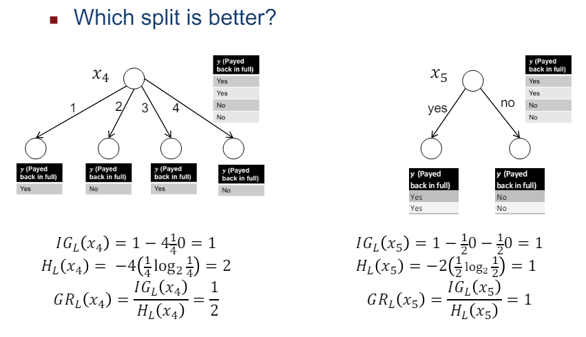

오른쪽이 더 높은 ratio를 가지는것을 볼 수 있다. 따라서 오른쪽이 더 낫다. 이렇게 각 attribute에 대한 spliting의 효과를 측정하고 비교할 수 있다. 근데.. 사실 이 ratio 없어도 그냥 대충 엔트로피만 비교해도 된다.

### ID3 Algorithm

ID3 알고리즘은 classification 문제에서 모든 attribute가 고정된 discrete 값 범위를 가지는 경우에 사용된다. 주요 아이디어는 다음과 같다.

- Choose attribute:

  클래스 레이블에 대한 정보를 가장 많이 전달하는 속성을 선택합니다. 이를 위해 정보 이득, 정보 이득 비율 또는 지니 지수를 사용할 수 있습니다.
- 데이터 분할:

  선택된 속성을 기준으로 학습 데이터를 분할합니다.
- 재귀 호출:
  
  각각의 분할에 대해 재귀적으로 알고리즘을 호출합니다.
- 속성 사용:
  
  각 분기에서 각 속성은 한 번씩만 사용됩니다. 모든 속성이 사용된 경우에는 터미널 노드를 반환합니다.

알고리즘은 다음과 같다.

```
ID3(L, X)
1. If all data in L have same class y or X={}, then
return leaf node with majority class y.
2. Else
  1. For all attributes x𝑗 ∈ X, calculate split criterion GL(x𝑗) or GRL(x𝑗).
  2. Choose attribute x𝑗 ∈ X with highest GL(x𝑗) or GRL(x𝑗).
  3. Let L𝑖 = {(x, y) ∈ L: x𝑗 = 𝑖}.
  4. Return test node with attribute x𝑗 and children ID3(L1, X ∖ x𝑗), …, ID3(L𝑘, X ∖ x𝑗).
```

한번 보도록 하자. 우리의 예시 데이터셋의 $x_1$부터 시작한다. 

|Loan|'$x_1$ (Credit report)' |$x_2$ (Employment last 3 months)|$x_3$ (Collateral > 50% loan)|$y$ (Payed back in full)|
|-|-|-|-|-|
|1|'Positive'|Yes|No|Yes|
|2|'Positive'|No|Yes|Yes|
|3|'Positive'|No|No|No|
|4|'Negative'|No|Yes|No|
|5|'Negative'|Yes|No|No|

아 모르겠다. 그냥 결과는 다음과 같다. 자세한건 3번강의 decision tree의 ID3: example을 보도록 하자.

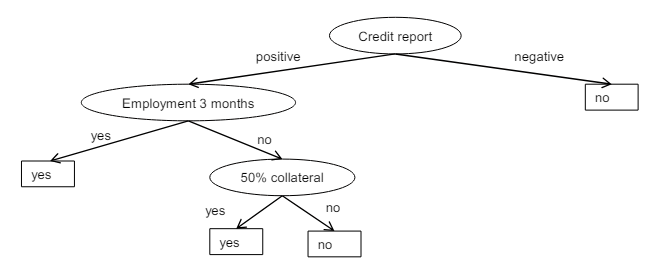


## Continuous Attributes - C4.5

ID3는 continuous attributes를 어떻게 처리할까?
 
ID3는 선택된 continuous attributes의 각 값에 대해 가지를 생성한다.  그러나 이는 continuous attributes에 대해서는 잘 작동하지 않는다.

continuous attributes을 처리하기 위한 아이디어 중 하나는 속성과 임계값의 조합을 사용하여 이진 분할을 수행하는 것이다.  예를들어, $x_j \leq v$와 같은 형태의 테스트를 사용하여 데이터를 분할할 수 있다. 이를 위해 사용되는 알고리즘이 C4.5이다.

이 뒤에 information gain을 계산해서 뭐 대충 하면된다. 근데 식은 좀 다르다.

$$G_L(x_j \leq v) = H_L(y)-p_L(x_j\leq v)\cdot H_L(y|x_j\leq v)-p_L(x_j> v)H_L(y|x_j> v)$$

여기서 각 H는 클래스 레이블에 대한 조건부 엔트로피를 나타낸다. 

문제는 continuous attributes에는 무한한 수의 가능한 값이 존재한다는 것이다. 이를 해결하기 위해 트레이닝 데이터에 있는 해당 속성의 값만을 사용하여 이진 분할을 수행할 수 있다. 이러한 방식으로 속성의 유한한 수의 값을 고려하여 이진 분할을 수행한다.

알고리즘은 다음과 같다.

```
C4.5(L)
1. If all data in L have same class y or are identical, then return leaf node with majority class y.
2. Else
    1. For all discrete attributes x𝑗 ∈ X: calculate GL(x𝑗).
    2. For all continuous attributes x𝑗 ∈ X and all values v that occur for x𝑗 in L: calculate GL(x𝑗 ≤v).
    3. If discrete attribute has highest GL(x𝑗):
        1. Let L𝑖 = {(x, y) ∈ L: x𝑗 = 𝑖}.
        2. Return test node with attribute x𝑗 and children C4.5(L1), …, C4.5(L𝑘).
    4. If continuous attribute has highest GL(x𝑗 ≤v):
        1. Let L≤ = {(x, y) ∈ L: x𝑗 ≤ v}, L> = {(x, y) ∈ L: x𝑗>v}
        2. Return test node with test x𝑗 ≤v and children C4.5(L≤), C4.5(L>).
```

다음은 워크플로우이다.

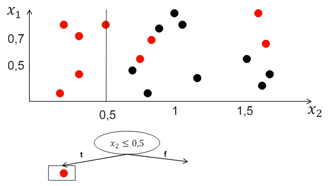

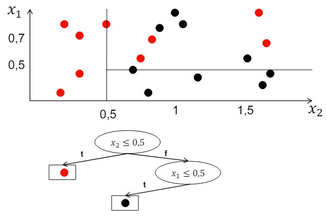


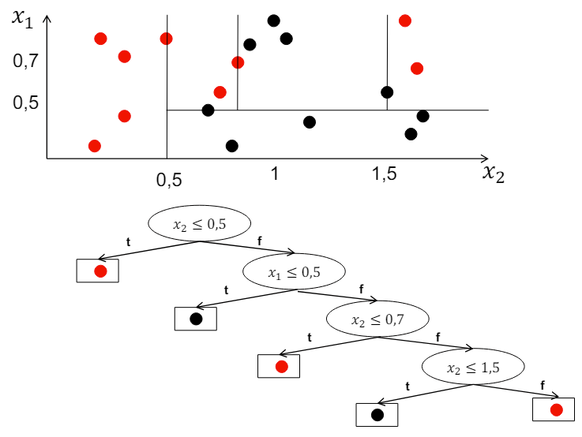

## Pruning

한국어로는 가지치기라고도 한다. 이는 디시젼트리에서 supported되는 인스턴스가 하나 또는 매우 적은 경우에 종종 좋은 분류를 제공하지 않는 터미널 노드를 제거하는 과정이다. 

이는, Pruning의 parameter인 threshold $\tau$보다 적은 수의 인스턴스를 가진 노드를 제거한다. 그리고, 제거된 노드들의 대다수 클래스를 레이블로 하는 새로운 터미널 노드를 생성한다. 

에러를 제거하기 위해서, 다음과같은 단계를 따른다.ㄴ

- 먼저 트레이닝 세트와 pruning 검증 세트로 분할한다.
- 트레이닝 세트를 사용하여 디시젼 트리를 구축한다. (알고리즘 사용)
- pruning ㄱㄱ 
  - 테스트 노드를 제거하고 대다수 클래스를 예측하는 터미널 노드로 대체할 경우, pruning세트의 오류율이 감소한다면, 해당 테스트 노드를 제거한다. 