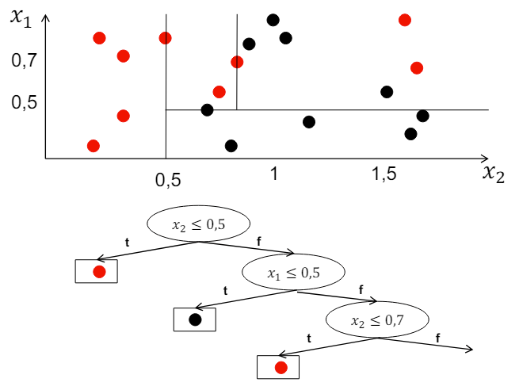
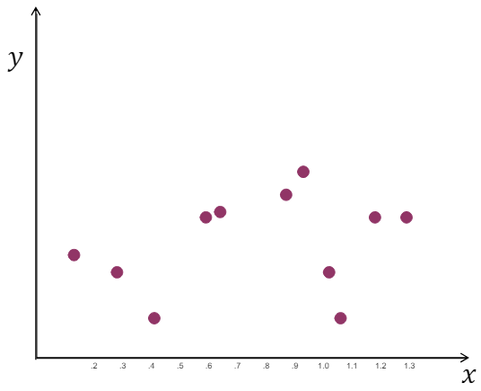

# Intelligent Data Analysis & Machine Learning

## 목차

- [Intelligent Data Analysis \& Machine Learning](#intelligent-data-analysis--machine-learning)
  - [목차](#목차)
  - [Supervised Learning](#supervised-learning)
    - [Classification](#classification)
    - [Regression](#regression)
    - [Ordinal Regression](#ordinal-regression)
    - [Metric Learning](#metric-learning)
    - [Taxonomy Classification](#taxonomy-classification)
    - [Rankings](#rankings)
    - [Recommendations](#recommendations)
    - [Taxonomy of Learning Problems: Supervised](#taxonomy-of-learning-problems-supervised)
  - [Unsupervised Learning](#unsupervised-learning)
    - [Taxonomy of Learning Problems: Unsupervised](#taxonomy-of-learning-problems-unsupervised)
  - [Reinforcement Learning](#reinforcement-learning)
    - [Learning to Control a System](#learning-to-control-a-system)
    - [Example: Advertisement placement](#example-advertisement-placement)
    - [Taxonomy of Learning Problems: Reinforcement](#taxonomy-of-learning-problems-reinforcement)
  - [Model or Parameter Space](#model-or-parameter-space)
    - [Loss Function](#loss-function)
    - [Uncertainty](#uncertainty)
    - [Regularizer](#regularizer)
    - [Optimization](#optimization)
      - [Criterion](#criterion)
      - [Problem](#problem)
      - [Regularized Empirical Risk Minimization](#regularized-empirical-risk-minimization)
    - [Evaluation of Models](#evaluation-of-models)
  - [Problem Analysis](#problem-analysis)
    - [Understanding Requirements](#understanding-requirements)
    - [Taxonomy of Learning Problems](#taxonomy-of-learning-problems)
    - [Data](#data)
      - [Data Availability](#data-availability)
      - [Data Properties](#data-properties)
      - [Data Dependencies](#data-dependencies)
    - [Example!](#example)
      - [Campaing Discovery](#campaing-discovery)
      - [Creating a regular expression for each campaign](#creating-a-regular-expression-for-each-campaign)
      - [Evaluation and Testing](#evaluation-and-testing)
  - [Data Preprocessing](#data-preprocessing)
    - [Data Integration](#data-integration)
    - [Feature Representation](#feature-representation)
    - [Attribute with Missing Values](#attribute-with-missing-values)
    - [Attribute with Erroreous Values](#attribute-with-erroreous-values)
    - [Feature Selection](#feature-selection)
  - [Decision Trees](#decision-trees)
    - [Small Decision Trees](#small-decision-trees)
    - [Decision Trees - Classification](#decision-trees---classification)
    - [ID3](#id3)
      - [Information](#information)
      - [Entropy](#entropy)
      - [Entropy of Class Labels in Training Data](#entropy-of-class-labels-in-training-data)
      - [Conditional Entropy](#conditional-entropy)
      - [Information Gain of an Attribute](#information-gain-of-an-attribute)
      - [Information Gain Ratio](#information-gain-ratio)
      - [ID3 Algorithm](#id3-algorithm)
    - [Continuous Attributes - C4.5](#continuous-attributes---c45)
    - [Pruning](#pruning)
    - [Decision Trees - Regression](#decision-trees---regression)
    - [CART](#cart)
      - [CART Algorithm](#cart-algorithm)
    - [Model Tree](#model-tree)
  - [Ensemble Learning](#ensemble-learning)
    - [Bagging](#bagging)
      - [Bootstrapping](#bootstrapping)
      - [Bagging](#bagging-1)
    - [Random Forests](#random-forests)
  - [Linear Classification Models](#linear-classification-models)
  - [Regularized Empirical Risk Minimization](#regularized-empirical-risk-minimization-1)
    - [Gradient Method](#gradient-method)
      - [Gradient Method with Line Search](#gradient-method-with-line-search)
      - [Stochastic Gradient Method](#stochastic-gradient-method)
      - [Parallel Stochastic Gradient](#parallel-stochastic-gradient)
    - [Loss Functions for Classification](#loss-functions-for-classification)
      - [Regularizers for Classification](#regularizers-for-classification)
      - [Perceptron](#perceptron)
      - [Support Vector Machine (SVM)](#support-vector-machine-svm)
  - [Multi-Class Classification](#multi-class-classification)
  - [Linear Regression Models](#linear-regression-models)
    - [Learning Regression Models](#learning-regression-models)
    - [Loss Functions for Regression](#loss-functions-for-regression)
    - [Regularizer for Regression](#regularizer-for-regression)
      - [Special Cases](#special-cases)
    - [Regularized Empirical Risk Minimization](#regularized-empirical-risk-minimization-2)
      - [솔루션 방법 (Solution Methods)](#솔루션-방법-solution-methods)
      - [Empirical Risk: Squared loss](#empirical-risk-squared-loss)
    - [Lasso Regression](#lasso-regression)
      - [최적화 문제 정의](#최적화-문제-정의)
    - [Ridge Regression](#ridge-regression)
      - [최적화 문제 정의](#최적화-문제-정의-1)
      - [해석적 해법](#해석적-해법)
  - [Model Evaluation](#model-evaluation)
    - [Loss function](#loss-function-1)
    - [Risk](#risk)
  - [**Finite set 𝑌 (classification):**](#finite-set-𝑌-classification)
    - [Estimator](#estimator)
    - [Precision and Recall](#precision-and-recall)
    - [F measures](#f-measures)
    - [ROC Analysis](#roc-analysis)
    - [Evaluation Protocols](#evaluation-protocols)
    - [Holdout Testing](#holdout-testing)
    - [K-Fold Cross Validation](#k-fold-cross-validation)
    - [Leave-One-Out Cross Validation (LOOCV)](#leave-one-out-cross-validation-loocv)
    - [Model Selection](#model-selection)
    - [Regularized Polynomial Regression](#regularized-polynomial-regression)
    - [Model Selection, Setting Hyperparameters](#model-selection-setting-hyperparameters)
      - [Triple Cross Validation](#triple-cross-validation)
      - [Nested Cross Validation](#nested-cross-validation)
  - [Summary (요약)](#summary-요약)
  - [Neural Networks](#neural-networks)
    - [Feed Forward Networks](#feed-forward-networks)
      - [Classification: Softmax layer](#classification-softmax-layer)
      - [Regression: Linear Activation](#regression-linear-activation)
      - [Internal Units: Rectified Linear Units](#internal-units-rectified-linear-units)
      - [Learning](#learning)
      - [Back propagation](#back-propagation)
    - [Regularizer](#regularizer-1)
      - [Dropout](#dropout)
    - [Initialization](#initialization)
    - [Parallel inference](#parallel-inference)
    - [convolutional layers](#convolutional-layers)
      - [pooling](#pooling)
      - [training](#training)
    - [Recurrent neural networks](#recurrent-neural-networks)


## Supervised Learning

### Classification
강의 1 초반부, 채워야함
### Regression

### Ordinal Regression

### Metric Learning

Metric Learning은 간략하게, 데이터 간의 유사도를 잘 수치화하는 거리 함수(metric function)를 학습하는 것이다. 여기에 쓰일 수 있는 metric으로는 유클리디언 다스탠스가 있겠지만, 몇가지 단점 때문에 고차원에서는 사용하기 어렵다. 유클리드 거리는 클래스 간의 상관관계를 고려하지 않고 isotropic(모든 방향에서 동일) 하다.이에 우리는 차원 간 관계를 캡처하는 non-isotropic 거리를 사용할 수 있다.

미리 정의한 Distance Metric들은 데이터와 task에 대한 고려가 적기 떄문에 우리 용도에 적합하지 않다.(Mahalanobis Distance조차도 공분산을 고려한 Linear Transformation을 한 것일 뿐이다)

이러한 이유로 데이터에 적합한 거리 함수를 기계학습으로 직접 만드는 것이 Metric learning이며, 기계학습 중에서도 딥러닝을 활용하는 경우가 Deep Metric Learning이다.

Metric Learning의 목표는 데이터로부터 Metric function을 학습하는 것이다.

이를 달성하고자 보통 우리는 original feature space를 거리 계산하기 쉬운 embedding space로 mapping하는 embedding 함수 f를 학습한다. 이때 학습된 metric function은 아래에서 보이듯이 similiarity를 나타내는 s일수도 있고, distance를 나타내는 d일수도 있다.

Metric Learning은 Classification 문제에서 새로운 클래스를 식별하는 것을 목표로 하는 방법 중 하나이다. 일반적으로 Classification problem에서는 training time에 이미 정의되고 고정된 classes가 있다.    
그러나 일부 model에서는 이전에 본 적 없는 클래스를 식별할 수 있어야 한다. 예를 들어, 생체 인식에서는 모든 개인의 얼굴 이미지, 지문 스캔, 홍채 스캔을 하나의 클래스로 볼 수 있다. 새로운 개인은 그에 따라 인식되어야 한다. 이게 무슨 말이냐면, 이제 분류를 하려고 머신러닝을 시키는데, 매일 분류 대상이 바뀐다는 것이다. 이걸 해결한느 것이 metric learning이다.

또 다른 예시로는 object classification이 있다. 여기서는 새로운, 이전에 본 적이 없는 유형의 object image가 동일한 클래스에 속한다고 인식되어야 한다.

Metric learning은 **similarity metric s(z,z')**에 기반하여 데이터 인스턴스 x $\in X$를 embedding vector z로 매핑하는 방법이다. 메트릭 러닝에서 learner에서 제공되는 input은 다음과 같다:

- Training instances x with classes y.
- $T_n = \{(x_1,y_1),\dots,(x_n,y_n)\}$

이는 위의 classification에서 이미 봤던 것과 비슷하다.

그러나 output의 경우는 조금 다르다. 모델은 input instances를 embedding vector에 assign해야 한다.  함수 $f: x\mapsto z$로 표시되는 모델로써 이 모델은 입력데이터 x를 embedding vector z로 변환하는 역할을 한다.

이에 따라 learner는 다음과 같은 output을 생성해야한다. 

- 동일한 클래스 y에 속하는 모든 인스턴스 x, x'에 대해 similarity가 유지된다:
  - $s(f_{\Theta}(\mathbf{x}),f_{\Theta}(\mathbf{x'})) > \varepsilon$
  - 즉, 같은 클래스 내의 두 vector는 서로 similar properties를 가져야 한다는 것이다. 여기서 $f_{\Theta}$는 instance의 embedding이다.
  - 예를 들면, 비슷한 두 사람을 담은 두개의 사진이 있을 때, 그 둘에 대한 두 embedding vectors의 similarity는 $\varepsilon$보다, 즉 특정 값보다 커야한다는 것이다.
- 서로다른 클래스 y, y'에 속하는 인스턴스 x, x'는 서로 다른 클래스에 속한다는 것을 보장하기 위해 dissimilarity가 유지된다:
  - $s(f_{\Theta}(\mathbf{\tilde{x}}),f_{\Theta}(\mathbf{\tilde{x}'})) < \varepsilon$
  - 위에 틸드가 들어간 x는 dissimilarity를 나타내기  위해 사용된다.

Classification과 비교해서, metric learning은 장점을 가진다.

1. 일반적인 Classification은 학습한 이미지에 대해서만, 인식이 가능하다.

     - 반면, Metric Learning은 학습하지 않은 이미지도 DB로 구축만 해둔다면 인식 가능하다.

2. 일반적인 Classification은 Feature 간의 Decision Boundary를 찾도록 학습한다.(Learn separable features)

    - 반면, Metric Learning은 비유사한 Feature들을 멀리 떨어지도록 학습한다.(Learn Large-Margin features) Feature 공간을 더 잘 사용할 수 있음
### Taxonomy Classification

마찬가지로 input은 instance x $\in X$로 주어진다.

일반적인 classification처럼 discrete value $y \in Y$가 output으로 생성되지만, 여기선 일반적인 classification과는 달리, Y의 elements에 대해 트리 기반의 ordering이 주어진다. 

이러한 방식은 예측된 값과 실제 값 사이의 거리가 멀 수록 prediction이 나빠진다는 특징을 가진다. 이는 카테고리 간의 순서가 있기 때문에 발생한다. 

Parse natural languages 혹은 Protein folding의 prediction에 사용될 수 있다.

### Rankings

Ranking에서 input은 query $q$와 아이템 리스트 $I_1,\dots,I_n$으로 주어진다. output은 sorted item list이다. 

사용되는 Training data는 $q$로 쿼링 한 이후 유저가 $I_j$를 클릭한 것이다. 클릭된 아이템은 클릭되지 않은 아이템보다 높은 순위로 나열되어야 한다.  

이는 보통 검색 엔진에서 사용된다. 사용자의 피드백을 통해 아이템들을 정렬하고, 사용자가 선택한 아이템을 클릭한 후 해당 아이템의 순위를 높이는 것이 목표이다.

### Recommendations

- Input: users, items, contextual information
- Output: 사용자가 recommandation을 얼마나 좋아할지에 대한 prediction
- Training data: ratings, sales, page views 등에 대한 정보

사용자에게 관련성이 높은 아이템을 추천하여 사용자 만족도를 향상시키고, 아이템의 판매량을 증가시키는 것이 목표이다. 트레이닝 데이터는 사용자가 아이템에 대해 평가한 등급이나 실제 구매 행동 등을 기반으로 한다. 이를 통해 사용자의 취향과 관심사를 파악하고, 이에 맞춰서 개인화된 추천을 제공한다.

### Taxonomy of Learning Problems: Supervised

Supervised Learning에서는 Training data가 모델이 예측해야하는 변수의 값을 포함한다.

- **Classification**: categorial variable
- **Regression**: continuous variable
- Ordinal regression, finite, ordered set of values
- **Rankings**: ordering of elements
- **Structured prediction**: sequence, tree, graph, …
- **Recommendation**: Item-by-user matrix

## Unsupervised Learning

Unsupervised learning에서 사용되는 Training data는, supervised 에서와는 달리, input, 즉 set of instances $x \in X$ 뿐이다. 여기에는 target variable이 없다. instances만이 주어졌기 때문에 우리가 직접 데이터의 형성 과정에 대한 추가적인 assumption을 만들어야 한다. 예를 들어 무작위 변수들의 독립성이 있겠다.

이 unsupervised learning의 목표는 데이터에서 structure의 detection이다. 예를 들어, 특정 properties를 공유하는 인스턴스들의 클러스트로의 가장 가능성있는, 그러나 데이터에서 아직은 관찰되지 않은 grouping을 찾는다. 

일반적으로 군집화(clustering), 차원 축소(dimensionality reduction), 이상치 탐지(anomaly detection) 등의 작업에 사용된다.

### Taxonomy of Learning Problems: Unsupervised

Unsupervised에서는 데이터들의 structural properties를 발견하는것을 목표로 삼는다.

- Clustering
- Unsupervised feature learning: 데이터를 잘 설명할 수 있는 attributes를 찾는다.


## Reinforcement Learning

Reinforcement Learning은 시스템을 제어하고 원하는 목표를 달성하기 위해 시행착오를 통해 학습하는 방법이다. 여기서는 시스템의 현재 **statement**를 관찰하고 행동을 선택하여 시스템에 영향을 준다. 이후 시스템의 반응을 통해 얻은 보상을 기반으로 학습이 이루어진다.

강화 학습의 목표는 주어진 환경에서 최적의 정책(policy)을 학습하는 것이다. Policy는 주어진 상태에서 취해야 할 행동을 결정하는 전략을 의미한다. Reinforcement learning은 주어진 환경에서 policy를 향상시키기 위해 exploration과 exploitation 사이에서 균형을 유지한다. 

* 환경(Environment)에 대한 사전지식이 없는 상태로 학습을 진행한다.
* 보상을 통하여 학습을 한다.
* 컴퓨터가 선택한 행동(Action)에 대한 환경의 반응에 따라 보상이 주어집니다.
* 행동의 결과로 나타나는 것이 보상이며 이것을 통하여 학습을 진행한다.
* 보상을 최대한 많이 얻도록 하는 행동을 유도하도록 학습을 진행한다.

### Learning to Control a System

Reinforcement Learning은 다음과 같은 system control을 학습하는 작업을 수행한다.

- contrl parameters를 가지는 시스템이 있다고 가정한다.
- utility function은 desired system behavior를 의미한다.
- control paramters의 변화는 시간이 지나도록 영향을 미칠 수 있다.
- learner는 desired behavior를 달성하는 모델을 찾기 위해 시스템을 실험하여야 한다. 이를 Exploration이라 한다.
- 동시에 시스템은 가능한 best state를 유지하여야 한다. 이를 Exploitation이라 한다.

Exploration과 Exploitation의 균형을 유지하는 것이 중요하다. 새로운 행동을 시도하고 새로운 정보를 얻기 위해 Exploration을 하면서, 동시에 현재의 최적 상태를 유지하기 위해 Exploitation을 해야 한다. 이를 통해 시스템을 효율적으로 제어하고, 원하는 동작을 달성할 수 있다.     
예를 들어, 자율 주행 자동차의 경우, Exploration을 통해 새로운 환경에 대한 정보를 수집하고, Exploitation을 통해 안전하게 목적지에 도착할 수 있는 최적의 경로를 선택한다.

### Example: Advertisement placement

광고를 배치하는데 있어 reinforcement learning은 사용자들의 클릭을 최대화하기 위해 광고를 배치하는 최적의 전략을 학습하는 것을 의미한다. 이 예시에서, 사용자가 어떤 광고를 클릭하는지를 학습하기 위해 learner는 실험을 해야한다. 그러나 가장 인기 있는 광고 이외의 광고를 사용할 때 학습자가 실험을 하는 경우에는 판매량이 감소할 수 있다.

### Taxonomy of Learning Problems: Reinforcement

다이나믹한 시스템을 컨트롤 하는 방법을 학습한다.


## Model or Parameter Space

Model space 혹은 parameter space $\Theta$는 다음과 같은 특징을 가진다:

- Model space는 모든 가능한 모델 또는 Classifier의 집합을 의미한다.
- Classifier는 Parameter $\theta \in \Theta$를 가진다.
- $\Theta$는 learning methode에 적합한 모델(classifier)의 집합이다.
- model space는 maschine learning을 위한 자유도(degree of freedom)중 하나이고, 흔히 사용되는 많은 spaces가 있다.
- Language Bias라고도 한다.

Linear model의 예시를 보자면 다음과 같다.

$$
y_{\theta}(\mathbf{x})=
\begin{cases}
bad,& \text{if } \sum^{m}_{j=1}x_j\theta_j \geq \theta_0\\
good, & \text{otherwise}
\end{cases}
$$

머신러닝, 혹은 딥러닝은 어떻게 보면 x에서 y로의 함수관계를 찾는 문제로 볼 수 있다. 이 때 함수의 구조와 복잡도를 정하는 것이 모델링 과정이다. 모델이 정해지면 모델의 parameter가 정해지게 되는데, 딥네트워크에서는 input과 output사이에 존재하는 모든 weight들이 모델의 parameter가 된다. model parameter는 model에 종속되어 정해진다.

모델과 모델 parameter가 정해지면 이제 남은 일은 모델 파라미터의 값을 정하는 것이다. 주어진 input(x)에 대해 원하는 output(y)이 나오도록 모델 parameter 값을 조정하는 것이 목적이다. 수집된 관측값들이 (xi; yi), i = 1, 2, ..., n라면 각각의 i에 대해 최대한 yi = fw(xi)가 되도록 parameter 값을 찾게 되는데, 이 과정이 딥러닝의 학습과정 또는 parameter 추정 과정에 해당한다.

그런데, 파라미터 추정을 위해서는 먼저 파라미터의 좋고 나쁨을 판단하는 기준이 있어야 한다. 그것이 바로 **loss function**를 정하는 일이다. 앞서 과정에서 **모델과 모델 파라미터가 정해지면 일종의 파라미터 공간(parameter space)이 생성**된다. 이 공간의 **차원은 모델 파라미터의 개수와 동일**하며 아직은 차원만 정해진 빈 공간이다. 그런데, loss function가 정해지면 이 공간에 산맥이 생기고 골짜기가 생긴다. 즉, Loss 함수에 따라서 각 파라미터 값에 대한 score(or 손실)가 매겨지기 때문에 이 score에 따라서 파라미터 공간에 높고 낮음이 생성된다.

딥러닝 학습에 있어서 마지막 선택은 주어진 산맥과 골짜기의 파라미터 공간에서 어떻게 최적의 답을 찾아갈 것인가이다. 파라미터 공간이 정해지면 이미 최적의 답도 같이 정해진다. 하지만 무한한 파라미터 공간을 미리 다 evaluation 해볼 수는 없기 때문에 현실적으로는 시작 위치에서 조금씩 해를 찾아갈 수 밖에 없다. 즉, gradient descent 방법, Gauss-Newton 방법, LM 방법 등과 같은 최적화 기법(optimizer)이 필요하다.

이상의 내용을 정리해 보면 다음과 같다.

* 학습데이터: problem의 domain을 정의
* 네트워크 구조: 함수의 복잡도와 power를 정의, 모델 파라미터를 정의
* loss 함수: 파라미터에 대한 evaluation(cost)을 정의
* optimizer: 파라미터 공간에서의 탐색 방법을 정의
  
이중 어떤 요소가 더 중요할까? optimizer는 해 자체를 바꾸지는 못하지만 optimizer에 따라 해를 잘 찾을 수도 있고 못 찾을 수도 있다. 네트워크의 구조와 복잡도를 정하는 것은 비유컨데 닭 잡는데 소 잡는 칼을 쓸 것인지 아니면 소 잡는데 닭 잡는 칼을 쓸 것인지를 정하는 문제로 볼 수 있다. 물론 적당한 규격의 칼이 좋을 것이다. 학습데이터와 loss 함수는 선택된 칼의 규격 내에서 최적의 칼이 되기 위한 기준을 잡아준다.

Learning problem은 Optimization problem으로 정의될 수 있다. 이에 따라 다음과 같은 함수들이 중요하게 다뤄진다.

- **Loss function**: 우리의 모델이 observed training data에 대해 얼마나 적합한지 측정한다.
- **Regularization function**: 모델이 우리의 사전 지식에 따라 likely(적합)한지를 측정한다.
- **Optimization criterion**: training data와 regularizer의 Losses들의 합이다.

이 Optimization problem에서 우리는 이 기준을 최소화하는 모델을 찾게된다. 

### Loss Function

Loss는 영어 단어로는 상실, 손실을 의미한다. 그리고 기계학습에서의 Loss는 어떤 학습된 모델을 실제 데이터에 적용했을 때 모델의 추정 오차로 인해 발생하는 손실을 의미한다. 즉 loss function은 target variable의 실제 값이 $y_i$일 때, 모델이 값 $y_𝜃(x_i)$을 예측한다면 이 예측이 얼마나 나쁜지를 측정한다. 얼마나 나쁜지 이지만, 대충 생각해보면 그냥 모델이 실제 값을 얼마나 잘 예측하는가를 판단하는 기준이 될 수 있다는 것이다. 이를 수식으로 표현하면 다음과 같다.

$$ℓ(y_\theta(x_i),y_i)$$

예를 들어, 학습된 모델을 $f_w(·)$, 관측 데이터를 (xi; yi)라 하자. 이 때, 입력 xi에 대한 모델 추정값과 실제 관측값 사이의 오차를 residual이라 부르며 xi에 대한 residual은 ri = yi - fw(xi)로 계산된다. Residual이 단순히 모델 추정값과 참값(관측값) 사이의 차이를 말하는 반면에, **Loss는 이 차이로 인해 발생하는 실제 계산상의 손실을 의미**한다. 사실 Loss는 우리가 마음대로 정할 수 있으며 예를 들어 residual의 절대값을 Loss로 정하거나(L(xi) = ‖yi - fw(xi)‖), residual의 제곱을 Loss로 할 수도 있다(L(xi) = ‖yi - fw(xi)‖2). 이 외에도 문제나 응용에 따라서 focal loss, triplet loss 등 다양한 형태의 Loss 함수 정의가 가능하다.

암튼, 우리는 전체 트레이닝 데이터 $T_n$의 loss를 평균화하여 이를 표현할 수 있다.

$$\text{Empirical risk} = \hat{R}(\theta) = \frac{1}{n}\sum^{n}_{i=1}ℓ(y_\theta(x_i),y_i)$$

간단히, 위의 loss를 평균낸 것이 empirical risk이다.

예를 들어서, positive class(+1)와 negative class(-1)을 가지는 binary classification problem을 생각해 볼 수 있다. 이 경우 false positive와 false negative가 똑같이 동일하게 나쁘다. 이 경우, loss는 다음과 같이 표현될 수 있다.

- Zero-One Loss:
    
    $$
    ℓ_{0/1}(y_\theta(x_i),y_i)=
    \begin{cases}
    0,& \text{if } y_\theta(x_i)=y_i\\
    1, & \text{otherwise}
    \end{cases}
    $$

이번에는 false positive와 false negative의 가치가 다른, 또 다른 예시를 살펴보자. Diagnostic classification problem에서, false negative는 overlooked illness를 의미하고, false positive는 incorrectly diagnosed를 의미한다. 이 경우, 질병을 놓치는 것이 잘못 진단한 것 보다 더 안좋다. 

이런 경우, $ℓ_{C_{FP}/C_{FN}}(y_\theta(x_i),y_i)$의 Loss는 아래와 같이 cost matrix 형태로 표현될 수 있다.

|          | $y_i = +1$ | $y_i = -1$ |
|----------|--------------|--------------|
| $y_𝜃(x_i) = +1$ |      0       |     CFP      |
| $y_𝜃(x_i) = -1$ |     CFN      |      0       |


Loss function의 종류는 Problem의 종류에 따라 다르다. 즉, 우리의 Problem이 classification problem인지 regression problem인지의 형태에 따라 loss function의 종류도 나뉜다는 것이다. 이번에는, Regression problem의 Loss function을 알아보자. 

Regression Problem에 대한 Loss function은, 우리의 Target variable이 실제의 값과 가능한 가까워야 한다는 것을 고려해야 한다. 예시로는 Quadratic Error가 있다.

- Quadratic Error

    $$ℓ_2(y_\theta(x_i),y_i) = (y_\theta(x_i)-y_i)^2$$


### Uncertainty

모델을 찾는 예시를 하나 보도록 하자.


모델의 트레이닝 데이터에 대한 empirical risk가 0인 모델들은 version space를 형성한다. 그러나 만약 데이터셋이 모순되었다면, 그 모순된 데이터셋에 대해서는 version space가 비어있게 된다. version space의 모델들은 트레이닝 셋에서는 나타나지 않는 일부 인스턴스의 예측에 대해서 차이가 존재할 수 있다.

그러나 어떤 모델이 올바른지를 결정하는 것은 어려운 문제이다. 왜냐하면 버전 공간에 속하는 모든 모델은 훈련 데이터에 대해 완벽하게 일치하며, 새로운 데이터에 대한 일반화 능력은 보장되지 않기 때문이다.

따라서, 우리가 어떤 모델을 하나 선택을 했을 때, 우리가 올바른 모델을 찾았는지 확신 할 수 없다는 문제가 생긴다. 다음과 같은 세부적인 문제가 있다.

- 데이터가 모순 혹은 잘못된 경우가 있을 수 있다
- 비슷한 loss를 가지는 모델이 여러개이다
- 올바른 모델이 실제로 존재하지 않을 수 있다

이 부분은 엄청 방대한 내용인데, 강의에서는 별로 다루지 않으니 넘어가도록 하겠다.

### Regularizer

Regularizer(Regularization)란 머신 러닝에서 Overfitting을 방지하기 위해 사용되는 기법이다. Overfitting은 모델이 학습 데이터에 지나치게 잘 맞춰져 있어 새로운 데이터에 대한 일반화 능력이 떨어지는 현상을 말한다. Regularizer는 모델의 복잡도를 제한하여 이러한 문제를 완화한다. 가장 일반적인 Regularizer 기법으로는 L1 Regularizer(Lasso)와 L2 Regularizer(Ridge)가 있다.
Regularizer(Regularization)란 머신 러닝에서 Overfitting을 방지하기 위해 사용되는 기법이다. Overfitting은 모델이 학습 데이터에 지나치게 잘 맞춰져 있어 새로운 데이터에 대한 일반화 능력이 떨어지는 현상을 말한다. Regularizer는 모델의 복잡도를 제한하여 이러한 문제를 완화한다. 가장 일반적인 Regularizer 기법으로는 L1 Regularizer(Lasso)와 L2 Regularizer(Ridge)가 있다.

L1 Regularizer는 모델의 weight에 대한 절대값의 합을 loss function에 추가하며, 이는 모델의 일부 weight를 정확히 0으로 만들어 특성 선택의 효과를 낸다. 반면, L2 Regularizer는 weight의 제곱의 합을 loss function에 추가하여, 모든 weight가 0에 가까워지도록 만들지만 정확히 0이 되지는 않는다. 이러한 Regularizer 기법들은 모델이 데이터의 중요한 패턴을 학습하면서도 과도하게 복잡해지는 것을 방지한다.

여기서 Regularizer는 모델이 사전 확률 적으로 얼마나 가능성 있는지를 표현한다. 이는 모델이 얼마나 적합한지를 나타내는 loss function과는 별개다. 

Regularizer $\Omega(\theta)$는 모델 𝜃이 사전 확률적으로 어떤지에 대한 가정을 나타낸다. 
또한 $\Omega$는 트레이닝 데이터와 독립적이며, 모델의 Regularizer가 높을수록 해당 모델의 가능성은 낮아지게 된다. 일반적으로, 이러한 가정은 더 적은 수의 attributes가 적절한 모델을  나타내기에 충분하다는 것을 나타낸다.

$L_0$, $L_1$, $L_2$ Regularization 등이 있다.


### Optimization

#### Criterion

Optimization Criterion은 average loss와 regularizer 사이의 균형을 맞추는 것으로 정의된다. 따라서, 이를 Regularized Empirical Risk라 한다.

- Regularized Empirical Risk

    $$\frac{1}{n}\sum^{n}_{i=1}ℓ(y_\theta(x_i),y_i)+\lambda\Omega(\theta)$$

여기서 parameter $\lambda>0$은 Loss와 Regularizer사이의 trade 비율을 조절한다. $\lambda$가 클수록 Regularizer의 중요성이 커지고, 작을수록 Loss의 중요성이 커진다. 

#### Problem

이 Optimization criterion(Regularized Empirical Risk)을 사용하는 이유가 있을까?

Regularized Empirical Risk를 criterion으로 사용하면 가장 가능성이 높은(posteriori) 모델(MAP-Model)을 얻을 수 있다. 또한 $|\theta|$에 따른 future data에 대한 error의 upperbound를 더 작게 설정할 수 있다. 이를 (SRM,Structural risk minimization)이라 할 수 있겠다. 

Regularization 없이 learning하는것은 _ill-posed_ Problem이다. 즉, 잘 정의되지 않은 문제라는 것이다. 이는 고유한 해가 없거나 데이터의 미세한 변경에 강력하게 영향을 받을 수 있다. 

Parameter $\lambda$는 어떻게 설정해야할까? 일단 evaluation을 보고, 그 뒤에 알아보자.

#### Regularized Empirical Risk Minimization


### Evaluation of Models


Evaluation은 미래에 모델이 얼마나 잘 작동할 것인가를 예측하는 것이다. Model은 보통 실제 값과 모델에 의해 예측된 값을 비교하여 두 값의 차이 혹은 오차를 구하는 방식으로 진행된다. 이 Evaluation과정은 Overfitting을 방지하고 최적의 모델을 찾기 위해 실시한다. 이는 결과변수(답안지)가 있어야 잘한건지 아닌지 확인할 수 있기 때문에, 지도학습에서만 사용할 수 있다.

Evaluation은 모델링의 목적, 혹은 target variable의 유형에 따라 다른 평가지표를 사용한다. 

Training과 validation 값이 거의 일치해야 좋은 모델이다. 만약 Training 데이터로는 성능이 좋게 나왔는데, validation 데이터를 사용했을 때 성능이 확연하게 떨어진다면 모델이 overfitting상태라고 볼 수 있다. 

Future instances는 알려지지 않은 어떤 확률 분포 $p(x,y)$에 따라 생성된다. 여기서 Risk는 분포 $p(x,y)$에 따른 예상 Loss를 의미하며, 수식으로 다음과 같이 나타낼 수 있다.

$$R(\theta) = \sum_{y}\intℓ((y_\theta(x_i),y))p(x,y)dx$$

트레이닝 데이터에 대한  Empirical Risk는 Risk를 추정하는데 유용하지 않다. version space의 모든 모델이 트레이닝 데이터에 대해 0의  Empirical Risk를 가지기 때문이다. 또한 Classifier는 각 트레이닝 instance를 단순히 테이블에 저장하고 쿼리될 때 저장된 레이블을 재생산하여 트레이닝 데이터에 대한 Empirical Risk를 0으로 만들 수 있다. 따라서 트레이닝 데이터에 대한 Empirical Risk는 Risk에 대한 매우 매우 낙관적인 estimator이다.

따라서, Risk는 Training에 사용되지 않은 instance를 사용하여 평가된다. 

위에 이어서, Parameter $\lambda$는 어떻게 설정해야할까?

1. avaliable data를 training data와 test data로 나눈다.
2. 가능한 $\lambda$ 값에 대해 다음을 반복한다(람다값 다 넣어보고 실제로 돌려봄)
   1. 트레이닝 데이터를 이용해서 모델을 찾기위한 훈련
   2. 테스트 데이터로 테스트
3. 이제 Loss가 최소화되는 값을 가진 $\lambda$를 선택한다.
4. 모든 데이터를 사용하여 최종 모델을 훈련한다.

## Problem Analysis

Problem Analysis을 위한 engineering approach는 다음과 같이 진행된다.

1. Understanding requirements
   - Application 목표 및 품질 지표를 이해한다.
   - 데이터와 데이터를 생성하는 프로세스의 properties를 이해한다
   - Application-specific requirment를 파악한다
   - 사용하는 방법의 기본 가정이 문제의 요구 사항과 일치하는지 확인한다
2. Developing solution
   - 문제 해결을 위한 알고리즘 또는 방법을 개발한다
   - 데이터를 처리하고 분석하는 방법을 개발한다
   - 문제 해결을 위한 적절한 모델 또는 시스템을 설계한다


### Understanding Requirements

여기서 알아보려는것은 방법의 첫번째, 요구사항을 파악하는 것이다.

requirements를 파악하는것은 각 industries의 culture에 따라 다르다. 예를 들어, 자동차 산업에서는 종종 10 ~ 20 페이지에 이르는 소프트웨어 요구 사항이 일반적이다. 그러나 이는 전체적으로는 일반적이지 않다.

더 일반적인 경우에는, 사용자 또는 고객이 좋은 솔루션의 특성에 대한 아이디어를 가지고 있다. 정확한 문제 설정과 요구 사항은 인터뷰를 통해 결정되어야 한다.

다음의 이메일 서비스 제공업체의 예시를 통해 더 자세히 알아보자.

**Problem**: 이메일 스팸이 하드 드라이브와 처리 용량을 고갈시킴.

서버 및 저장소는 따라서 거대한 cost factor이다.

**Legal requierments**: 딜리버리를 위해 수락된 메시지는 삭제되지 않아야 한다. 봇넷에 의해 배포된 개별 메일 캠페인은 엄청난 데이터 양을 생성한다.

관리자는 대규모 캠페인을 인지하고 해당 캠페인과 일치하는 정규 표현식을 작성한다.    
그런다음 이메일 서버는 이러한 정규 표현식과 일치하는 메시지를 수락하지 않는다.

여기서 추가적인 **Problem**: 캠페인은 제때 인지되어야 하며 관리자가 조치를 취해야 한다. 항상!

legitimate messages가 도착하지 않으면, 콜센터로 불만전화가 폭주한다.

이러한 문제를 해결하기 위해, 캠페인을 신속하게 인지하고 관리자가 조치를 취할 수 있는 자동화된 시스템이 필요한 것이다. 또한, 합법적인 메시지가 차단되지 않도록 신중한 처리가 필요하다.  시스템은 신속한 대응 및 관리자 행동을 지원하고, 합법적인 메시지의 배달을 보장하며, 사용자들의 불만을 최소화할 수 있어야 한다.

이 문제를 해결하기 위해 고려해야할 사항은 다음과 같다.

- 자동화된 솔루션에 대한 요구사항이 있는가?
- Evalutaion metric은 어떻게?
- Learning problem으로 모델링을 해야하나?
- 그렇다면 learning problem의 타입은?
- model space는?
- loss function은? regularizer는?

어휴

이쯤에서 learning problem의 taxonomy에 대해 다시 알아보자.

### Taxonomy of Learning Problems

- **Supervised Learning**
  - 훈련 데이터에는 모델이 예측해야 하는 변수의 값이 포함된다.
  - **Classification**: 범주형 변수를 예측한다.
  * **Regression**: 연속 변수를 예측한다.
  * **Ordinal Regression**: 유한하고 순서가 있는 값 집합을 예측한다.
  * **Rankings**: 요소들의 순서를 예측한다.
  * **Structured Prediction**: 시퀀스, 트리, 그래프 등의 구조를 예측한다.
  * **Recommendation**: 항목별 사용자 행렬을 예측한다.
- **Unsupervised Learning**
  - 데이터의 구조적 특성을 발견한다.
  - **Clustering**: 비슷한 특성을 가진 데이터를 그룹화한다.
  * **Unsupervised Feature Learning**: 데이터를 잘 설명할 수 있는 속성을 찾다.
  * **Anomaly Detection**: 이상한 데이터 포인트를 식별한다.
- **Control / Reinforcement Learning**
  - dynamical system을 control하는 것을 학습한다.
  - 에이전트가 환경과 상호 작용하며 보상을 최적화하는 방법을 학습한다.
- 기타 모델:
  * **Semi-supervised Learning**: 일부 레이블이 있는 데이터와 일부 레이블이 없는 데이터를 사용하여 모델을 훈련한다.
  * **Supervised Clustering**: 레이블이 있는 데이터를 사용하여 클러스터링 모델을 훈련한다.
  * 그 외의 다양한 모델들이 존재한다.

### Data

이러한 Learning problem에 사용되는 데이터 또한 중요하다.

#### Data Availability

Batch learning의 경우, 모든 데이터를 사용할 수 있다. 전체 데이터셋을 사용할 수 있으므로 모델을 **한번에** 훈련시킨다. 그러나 Online learning의 경우, 데이터가 하나씩 들어오기 때문에, 점진적으로 모델을 훈련시킨다. Online learning은 데이터가 실시간으로 생성되는 경우에 유용하다.

이것 말고도, 다음과 같은 요소들이 중요하다.

* Number of data
  * 데이터가 매우 적은 경우
  * 데이터를 저장하고 처리하는 데 분산 시스템이 필요할 정도로 데이터가 많은 경우

* Number of attributes
  * attributes가 너무 적은 경우
  * attributes가 너무 많은 경우.
  * attributes가 sparse한 경우: 대부분의 항목이 0인 희소한 데이터를 다루는 경우
* Quality of data
  * 결측값이 있는 경우
  * 오류값이 있는 경우
  
#### Data Properties

데이터의 Representational Properties또한 중요하다. 

- 데이터의 epresentational Properties 중 첫번째는 클래스의 ratio이다. 클래스의 ratio가 균형적인지, 특정 클래스가 드물게 나타나는지, 혹은 특정 클래스가 다른것보다 훨씬 많아서 representative한지가 되겠다.

- 또한 Marginal distribution가 중요하다. 데이터의 Marginal distribution이 application의 실행시간의 분포와 동일한지 봐야한다. 만약 아니라면, 변량 이동(Covariate Shift)을 고려하여 학습하고 모델을 조정해야 한다. 즉, 입력 데이터의 분포가 학습 데이터와 테스트 데이터 사이에 차이가 있는 경우에 대비한 학습 방법을 적용해야 한다.

- 또한, target attribute의 값이 실제 타겟 분포에서 나오는지, 아니면 auxiliary distribution에서 나오는지 알아야 한다. 여기서 auxiliary distribution은 실험실 데이터 혹은 시뮬레이션 데이터를 의미한다.

- 데이터가 신선한지, 즉 최신 데이터인지 또한 알아야 한다. process가 바뀌었을 수도 있고, 시간에 따라 데이터가 변하는 경우도 있다.

- 데이터 소스가 단일인지 여러 소스가 있는지도 알아야 한다.

- 데이터의 신뢰성, 품질, 일관성 또한 당연히 중요하다. 

- 데이터의 Availability도 중요하다. 접근하지 못하는 데이터면 의미가 없다. 또한 데이터가 데이터 세트로 fixed하게 제공되는지, 아니면 데이터 수집을 위한 프로토콜을 따로 마련해야하는지 알아야 한다.

#### Data Dependencies


### Example!

다시 위의 이메일 서비스 제공자 예시로 돌아가보자. 

이 예시는 두 단계의 Learning problem으로 모델링 될 수 있다.

#### Campaing Discovery


봇넷에 의해 전달되는 대규모 캠페인을 발견하는 문제이다. 이 단계에서는 이메일 데이터에서 대규모 캠페인을 식별하기 위한 기계 학습 모델을 구축한다. supervised 또는 unsupervised learning methode를 사용하여 캠페인을 탐지할 수 있다.

- 일단 이 예시에서는 Unsupervised learning의 cluster analysis approach를 사용할 수 있겠다.     
- 또한 데이터가 실시간이고 계속 추가될 수 있기 때문에, 데이터 스트림에서 Online processing할 수 있다.    
- Optimizing criterium으로써는, 어떻게 데이터를 clustering을 하는게 적절한지를 찾아야겠다.
- Instance의 경우, 이메일의 header attributes와 word-occurrance attributes를 사용할 수 있다.

이제 이렇게 만들어진 모델을 evaluation해야한다. 

두가지 방법을 이용해 평가한다.

- Offline evaluation
  - 제한된 시간동안 발생한 모든 이메일을 저장하고, 수동으로 클러스터링 한다.
  - 수동 생성 클러스터와 자동 생성 클러스터 간의 일치도를 측정한다
  - FP 및 FN 비율과 같은 metric을 사용하여 성능을 평가한다.
- Online evaluation
  - 실제 정기 비즈니스 시간에 클러스터링을 해본다.
  - 캠페인 차단을 담당하는 관리자에게 표시한다.
  - 관리자의 피드백을 수렴하여 모델이 괜찮은지, 실제로 여러 캠페인을 처리할 수 있는지 등을 평가한다.
  - 캠페인을 차단해도 괜찮은지 여부를 결정하기 위해 관리자의 피드백을 사용할 수 있다.


#### Creating a regular expression for each campaign


캠페인을 식별하기 위한 정확한 패턴을 정의하는 데 사용되는 정규 표현식을 자동으로 생성하는 기계 학습 모델을 구축한다. 캠페인마다 다르게.

Regular expression을 찾는 방법을 제대로 알아보자.

- Instance x는 set of emails(sets of strings)가 될것이다.
- Target attribute y는 regular expression이다.
- 트레이닝 데이터 {(xi,yi)}는 sets of strings와 그에 상응하는, 어드민이 작성한 regular expression이 될 것이다. 
- Loss function $ℓ(y_\theta(x_i),y)$은 서로다른 expression들이 얼마나 다른지의 측정값일 것이다. 이는 syntax tree의 non-identical nodes의 proportion으로 찾을 수 있다.
- Regularization은 L2이다. 

이 경우, 트레이닝 데이터가 **올바른** regular expression을 포함하므로, **supervised learning**이다.

또한 target variable이 regular expression이기 때문에, 즉, **discrete, structured**이고, 따라서 **structured prediction**이다. structured output spaces를 학습하는 것이다. 

#### Evaluation and Testing

온라인 평가의 경우, 발견된 캠페인 및 생성된 정규 표현식을 관리자에게 제시하고, 관리자가 이 정보를 사용하여 캠페인을 차단할지 여부를 결정한다.

생성된 expression의 acceptance, acceptance+ editing, rejection에 대한 rates를 측정한다. 이는 평가의 척도로 사용된다.

불만신고 비율을 측정하여 생성된 expression이 실제로 이메일 서비스의 품질을 향상시키는지 여부를 확인할 수 있다.


## Data Preprocessing

데이터 프리프로세싱은 수집한 데이터를 분석하고 머신러닝에 사용할 형태로 변환시키는 단계이다. 즉, 기존의 데이터를 머신러닝 알고리즘에 알맞은 데이터로 바꾸는 과정이다. 크롤링이나 DB 데이터를 통해 수집된 데이터를 머신러닝에 학습시키기 위해서는 데이터 프리프로세싱 과정이 필요하다. 

데이터 전처리는 크게 3가지로 나뉜다. 
1. 머신러닝의 입력 형태로 데이터 변환(Feature engineering)
2. 결측값 및 이상치를 처리하여 데이터 정제 (Data Cleaning)
3. 트레이닝용 및 평가용 데이터 분리


### Data Integration

Data integration은 여러 데이터 소스를 일관되게 통합하는 프로세스를 의미한다. 여러군데에서 긁어온 데이터를 잘 사용하려면 이 통합과정이 필요하다. 

데이터 소스가 여러개인 경우, 이 데이터를 데이터 웨어하우스와 같은 단일 저장소에 일관되게 저장한다. 또한 가진 데이터들이 서로다른 형식을 가지고 있다면, 이 데이터의 형식을 통합하여 통일된 형식으로 변환해야한다. 

서로 다른 데이터들은 서로다른 attributes를 가지는 경우도 있지만, 같은 attiributes를 가지는 경우도 있다. 이렇게 관련된 attributes를 식별하여 통합해주는것이 중요하다. 

여러 소스에서 긁어온 데이터들 사이에는 충돌이 발생할 수 있다. 대표적으로 단위 충돌이 있다. 이를 일관되게 변경해야한다.

가끔 중복된 데이터가 있을 수 있다. 자료 크기가 방대해지면 이 중복 데이터는 큰 문제가 될 수 있기 때문에 적절하게 제거해줘야 한다.

### Feature Representation

위에서 말했듯, 우리가 가진 모델의 구조에 따라 attribute를 변환해야한다. 알고리즘에 맞는 데이터로 변환시키는 단계이다. 

예를 들어, attribute와 model parameter의 inner product를 계산하는 linear model이 있다고 해보자. 이 경우, 모든 attributes는 numeric이여야 하며, 큰 attribute values는 큰 innerproduct를 계산한다. categorical data는 모두 numerical로 변환되어야 하며, attribute에는 order가 없을 것이다.    
또한 텍스트는 TF- or TFIDF- representation으로 변환될 수 있을 것이다. 

텍스트 표현을 위한 TF- or TFIDF- representation는 뭘까? 자세히 알아보도록 하자. 

TF- or TFIDF- representation는 정보 검색과 텍스트 마이닝에서 이용하는 weight로, 여러 문서로 이루어진 문서군이 있을 때 어떤 단어가 특정 문서 내에서 얼마나 중요한 것인지를 나타내는 통계적 수치이다. 문서의 핵심어를 추출하거나, 검색 엔진에서 검색 결과의 순위를 결정하거나, 문서들 사이의 비슷한 정도를 구하는 등의 용도로 사용할 수 있다.

**이중 TF-IDF는 두 요소의 곱으로 계산되게 되는데, TF는 Term Frequency, 즉 단어 빈도, IDF는 Inverse Document Frequency, 즉 역문서 빈도를 의미한다.**

TF는 특정 문서 내에서 특정 단어가 얼마나 자주 나타나는지를 측정한 값이며 일반적으로 문서내에서 자주 나타나는 단어일수록 해당 단어의 TF값이 높으며, TF는 다음과 같이 계산된다.

    TF(d, w) = (특정 단어 w의 문서 d 내 등장 횟수) / (해당 문서 d 내 총 단어 수)

IDF는 특정 단어가 다른 문서에서 얼마나 자주 나타나는지를 측정한 값이며, IDF값은 특정 단어의 중요성을 반영하며, 다른 문서에서 자주 나타나는 단어일수록 IDF값은 낮으면 다음과 같이 계산된다.

    IDF(w) = log(총 문서 수 / 특정 단어 w를 포함한 문서 수)

이때, 로그 함수를 사용하여 IDF 값을 조절하고, 특정 단어가 전체 문서에 나타나지 않을 때 분모가 0이 되는 것을 방지한다.

TF-IDF는 TF와 IDF를 곱하여 계산된다.

    TF-IDF(w) = TF(w) * IDF(w)  

이 TFIDF 값을 벡터로 표현할 수 있다. 

$$ TFIDF(x) = \frac{1}{|x|}
\begin{pmatrix} 
TF(\text{term}_1) \cdot IDF(\text{term}_1)\\
\vdots \\
TF(\text{term}_n) \cdot IDF(\text{term}_n)
\end{pmatrix}$$


텍스트를 나타내는 또 다른 표현 방법은 N-Gram vector이다. TF-IDF representation에서는 term의 순서에 대한 정보가 손실된다. 그러나 N-gram은 연속적인 terms의 k-tuple마다 하나의 attribute를 만든다. 이는 모든 $k \leq N$에 대해 적용된다.

또한 N-Gram feature는 다양한 범위값을 가질 수 있다. 절대값이 큰 값은 decision function에 더 큰영향을 미친다. 때로는 이러한 범위를 Regularizer 할수도 있다. 범위를 Regularizer하면 해당 weight에 더 강한 적용될 수 있다. 

normalization의 방법에는 여러가지가 있다.

- Min/Max normalization
  - 각 feature의 값을 최소값과 최대값 사이의 범위로 변환해서, 데이터를 0과 1 사이의 값으로 변환하여 일반화시킨다.

$$x^{new} = \frac{x-x_{min}}{x_{max}-x_{min}}(x^{new}_{max}-x^{new}_{min})+x^{new}_{min}$$

- Z-Score normalization
  - 각 특성의 값을 평균이 0이고 표준 편차가 1인 표준 정규 분포로 변환하고, 데이터 분포를 중심에 맞추고 스케일링한다.

$$x^{new}=\frac{x-\mu_{x}}{\sigma_x}$$

- Decimal Scailing
  - 각 특성의 값을 고정된 자릿수로 스케일링한다. 반적으로 0과 1 사이의 범위로 스케일링된다.

$$x^{new}=|x|\cdot 1-^a$$

$$a= max\{i \in \mathbb{Z}| |x|\cdot 10^i < 1\}$$

- Logarithmic Scaling
  - 값의 분포가 한쪽으로 치우쳐져있는 경우에 유용하고, 값에 로그를 취한다.

$$x^{new}= \log_a x$$


Feature representation은 모델이 학습하는데 중요한 역할을 한다. 때로는 모델이 찾지 못하는 복잡한 관계를 포함하는 특성을 직접 구성하는 것이 도움이 될 수 있다.

Feature construction에는 두가지가 있다. 

- Combinations of elementary features: 기본 features을 조합해서 새로운 feature을 만든다. 

$$(x_i,x_j) \to (x_j,\sqrt{x_ix_j},x_i+x_j)$$

- Mapping of elementary features: 본 특성들을 변환하여 새로운 특성을 만든다. 

$$x_i \to (x_i,\log x_i, x_{i}^{2})$$

### Attribute with Missing Values

Missing value가 발생하는 이유는 다양하다. 뭐 무작위로 누락이 될수도 있고, 어떤 값들은 systematically(체계적으로) 누락이된 경우도 있을 수 있다. 이 경우는 특정 클래스나 범주에 속하는 경우 누락된 값이 더 많은 수 있다.

또한 위의 Data integration과정에서 값의 불일치로 인해 값이 삭제되었을 수도 있다. 혹은, 개인정보 보호를 위해 데이터가 삭제될수도 있다.

이런 Missing value를 어떻게 처리할까?

먼저, 결측값이 적은 경우엔 그냥 인스턴스를 삭제해버릴수도 있다. 아니면 attribute가 있는지, 없는지를 나타내는 새로운 binary attribute를 도입할수도 있다. 아니면 그냥 결측치를 추정해서 때려 맞출수도 있다. 아니면 알고리즘이 누락된 값을 알아서 처리할 수 있는 경우 그냥 뭐 냅둘 수도 있다.

### Attribute with Erroreous Values

값이 잘못된 경우, 이를 먼저 식별할 수 있어야 한다. 그 뒤 처리한다.

식별 방법에는 Binning과 Clustering이 있다.

- Binning은 구간화라고도 하며, 동일한 간격으로 구간화하여 구간에 속하는 값들을 나눕니다. 이때 적은 인스턴스를 가진 구간은 이상값일 수 있다.
- Clustering을 통해 한 개 이상의 인스턴스를 가진 클러스터를 이상값으로 간주할 수 있다.
- Active learning/labeling: 데이터와 모델 간의 불일치로 인한 일관성 문제를 해결하기 위해 인간에게 올바른 레이블을 요청한다.

이렇게 식별된 오류값은 regression, 혹은 average를 이동하는 등 다듬거나, 뭐 삭제할수도 있다.

### Feature Selection

Feature Selection은 다수의 특징 중에서 중요한 특징을 선택하는 것을 말한다. 이를 통해 시스템을 운영하는 비용을 줄일 수 있으며, 변수를 적게 사용할 경우 시스템의 속도가 빨라지는 등 이점을 가질 수 있다. 데이터에 대한 해석력을 높여주며, 차원 축소를 통해 다중공성성 문제를 해결할 수도 있다. 또 간단한 모델로 예측력을 향상할 수 있어 bias나 overfitting 방지에도 효과적이다.

pearson, spearman correlation등을 이용해 계산한 상관계수를 척도로 사용할 수 있고, 평가는 n-fold 교차검증 등을 통해 feature selection을 평가할 수 있다. 

선형 모델에 대한 feature selection을 할때는 가장 작은 weight를 가진 특성을 제거하는 방법을 사용한다.

## Decision Trees

결정 트리(Decision Tree, 의사결정트리, 의사결정나무라고도 함)는 분류(Classification)와 회귀(Regression) 모두 가능한 지도 학습 모델 중 하나이다. Decision Tree는 일련의 필터 과정 또는 스무고개라고 생각하면 된다. 이 디시젼 트리가 사용되는 많은 이유가 있지만, 그중에 첫번째는 해석의 유용성이다. 분류를 함과 동시에 그 이유를 논리적으로 설명할 수 있고, 인간이 쉽게 이해할 수 있기 때문에 해석하기가 쉽다. 

또한 디시젼 트리는 yes or no라는 간단한 절차이기 때문에, 프로세스가 빠르다. 특히, 이미지 처리에 주로 사용될 수 있다. 이런 특성 덕분에, 디시젼 트리는 간단하고 효율적이며, 확장또한 용이하다. 

디시젼 트리는 numerical과 categorical 변수에 대한 사전 처리가 필요하지 않으며, regression 혹은 classification에 모두 사용할 수 있다.


이 디시젼 트리는 Test node, Terminal node와 같은 특징을 가진다. 

- Test Nodes가 Discrete Attributes를 처리할때엔, 노드는 attribute를 포함하고, branch는 해당 attribute의 값들로 레이블링된다.

- Test nodes가 continuous attributes를 처리할땐, 노드는 "<"와 같은 비교를 포함하고, 가지는 yes 또는 no로 레이블링된다.

- Terminal nodes는 target attribute의 값이 포함된다. 

이 디시젼 트리는 decision rules로 표현될 수 있다. 각 terminal node는 rule에 해당한다.

예를 들어, "Rejected ← positive credit report ∧ employment duration ≤ 3 months ∧ unemployed." 는 뒤 조건을 충족하면 대출이 거부된다는 것을 의미한다. 

이런 디시젼 트리는, 다음과 같이 처리된다.

1. **Recursively, branch를 따라 내려감.** 
   - 각 노드를 통과하는 과정은 재귀적으로 수행된다.
2. **각 테스트 노드에서 테스트를 수행하고 적절한 가지를 선택**
3. **터미널 노드에서 값 반환**

### Small Decision Trees

다음과 같은 데이터가 주어졌다고 해보자.

|Loan|Credit report |Employment last 3 months|Collateral > 50% loan|Payed back in full|
|-|-|-|-|-|
|1|Positive|Yes|No|Yes|
|2|Positive|No|Yes|Yes|
|3|Positive|No|No|No|
|4|Negative|No|Yes|No|
|5|Negative|Yes|No|No|

디시젼 트리를 learning하는 방법은 주어진 트레이닝 데이터에 대해 올바른 클래스를 예측하는 트리를 찾는것이다. 가장 간단한 방법은 단순히 트레이닝 데이터를 재현하는 트리를 만드는 것이다. 이는 각각의 트레이닝 데이터 인스턴스에 대해 하나의 terminal node를 만드는 것이다. 이 터미널 노드에는 해당 인스턴스의 클래스가 포함된다. 


이 방법은 학습 데이터에 대해서는 완벽하게 작동하지만, 실제 데이터에서는 잘 일반화되지 않을 수 있다. 이러한 모델은 overfitting되었다고 할 수 있다. overfitting은 트레이닝 데이터에 대해서는 매우 정확하게 작동하지만, 새로운 데이터에 대해서는 일반화하기 어려울 수 있다.

따라서, 보다 일반화된 의사 결정 트리를 찾기 위해서는 overfitting을 피하기 위한 다양한 기법들을 적용해야 한다. 이러한 기법들에는 가지치기(pruning), 트리의 깊이 제한(depth limitation), 또는 정보 이득(Information Gain)을 최대화하는 특성 선택 등이 있다.

이런 trivial way말고도, 더 우아한 방법은 트레이닝 데이터와 일치하는 트리 중 **가능한한 가장 적은 노드**를 가지는 트리를 선택하는 것이다. 트리가 작을수록 각각의 분기점이 더 명확하게 나타나므로 결정 프로세스를 이해하기가 더 쉽다. 또한 트리가 작으면, 터미널 노드에 더 많은 트레이닝 인스턴스가 포함될 수 있다. 더 많은 인스턴스가 포함될수록 해당 클래스에 대한 통계적 신뢰도가 향상된다. 

smallest Tree를 만들기 위해, 알아야 할것들이 있다. 

- 기능적으로 다른 디시젼 트리가 몇개가 있을까?
  - m개의 이진 attribute와 두개의 클래스가 있다고 해보자.
  - 트리는 테스트 노드의 m개 레이어가 있으며, 즉, $2^m-1$개의 테스트 노드가 있다.
  - 따라서, $2^{(2^m)}$개의 터미널에 대한 클래스 할당이 있다.
- 그렇다면 이런 smallest tree를 찾는데 드는 시간은?
  - m개의 attribute가 있다고 할때, $2^m-1$개의 테스트 노드가 있으니, $O((m+1)^{2^m-1})$의 시간이 든다.. 존나김
  - 또, 터미널 노드에 클래스 레이블을 할당하는데 $O(2^{2^m})$의 시간이 든다.

---

### Decision Trees - Classification

디시젼트리에서 classification은 다음과 같은 과정으로 이루어진다.

1. Input: $x \in X$,  각각의 인스턴스 x는 attributes vector로 표현되며, feature vector라고도 불린다. 

2. Output: classification의 결과로써, 각각의 인스턴스 x에 해당하는 클래스 y가 결정된다. 클래스는 유한한 집합 Y에 속한다. 예를들어, {accepted, rejected}나 {spam, not spam}과 같은 클래스들이 있다. 이는 target attribute라고도 불린다. 

classifier를 learning시키기 위해서는, 트레이닝데이터가 필요한데, 이 데이터는 n개의 인스턴스로 이루어져있다. 각각의 인스턴스는 위에 언급한대로 이루어져 있다.

학습에 대한 출력으로, 입력 space 공간 X에서 클래스 space Y로의 매핑을 수행한다. 즉, 학습 결과는 함수 $f: X \to Y$이다.


### ID3

이런 smallest decision tree를 찾는 그리디 알고리즘을 알아보자. 

이 그리디 알고리즘은 Top-Down approach를 사용한다. ID3이라고도 하며, 디시젼 트리를 구축하기 위한 분류 알고리즘을 사용한다. 여기서는 optimal attribute를 선택하기 위해 엔트로피를 사용한다.

```
1. ID3(L)
   1. If all data in L have same class y, then return leaf
   node with class y.
   2. Else
      1. Choose attribute x𝑗 that separates L into subsets
      L1, … , L𝑘 with most homogenous class distributions.
      2. Let L𝑖 = {(x, y) ∈ L: x𝑗 = 𝑖}.
      3. Return test node with attribute x𝑗 and children
      ID3(L1,), …, ID3(L𝑘).
```

1. 만약 L의 모든 데이터가 동일한 클래스 y를 가지고 있다면, 해당 클래스를 가지는 터미널 노드를 반환한다.
2. 그렇지 않다면, 
   1. L을 가장 균일한 클래스 분포를 갖도록 분리할 수 있는 특성 $x_j$를 선택한다.
   2. L을 $x_j$에 대한 값 $i$에 따라 $k$개의 하위집합 $L_1,\dots,L_k$로 분할한다. 각각의 하위집합 $L_i$는 $x_j=i$를 만족하는 데이터들의 집합이다.
   3. $L_i$에 대한 재귀적 호출을 통해 각각의 하위 집합에 대한 디시젼트리를 생성한다.
   4. 결과 반환

#### Information

Information 이론은 송신자(p(y)), 채널, 수신자 및 메시지(y)에 대한 확률 분포를 포함하는 모델을 사용한다. 여기서 information은 메시지의 attribute, bit 단위로 측정된다. **메시지 내의 information은 메시지를 최적으로 코딩하는데 필요한 bit의 수이다.** p(y)의 확률로 전동되는 메시지 y의 정보는 $-\log_2p(y)$이다. 


#### Entropy

엔트로피는 메시지의 expected information이다. 엔트로피는 다음과 같이 정의될 수 있다.

$$H(y)=-\sum^{k}_{v=1}p(y=v)\log_2 p(y=v)$$

엔트로피는 Reciever가 메시지에 대한 불확실성(uncertainty) 혹은 불순도(Impurity)를 수치적으로 나타내는 척도이다. 즉, 엔트로피가 높을수록 수신자는 더 많은 정보를 필요로 하고, 낮을수록 메시지에 대한 예측이 더 쉬워진다.

엔트로피가 낮을수록 데이터의 섞임정도인 impurity가 높아지고, 즉 데이터들이 다양한 클래스에 나뉘어져 있다는 것을 의미한다. 무질서하게 정리되어있다고도 표현을 하고, 불확실하다고도 한다. 엔트로피는 0과 1사이의 값을 가진다.

실제 데이터 L에서 관측된 빈도수를 확률 대신에 사용하여 계산된 엔트로피를 Empirical Entropy $H_L$이라고 한다. 이는 다음과 같이 계산된다.

$$H_L=-\sum^{k}_{v=1}f(v)\log_2f(v)$$


#### Entropy of Class Labels in Training Data

이쯤에서 아까 그 표를 다시 가져와보자.

|Loan|$x_1$ (Credit report) |$x_2$ (Employment last 3 months)|$x_3$ (Collateral > 50% loan)|$y$ (Payed back in full)|
|-|-|-|-|-|
|1|Positive|Yes|No|Yes|
|2|Positive|No|Yes|Yes|
|3|Positive|No|No|No|
|4|Negative|No|Yes|No|
|5|Negative|Yes|No|No|

학습 데이터의 클래스 레이블에 대한 엔트로피는 클래스 레이블에 대한 정보 또는 불확실성을 나타낸다. y의 엔트로피를 계산해보자.

$$H_L(y)=-\frac{2}{5}\log_2\frac{2}{5}-\frac{3}{5}\log_2\frac{3}{5}=0.97 bit$$

#### Conditional Entropy

특정 조건에 따른 클래스 레이블의 정보 또는 불확실성은 해당 조건이 주어졌을 때 클래스 레이블에 대한 예상 비트 수를 나타낸다.

$$H_L(y|x_1=n)=-\frac{2}{2}\log_2\frac{2}{2}-\frac{0}{2}\log_2\frac{0}{2}=0 bit$$

$$H_L(y|x_1=p)=-\frac{2}{3}\log_2\frac{2}{3}-\frac{1}{3}\log_2\frac{1}{3}=0.91 bit$$

#### Information Gain of an Attribute

|Loan|$x_1$ (Credit report) |$x_2$ (Employment last 3 months)|$x_3$ (Collateral > 50% loan)|$y$ (Payed back in full)|
|-|-|-|-|-|
|1|'Positive'|'Yes'|'No'|'Yes'|
|2|'Positive'|'No'|'Yes'|'Yes'|
|3|'Positive'|'No'|'No'|'No'|
|4|Negative|No|Yes|No|
|5|Negative|Yes|No|No|

Attribute에 대한 information gain은 데이터를 해당 attribute를 기준으로 분할함으로써 엔트로피가 감소되는 양을 나타낸다.

$$G_L(x_j) = H_L(y) -\sum^{k}_{v=1}p_L(x_j=v)\cdot H_L(y|x_1=v)$$

여기서 $H_L(y)$는 원본 데이터의 클래스 레이블에 대한 엔트로피이고, $p_L$(x_j=v)는 attributre $x_j$가 $v$값으로 주어졌을때의 확률을 나타낸다. $H_L(y|x_1=v)$는 attribute $x_j$가 값 v로 주어진 상황에서의 클래스 레이블에 대한 조건부 엔트로피이다. 

따라서, 위 데이터에서 $x_1$에 대한 information gain은 다음과 같이 계산될 수 있다.

$$G_L(x_1) = H_L(y) -p_L(x_1=p)\cdot H_L(y|x_1=p)-p_L(x_1=n)\cdot H_L(y|x_1=n)\\
= 0.97-\frac{3}{5}0.91-\frac{2}{5}0=0.42\text{ bit}$$

즉, attribute $x_1$를 기준으로 데이터를 분할하는 것은 클래스 레이블 y에 대한 uncertainty를 0.42 bit 만큼 감소시킨다는 것을 의미한다.

따라서, **decision tree 알고리즘은 이 information gain을 최대화 하는 방향으로 학습이 진행된다.**

#### Information Gain Ratio

information gain ratio는 attribute의 information gain을 spliting 이후의 엔트로피로 나눈 값이다. 이것은 attribute의 스플리팅 이후 엔트로피가 증가할 수 있는 경우를 고려하여 information gain을 보정하는데 사용된다.

$$\text{Information Gain Ratio}=\frac{\text{Information Gain}}{\text{Split Information}}$$

$$GR_L(x_j)=\frac{G_L(x_j)}{H_L(x_j)}$$

여기서, information gain $G_L(x_j)$은 스플리팅 전후의 엔트로피의 차이이며, split information은 해당 attribute를 기준으로 데이터를 분할한 후의 엔트로피 $H_L(x_j)$이다.

$$H_L(x_j)=-\sum^{k}_{v=1}p_L(x_j=v)\log_2 p_L(x_j=v)$$

이러한 Information Gain Ratio은 속성의 Information Gain이 해당 속성의 분할 후의 엔트로피에 비례하는지 여부를 나타낸다. Information Gain Ratio이 높을수록 속성이 분할 후의 엔트로피를 줄이는 데 더욱 효과적이며, 따라서 분할 후의 엔트로피를 기준으로 Information Gain을 판단할 때 더욱 신뢰할 수 있다.

예시를 한번 보도록 하자.


오른쪽이 더 높은 ratio를 가지는것을 볼 수 있다. 따라서 오른쪽이 더 낫다. 이렇게 각 attribute에 대한 spliting의 효과를 측정하고 비교할 수 있다. 근데.. 사실 이 ratio 없어도 그냥 대충 엔트로피만 비교해도 된다.

#### ID3 Algorithm

ID3 알고리즘은 classification 문제에서 모든 attribute가 고정된 discrete 값 범위를 가지는 경우에 사용된다. 주요 아이디어는 다음과 같다.

- Choose attribute:

  클래스 레이블에 대한 정보를 가장 많이 전달하는 속성을 선택한다. 이를 위해 정보 이득, 정보 이득 비율 또는 지니 지수를 사용할 수 있다.
- 데이터 분할:

  선택된 속성을 기준으로 학습 데이터를 분할한다.
- 재귀 호출:
  
  각각의 분할에 대해 재귀적으로 알고리즘을 호출한다.
- 속성 사용:
  
  각 분기에서 각 속성은 한 번씩만 사용된다. 모든 속성이 사용된 경우에는 터미널 노드를 반환한다.

알고리즘은 다음과 같다.

```
ID3(L, X)
1. If all data in L have same class y or X={}, then
return leaf node with majority class y.
2. Else
  1. For all attributes x𝑗 ∈ X, calculate split criterion GL(x𝑗) or GRL(x𝑗).
  2. Choose attribute x𝑗 ∈ X with highest GL(x𝑗) or GRL(x𝑗).
  3. Let L𝑖 = {(x, y) ∈ L: x𝑗 = 𝑖}.
  4. Return test node with attribute x𝑗 and children ID3(L1, X ∖ x𝑗), …, ID3(L𝑘, X ∖ x𝑗).
```

한번 보도록 하자. 우리의 예시 데이터셋의 $x_1$부터 시작한다. 

|Loan|'$x_1$ (Credit report)' |$x_2$ (Employment last 3 months)|$x_3$ (Collateral > 50% loan)|$y$ (Payed back in full)|
|-|-|-|-|-|
|1|'Positive'|Yes|No|Yes|
|2|'Positive'|No|Yes|Yes|
|3|'Positive'|No|No|No|
|4|'Negative'|No|Yes|No|
|5|'Negative'|Yes|No|No|

아 모르겠다. 그냥 결과는 다음과 같다. 자세한건 3번강의 decision tree의 ID3: example을 보도록 하자.


### Continuous Attributes - C4.5

ID3는 continuous attributes를 어떻게 처리할까?
 
ID3는 선택된 continuous attributes의 각 값에 대해 가지를 생성한다.  그러나 이는 continuous attributes에 대해서는 잘 작동하지 않는다.

continuous attributes을 처리하기 위한 아이디어 중 하나는 속성과 threshold의 조합을 사용하여 이진 분할을 수행하는 것이다.  예를들어, $x_j \leq v$와 같은 형태의 테스트를 사용하여 데이터를 분할할 수 있다. 이를 위해 사용되는 알고리즘이 C4.5이다.
continuous attributes을 처리하기 위한 아이디어 중 하나는 속성과 threshold의 조합을 사용하여 이진 분할을 수행하는 것이다.  예를들어, $x_j \leq v$와 같은 형태의 테스트를 사용하여 데이터를 분할할 수 있다. 이를 위해 사용되는 알고리즘이 C4.5이다.

이 뒤에 information gain을 계산해서 뭐 대충 하면된다. 근데 식은 좀 다르다.

$$G_L(x_j \leq v) = H_L(y)-p_L(x_j\leq v)\cdot H_L(y|x_j\leq v)-p_L(x_j> v)H_L(y|x_j> v)$$

여기서 각 H는 클래스 레이블에 대한 조건부 엔트로피를 나타낸다. 

문제는 continuous attributes에는 무한한 수의 가능한 값이 존재한다는 것이다. 이를 해결하기 위해 트레이닝 데이터에 있는 해당 속성의 값만을 사용하여 이진 분할을 수행할 수 있다. 이러한 방식으로 속성의 유한한 수의 값을 고려하여 이진 분할을 수행한다.

알고리즘은 다음과 같다.

```
C4.5(L)
1. If all data in L have same class y or are identical, then return leaf node with majority class y.
2. Else
    1. For all discrete attributes x𝑗 ∈ X: calculate GL(x𝑗).
    2. For all continuous attributes x𝑗 ∈ X and all values v that occur for x𝑗 in L: calculate GL(x𝑗 ≤v).
    3. If discrete attribute has highest GL(x𝑗):
        1. Let L𝑖 = {(x, y) ∈ L: x𝑗 = 𝑖}.
        2. Return test node with attribute x𝑗 and children C4.5(L1), …, C4.5(L𝑘).
    4. If continuous attribute has highest GL(x𝑗 ≤v):
        1. Let L≤ = {(x, y) ∈ L: x𝑗 ≤ v}, L> = {(x, y) ∈ L: x𝑗>v}
        2. Return test node with test x𝑗 ≤v and children C4.5(L≤), C4.5(L>).
```

다음은 워크플로우이다.





### Pruning

한국어로는 가지치기라고도 한다. 이는 디시젼트리에서 supported되는 인스턴스가 하나 또는 매우 적은 경우에 종종 좋은 분류를 제공하지 않는 터미널 노드를 제거하는 과정이다. 

이는, Pruning의 parameter인 threshold $\tau$보다 적은 수의 인스턴스를 가진 노드를 제거한다. 그리고, 제거된 노드들의 대다수 클래스를 레이블로 하는 새로운 터미널 노드를 생성한다. 

에러를 제거하기 위해서, 다음과같은 단계를 따른다.

- 먼저 트레이닝 세트와 pruning 검증 세트로 분할한다.
- 트레이닝 세트를 사용하여 디시젼 트리를 구축한다. (알고리즘 사용)
- pruning ㄱㄱ 
  - 테스트 노드를 제거하고 대다수 클래스를 예측하는 터미널 노드로 대체할 경우, pruning세트의 오류율이 감소한다면, 해당 테스트 노드를 제거한다. 


### Decision Trees - Regression

Regression tree의 개념에 대해 자세히 알아보자. Decision tree는 회귀문제도 풀 수 있다. 회귀(Regression)에서의 분할 기준은 주어진 입력 데이터를 가장 잘 설명하는 두 개 이상의 그룹으로 데이터를 나누는 과정이다. 이를 위해서는 각 분할 후의 오차를 최소화하는 것이 중요하다. 

1. Input: 각각의 인스턴스 x는 input space X에 속하는 feature vector로 표현된다. 벡터 내 각각의 요소는 attribute를 나타낸다.

2. Output: 연속적인 실수 값 y로 표현된다. $y \in \mathbb{R}$

3. Learning Problem: Regressio model을 학습시키기 위해서는 연속적인 대상 값과 관련된 학습 데이터가 주어진다. 이 트레이닝 데이터는 n개의 인스턴스로 구성되며, 각각의 인스턴스는 input feature vector $x_i$와 해당하는 연속적인 target value $y_i$로 구성된다. 다음과 같은 형태를 띈다.

$$L = (x_1,y_1),\dots,(x_n,y_n)$$

이는 예를들어 $(x_1,3.5 , \dots , x_n,-2.8)$과 같은 형태로 주어진다. 

4. Learning Goal: regression model을 학습시키는 과정에서는 두가지 주요 목표를 강조한다. 
   1. **Low Quadratic Error Rate**: 모델이 주어진 데이터를 잘 예측하는 능력을 말한다. 낮은 Low quadratic error rate는 모델이 데이터를 정확히 예측하는데 효과적이라는 것을 의미한다.

    SSE 또는 MSE 등을 measure로 사용한다.

    $$\text{SSE} = \sum_{i=1}^{n}(y_i-f(x_i))^2\\
    \text{MSE} = \frac{1}{n}\sum_{i=1}^{n}(y_i-f(x_i))^2$$
   1. **Simple Model**: 모델의 복잡성은 가능한한 낮아야한다. 모델이 복잡할 수록 overfitting의 위험이 있으며, 새로운 데이터에 대한 일반화능력이 감소할 수 있다. 
 
Regression tree에서는 여러가지 통계적 measure들을 사용한다. 먼저, 주어진 데이터 샘플 L에서 target attributes이 평균으로부터 얼마나 퍼져있는지 나타내는 variance가 있다. 다음과 같이 정의된다.

$$Var(L)=\frac{1}{n}\sum_{i=1}^{n}(y_i-\bar{y})^2$$

이때, 이 variance는 평균값 예측의 MSE와 같다. Supervised learning이서 이 variance는 예측값이 흩어진 정도를 의미하게 된다. bias와 variance 둘다 loss이기 때문에, 가능하면 bias와 variance를 모두 작게하는 것이 좋다. MSE는 디시젼 트리에서 total loss를 측정하는 지표로도 사용되며, 실제 값과 예측 값의 차이, 즉 오차를 제곱해서 더한 후 평균을 낸 값으로 오차가 클수록 MSE도 커지게 된다. 

$$\text{MSE} = \frac{1}{n}\sum_{i=1}^{n}(y_i-f(x_i))^2 \\
= E[(y_i-\bar{y})^2] = Var(\bar{y}) + Bias(\bar{y})^2 + Var(\epsilon)$$

영역을 분할하는 splitting criterion은 어떻게 될까? 특정 attribute $x_j$가 주어진 값 v보다 작거나 같은 경우 $[x_j \leq v]$의 variance reduction(감소량)을 측정하여, 새로운 splitting이 적용된 후 샘플 L의 variance가 얼마나 감소하는지 등을 비교하여 splitting criterion을 결정할 수 있을 것이다. 이때 splitting criterion $[x_j \leq v]$의 variance reduction $R_L[x_j \leq v]$는 다음과 같이 계산될 수 있다.

$$R_L[x_j \leq v] = Var(L)-\frac{n_{[x_j \leq v]}}{n}\cdot Var(L_{[x_j \leq v]}) - \frac{n_{[x_j > v]}}{n}\cdot Var(L_{[x_j > v]})$$

보기만 해도 역겹다. 

그럼 언제 이 짓거리를 멈춰야 할까? 분명 어느 순간엔 테스팅 노드를 만드는 것을 멈춰야 할 것이고, 이를 위한 기준이 있어야 한다. **새로운 splitting criterion이 적용된 후의 샘플 L의 variance가 일정 threshold $\tau$보다 작거나 같은 경우**인 $nVar(L) \leq \tau$에, 새로운 테스트 노드를 만들지 않는다. 이를 통해 overfitting을 방지한다. 

이렇게 Regression model을 만드는 알고리즘에 대해 알아보자. 

### CART

CART는 ID3알고리즘과 비슷한 시기에, 별도로 개발된 알고리즘으로 Classification And Regression Tree의 약자이다. 이름 그대로 Classification뿐 아니라 Regression도 가능한 알고리즘인데, 이 외에도 앞서 소개한 알고리즘들과 몇 가지 차이점이 존재한다. 

일단 CART는 ID3과는 다른 Impurity(불순도) 기준을 사용하는데, ID3에서 Entropy를 사용한 반면 CART는 Gini index를 사용한다. 작동 방식은 대충 ID3 알고리즘에서 Information Gain을 이용하는 것과 동일하다. **그러나! Regression tree를 만들때, CART는 위의 Gini index를 사용하지 않고, 실제값과 예측값의 오차를 사용한다.** 

또, ID3에서 한번의 splitting 이후 여러 자식 노드로 분기하는것과 다르게, CART는 완전 Binary tree를 만드므로, 단 두개의 노드로만 분기한다. 

#### CART Algorithm

알고리즘은 일단 SSE를 기준으로 작동한다. SSE가 $\sum_{i=1}^{n}(y_i-\bar{y})^2$일 때, 

```
CART(L)
1. If SSE < 𝜏, then return leaf node with prediction 𝑦 .
2. Else
  1. For all discrete attributes x𝑗 ∈ X: calculate RL(x𝑗).
  2. For all continuous attributes x𝑗 ∈ X and all values v that occur for x𝑗 in L: calculate RL(x𝑗 ≤v).
  3. If discrete attribute has highest RL(x𝑗):
    1. Let L𝑖 = {(x, y) ∈ L: x𝑗 = 𝑖}.
    2. Return test node with attribute x𝑗 and children CART(L1), …, CART(L𝑘).
  4. If continuous attribute has highest RL(x𝑗 ≤v):
    1. Let L≤ = {(x, y) ∈ L: x𝑗 ≤ v}, L> = {(x, y) ∈ L: x𝑗>v}
    2. Return test node with test x𝑗 ≤v and children CART(L≤), CART(L>).
```


1. 주어진 데이터 𝐿에 대해 평균 제곱 오차가 일정 threshold 𝜏보다 작은 경우, 이를 리프 노드로 처리하고 예측값 𝑦를 반환한다. 이것은 트리의 성장을 중지시키는 기준이다.
1. 주어진 데이터 𝐿에 대해 평균 제곱 오차가 일정 threshold 𝜏보다 작은 경우, 이를 리프 노드로 처리하고 예측값 𝑦를 반환한다. 이것은 트리의 성장을 중지시키는 기준이다.

2. 이 부분은 splitting을 진행하는 과정을 나타냅니다. 
   1. 주어진 데이터 𝐿에서 각 특성(이산형 또는 연속형)에 대해 splitting을 진행하고, 이에 따른 splitting 후의 $R_L$를 계산한다.  
   2. discrete attribute에 대한 $R_L$를 계산한 후, 가장 높은 $R_L$를 가진 특성을 선택한다.
   1. 연속형 특성에 대해서도 마찬가지로 $R_L$를 계산하고, 이를 기준으로 splitting을 진행한다.

3. 
   1. 가장 높은 $R_L$를 가진 특성에 따라 데이터를 splitting한다.
   2. discrete attribute인 경우 해당 특성값에 따라 데이터를 splitting하고, 각 splitting에 대해 CART 알고리즘을 재귀적으로 적용한다.
   3. 연속형 특성인 경우 해당 특성값에 대해 기준을 설정하여 데이터를 두 개의 부분집합으로 splitting하고, 각 부분집합에 대해 CART 알고리즘을 재귀적으로 적용한다.

다음의 예시를 보자.


트레이닝 데이터를 기반으로 regression 트리를 만드는 과정은 다음의 예시로 잘 볼 수 있다.

||
-|-|-|

이때 각 구간의 평균 값이 노드의 레이블이 된다. 트리의 깊이가 깊어질수록, 데이터를 나누는 초록 점선이 촘촘할 수록, 즉 구간이 좁아질 수록 예측값과 실제값의 오차는 줄어들 것이다. 이렇게되면 더 잘 분류하는것이지만, overfitting을 항상 염두에 두어야 한다. 

### Model Tree

Model Tree는 regression tree의 변형 중하나로, 기존의 regression tree에서는 각 노드가 해당 노드의 트레이닝 데이터 인스턴스들의 평균값으로 레이블 되었다. 하지만 모델 트리에서는 이러한 레이블 대신 해당 리프 노드에 속한 트레이닝 데이터 인스턴스들을 사용하여 지역적인 linear regression model을 훈련시킨다. 

여기서 각 리프 노드에 있는 선형 회귀 모델은 해당 노드의 훈련 데이터 인스턴스에 대해 최적화된다. 이를 통해 모델 트리는 각 리프 노드에서의 데이터 패턴을 고려하여 선형 회귀 모델을 구성하게 된다. 

linear Regression은 다음과 같이 구성된다. 

- input: $L = \left\langle (x_1,y_1),\dots,(x_n,y_n) \right\rangle$
- linear regression model $f(x) = \Theta^Tx+\theta_0$

후에 좀더 자세히 다루겠다. 

| 
-|-|

## Ensemble Learning 

Ensemble Learning은 여러 모델의 예측을 결합하여 더 나은 예측을 수행하는 기술이다. 간단한 예시를 통해 알아보자.

3개의 모델 $f_i(x)$가 있다고 해보자. 각 모델의 error probability가 0.1이라고 가정한다. 

주어진 3개의 모델에서 예측된 값 중 가장 많이 나온 값을 최종 예측 $f(x)$으로 선택하는 방식을 사용한다. 다수결과 비슷하다. 

$$f(x) = \text{arg max } |\{i: f_i(x)=y\}|$$

그러나 앙상블 모델의 error probability는 개별 모델의 error probability와 모델들 간의 상관 관계에 따라 달라진다. 만약 3개의 모델이 항상 동일한 예측을 하면, 앙상블 모델의 error probability는 개별 모델의 error probability와 동일하게 0.1이 된다. 그러나 모델들이 서로 독립적이고 서로 다른 오차 패턴을 가지고 있다면, 앙상블 모델의 error probability는 더 낮아질 수 있다.

모델이 서로 독립적인 경우, 앙상블 모델의 error probability을 계산할 수 있다. 3개 모델중 2개의 모델이 오차를 가지는 경우, 두 모델에 대한 3개의 subset이 생긴다. 즉, 3개 무델 중 2개를 선택하는 경우의 수는 3이므로, 2개의 모델이 오류를 범할 확률은 다음과 같이 계산될 수 있다.

$$R \leq 3 \times 0.1^2 = 0.03$$

앙상블 모델의 오차 확률은 0.03이다. 이는 개별 모델의 오차 확률인 0.1보다 훨씬 낮다. 이것은 앙상블 모델이 개별 모델보다 더 나은 성능을 갖는다는 것을 의미한다.

이런 앙상블 모델이 개별 모델보다 훨씬 우수한 결과를 제공하는 경우가 있는데, 몇가지 조건이 필요하다. 

- 각 모델의 오류 확률이 0.5 미만인 경우
- 모델들이 충분히 상관관계가 없는 경우

앙상블 모델은 다양한 방식으로 학습될 수 있는데, 배깅, 랜덤 포레스트, 부스팅 등의 방식이 있다.

- **Bagging**: 훈련 데이터의 무작위 하위 집합을 샘플링하여 각 모델을 학습시킨다. 이를 통해 각 모델들이 서로 다른 훈련 데이터를 사용하게 되므로, 각 모델들이 상호 독립적으로 작동할 수 있다.

- **Random Forests**: 배깅과 유사하게, 랜덤 포레스트는 훈련 데이터의 무작위 하위 집합을 샘플링하지만, 추가적으로 특성들의 무작위 하위 집합을 사용하여 각 트리를 학습시킨다. 이는 각 트리들이 서로 다른 특성을 고려하도록 하여 다양성을 증가시키는 데 도움이 된다.

- **Boosting**: 부스팅은 이전 모델이 실패한 샘플에 대한 weight를 증가시켜 다음 모델이 더욱 집중할 수 있도록 하는 방식으로 작동한다. 이를 통해 약한 학습기를 결합하여 강력한 앙상블 모델을 형성할 수 있다.


### Bagging 
#### Bootstrapping

부트스트래핑(Bootstrapping)은 데이터셋으로부터 replacement를 통해 샘플을 생성하는 방법이다. n개의 인스턴스를 데이터셋으로부터 replacement를 통해 draw(추출)한다. 부트스트래핑 프로세스는 다음과 같은 단계로 구성된다.

- input: 크기가 n인 데이터 샘플 L
- Bootstrap sampling: 
  - k번 반복하며, 각 반복에서 다음을 수행한다.
    1. L에서 n개의 인스턴스를 uniformly하게 draw with replacement한다. 
    2. 생성된 샘플 $L_i$을 통해 모델 $f_i$를 학습시킨다. 
  - k개의 모델 $(f_1,\dots,f_k)$를 반환한다. 

부트스트래핑은 주어진 데이터셋으로부터 여러 샘플을 생성하여 이들을 이용하여 모델을 학습하는 방법이다. 이를 통해 다양한 데이터 패턴을 학습할 수 있으며, 모델의 일반화 성능을 향상시킬 수 있다. 부트스트래핑은 앙상블 학습 방법에서 주로 사용되며, 배깅(Bagging) 알고리즘의 기초가 된다.

#### Bagging

Bagging은 Bootstrap Aggregation의 약자다. 배깅은 샘플을 여러 번 뽑아(Bootstrap) 각 모델을 학습시켜 결과물을 집계(Aggregration)하는 방법이다. 주어진 데이터셋에서 draw with replacement를 사용하여 여러 개의 부트스트랩 샘플을 생성하고, 각 부트스트랩 샘플을 사용하여 모델을 학습한 후 이들의 평균 또는 다수결 투표를 통해 최종 예측을 결정한다.

- input: 크기가 n인 데이터 샘플 L

- k번 반복하며, 각 반복에서 다음을 수행한다.
    1. L에서 n개의 인스턴스를 uniformly하게 draw with replacement한다. 
    2. 생성된 샘플 $L_i$을 통해 모델 $f_i$를 학습시킨다. 
- k개의 모델 $(f_1,\dots,f_k)$를 반환한다. 
- For classification:
  - 주어진 입력 벡터 x에 대해, 각 모델 $f_i$의 예측값을 **결합**하여 다수결 투표를 통해 최종 예측값을 결정한다.
- For Regression:
  - 주어진 입력 벡터 x에 대해, 각 모델 $f_i$의 예측값을 **평균**하여 최종 예측값을 결정한다. 


배깅(Bagging)의 핵심 아이디어는 서로 다른 부트스트랩 샘플을 사용하여 여러 모델을 학습하여 이들을 결합하는 것이다. 이로써 모델들이 서로 다른 데이터 패턴을 학습하게 되므로 모델들 간의 상관 관계가 줄어들어 모델의 성능이 향상될 수 있다. 그러나 모든 모델이 동일한 attribute를 사용하여 학습하면 이들간의 상관관계가 여전히 존재할 수 있다. 

이럴때는 attribute를 다양하게 변화시켜 모델간의 다양성을 증가시킬 수 있다. 이를 통해 각 모델들의 서로다른 조합을 고려하여 모델간의 상관관계를 줄일 수 있다. 

이를 구현하는 방법이 바로 **Random Forests**이다. 

### Random Forests

랜덤 포레스트(Random Forests)는 배깅(Bagging)의 일종으로, 여러 개의 결정 트리(Decision Trees)를 생성하고 이들의 예측을 결합하여 더 나은 예측을 수행하는 앙상블 학습 방법이다. 

부트스트랩한 데이터셋을 통해서 작은 결정나무(Decision Tree)들을 만든다. 이 나무들를 만들 때 주의할 점은 큰 나무 하나를 만드는것이 아니라 작은 나무 여러개를 만들어서 숲(Forest)을 이룬다는 점이다. 다시 말해서 나무가 작다는 것은 노드가 적다는 의미이고 또 특성이 많지 않다는 뜻이다. 즉, 모든 특성(Feature, column)들을 사용하는 것이 아니라 몇개의 특성들만 골라서 결정나무(Decision Tree)들을 만드는 것이다.

이때 몇개의 특성을 선택하는 것이 좋을지 고민이 될 수 있는데 보통 전체 특성의 개수의 제곱근($\sqrt{d}$ 또는 $\log_2(d)$)만큼 선택하는 것이 가장 성능이 좋다고 한다. 이때 특성들을 무작위(Random)로 선택하기 때문에 Random이라는 표현이 사용된다고 생각하면된다. 

일반적으로 랜덤 포레스트에서는 결정 트리를 가지치기 없이 학습한다. 샘플되는 attributes의 개수와 트리의 개수는 hyperparameter로 설정된다. 

랜덤포레스트는 디시젼트리 알고리즘을 기반으로 하며, 이 알고리즘은 수치형, 범주형, 문자열 속성들의 조합을 처리할 수 있다. 따라서 랜덤 포레스트는 데이터의 전처리 작업이 거의 필요하지 않다.  

또한 랜덤 포레스트는 여러 디시젼 트리의 앙상블로 구성되어 있으며, 이는 비선형 관계를 모델링하는데 매우 강력하다. 따라서 다양한 종류의 문제에 대해 좋은 성능을 발휘할 수 있다.

랜덤 포레스트는 구현이 간단하고, 동작이 효율적이고 빠르며 대규모 및 소규모 데이터셋에 모두 잘 작동하므로 가장 자주 쓰인다.

근데 이런 랜덤포레스트도 단점을 가지는데, 각 디시젼 트리의 앙상블로 구성되어있기 때문에 각 트리의 예측을 해석하기 어렵다는 점이다. 즉, 대충 괜찮은 prediction을 주긴 하는데, 왜 어떻게 이런 prediction을 줬는지 이해하기가 어렵단 점이다. 


## Linear Classification Models

위에서 한참 다뤘던 classification이다. 다시한번 자세히 알아보도록 하자.

classification에서 input은 인스턴스 $x \in X$의 형태이다. 이 인스턴스는 분류되어야 하는 개별 데이터 포인트 또는 예제를 나타낸다. 각 인스턴스는 attreibute 또는 properties의 집합으로 설명될 수 있다. 여기서 인스턴스 x가 여러 attributes의 집합형태, 즉 벡터 형태라면, 이것을 **feature vector**라고 한다. 

input에 대한 output으로는, 클래스 $y \in Y$형태로 주어진다. 클래스는 인스턴스가 분류되어 속할 수 있는 미리 정의된 카테고리 레이블을 나타낸다. Y는 이러한 클래스들의 유한집합이다. 클래스는 Target attributes라고도 한다. 

Linear classification model에는 Hyperplane, decision function, binary classifier와 같은 여러가지 요소들이 있다. 


1. **Hyperplane**
   - **정의**: 선형 분류 모델에서 Hyperplane은 데이터를 분리하는 경계이다.
   - **수학적 표현**: Hyperplane은 법선 벡터($\boldsymbol{\theta}$)와 이동 항($\theta_0$)을 사용하여 다음과 같이 표현된다:
     $$
     H_{\boldsymbol{\theta}} = \left\{ \mathbf{x} \mid f_{\theta}(\mathbf{x})=\mathbf{x}^T \boldsymbol{\theta} + \theta_0 = 0 \right\}
     $$
   - 예시: $X = \mathbb{R}^2$

2. **Decision Function**
   - **역할**: Decision Function은 입력 벡터 $\mathbf{x}$가 Hyperplane의 어느 쪽에 위치하는지를 계산한다.
   - **수학적 형태**: Decision Function은 다음과 같이 정의된다:
     $$
     f_{\boldsymbol{\theta}} (\mathbf{x}) = \mathbf{x}^T \boldsymbol{\theta} + \theta_0
     $$

3. **Binary Classifier**
   - **클래스**: 출력이 두 개의 클래스($+1$ 또는 $-1$) 중 하나이다.
   - **분류 기준**: Decision Function의 값을 이용하여 입력 벡터 $\mathbf{x}$를 분류한다:
     $$
     y_{\boldsymbol{\theta}} (\mathbf{x}) = \text{sign}(f_{\boldsymbol{\theta}} (\mathbf{x}))
     $$
     여기서 $\text{sign}(f_{\boldsymbol{\theta}} (\mathbf{x}))$는 결정 함수의 부호를 반환하며, 이는 입력 벡터가 어느 클래스에 속하는지를 나타냅니다. 


예를 들어, $f_{\theta}(\mathbf{x})= \mathbf{x^T} {1 \choose 3}-20$이 decision function일 때, 하이퍼 플레인의 아래쪽과 위쪽은 다음과 같이 나타난다. 

$$f_{\theta}{10 \choose 2}=\begin{pmatrix} 10 & 2 \end{pmatrix}{1 \choose 3}-20 = -4<0\\
f_{\theta}{2 \choose 10}=\begin{pmatrix} 2 & 10 \end{pmatrix}{1 \choose 3}-20 = 12>0$$

4. **Offset**
   - **정의**: 선형 분류 모델에서 오프셋 $\theta_0$는 Hyperplane이 원점을 지나지 않는 경우 Hyperplane의 위치를 조정하는 역할을 한다.
   - 오프셋을 별도의 항으로 유지하는 대신, 이를 파라미터 벡터 $\theta$에 통합할 수 있다. 

오프셋의 예시를 보도록 하자. 

조정 전:

$$f_{\theta}\mathbf{x}={x_1 \choose x_2}^T{1 \choose 3}-20$$

조정 이후: 

$$f_{\theta}\mathbf{x}=\begin{pmatrix}1\\x_1\\x_2\end{pmatrix}^T\begin{pmatrix}-20\\1\\3 \end{pmatrix}$$

이런 식으로 오프셋을 파라미터 벡터에 통합할 수 있다! 새로운 constatnt attribute $x_0=1$을 모든 인스턴스에 넣어주고, 오프셋 $\theta_0$은 $\mathbf{\theta}$에 통합되게 된다. 둘다 맨 위에 들어간다. 


## Regularized Empirical Risk Minimization

마찬가지로 이미 위에서 한번 다뤘지만, 더 자세히 다뤄보자. Regularized Empirical Risk Minimization(ERM)는 머신 러닝에서 모델을 훈련시키기 위한 중요한 기법이다. 이 방법은 모델의 성능을 최적화하면서 overfitting을 방지하는 것을 목표로 한다.

여기서 Empirical Risk이란 훈련 데이터셋에서 모델의 예측이 실제 값과 얼마나 다른지를 나타내는 척도이다. 이는 loss functionloss function로 정의되며, 모델의 예측 오류를 측정한다.

Regularized Empirical Risk Minimization 문제는 다음과 같이 정의된다:
$$
\arg\min_{\boldsymbol{\theta}} \left( \sum_{i=1}^{n} \ell(f_{\boldsymbol{\theta}}(\mathbf{x}_i), y_i) + \lambda \Omega(\boldsymbol{\theta}) \right)
$$

여기서 각 항목의 의미는 다음과 같다:

1. **loss function $\ell(f_{\boldsymbol{\theta}}(\mathbf{x}_i), y_i)$**:
   - **정의**: loss function는 모델의 예측 $f_{\boldsymbol{\theta}}(\mathbf{x}_i)$와 실제 값 $y_i$ 사이의 차이를 측정하는 함수이다. 
   - **목적**: loss function의 값이 작을수록 모델의 예측이 실제 값에 더 가까움을 의미한다.

2. **Empirical Risk $R_n(\boldsymbol{\theta})$**:
   - **정의**: Empirical Risk는 주어진 훈련 데이터셋에서 모델의 평균 손실이다.
     $$
     \hat{R}_n(\boldsymbol{\theta}) = \frac{1}{n} \sum_{i=1}^{n} \ell(f_{\boldsymbol{\theta}}(\mathbf{x}_i), y_i)
     $$
   - **목적**: Empirical Risk를 최소화하는 것이 모델 훈련의 기본 목표이다.

3. **Regularizer $\Omega(\boldsymbol{\theta})$**:
   - **정의**: Regularizer는 모델의 복잡도를 제어하기 위해 추가되는 항이다.
   - **목적**: overfitting을 방지하고 모델의 일반화 성능을 향상시키기 위해 사용된다. 대표적인 Regularizer는 L1 및 L2 Regularizer이다.
     - **L1 Regularizer**: $\Omega(\boldsymbol{\theta}) = \|\boldsymbol{\theta}\|_1 = \sum_{j} |\theta_j|$
     - **L2 Regularizer**: $\Omega(\boldsymbol{\theta}) = \|\boldsymbol{\theta}\|_2^2 = \sum_{j} \theta_j^2$
   - **목적**: overfitting을 방지하고 모델의 일반화 성능을 향상시키기 위해 사용된다. 대표적인 Regularizer는 L1 및 L2 Regularizer이다.
     - **L1 Regularizer**: $\Omega(\boldsymbol{\theta}) = \|\boldsymbol{\theta}\|_1 = \sum_{j} |\theta_j|$
     - **L2 Regularizer**: $\Omega(\boldsymbol{\theta}) = \|\boldsymbol{\theta}\|_2^2 = \sum_{j} \theta_j^2$
    -  Regularizer는 모델에 대한 사전 지식을 반영한다. 예를 들어, L1 Regularizer는 일부 파라미터가 0이 되도록 하여 희소한 모델을 생성한다.
    -  Regularizer는 수치적 안정성을 향상시켜 모델 학습 과정에서 발생할 수 있는 수치적 문제를 완화한다.
    -  Regularizer를 통해 모델의 일반화 오류를 줄일 수 있으며, 이는 확률 근사 정확도(PAC) 이론에 따라 더 강력한 오류 경계를 제공한다.

4. **트레이드오프 파라미터 $\lambda \geq 0$**:
   - **정의**: $\lambda$는 Empirical Risk과 Regularizer 간의 균형을 조절하는 하이퍼파라미터이다.
   - **목적**: $\lambda$ 값이 크면 모델의 복잡도를 줄이고, 값이 작으면 모델이 데이터에 더 잘 적합하도록 한다.


위에서 정의된 Regularized Empirical Risk Minimization의 Linear model은 다음과 같다. 

$$
\arg\min_{\boldsymbol{\theta}} \left( \sum_{i=1}^{n} \ell(\mathbf{x}_i^T\theta, y_i) + \lambda \Omega(\boldsymbol{\theta}) \right)
$$

Classification에서는 analytic solution은 없지만, numeric solutions는 찾을 수 있다. 해를 찾는 방법에는 gradient descent, cutting plane, interior point method 등 여러가지가 있다. 

Regression에는 analytic solution도 존재한다. 

---

### Gradient Method

Linear classification model에서 Minimize 문제는 다음과 같은 형태로 나타난다.

$$
L(\theta) = \sum_{i=1}^{n} \ell(x_i^T \theta, y_i) + \lambda \Omega(\theta)
$$

머신러닝에서, 즉 Regularized Empirical Risk Minimization에서 **Gradient**는 각 개별 매개변수에 대한 미분 벡터로, 주로 loss function의 기울기를 계산하여 모델의 매개변수를 최적화하는데 사용된다. 이 Gradient는 함수 $L(\theta)$의 가장 급격한 증가 방향을 나타낸다.

$$
\nabla L(\theta) = \left[ \frac{\partial L(\theta)}{\partial \theta_1}, \ldots, \frac{\partial L(\theta)}{\partial \theta_m} \right]^T
$$

이 Gradient는 **Gradient descent method**에 사용된다. 이 방법의 알고리즘은 다음과 같다.

||
|-|-|

```
RegERM(Data: x1, y1, … , xn, yn)
  Set θ0 = 0 and t = 0
  DO
    Compute gradient ∇L(θt)
    Compute step size αt
    Set θt+1 = θt - αt ∇L(θt)
    Set t = t + 1
  WHILE θt - θt+1 > ε
  RETURN θt
```
- 초기 솔루션 설정 $\theta_0 = 0$ 및 $t = 0$
- 경사 계산 $\nabla L(\theta_t)$
- 스텝 사이즈 계산 $\alpha^t$
- 스텝사이즈를 통해 업데이트 $\theta_{t+1} = \theta_t - \alpha^t \nabla L(\theta_t)$
- 반복 $\theta_t - \theta_{t+1} > \epsilon$일 때까지 (수렴 조건이 만족될 때까지 )
- 최종 $\theta_t$ 반환

Gradient는 함수가 가장 급격히 증가하는 방향을 가리킨다! Gradient **Descent** 메소드이기 때문에, 여기서는 이 Gradient 방향의 반대 방향으로 이동하게 된다. 따라서 각 반복에서 gradient의 반대 방향으로 parameter를 업데이트하여 함수 값을 줄인다. 함수의 크기, 즉 Gradient의 크기는 함수 값의 변화율을 나타낸다. 따라서 Gradient가 큰 곳에서는 함수 값이 급격히 변하고, Gradient가 작은 곳에서는 함수 값이 완만하게 변화한다. 

스텝사이즈 $\alpha^t$를 결정하는 방법에는 여러가지가 있지만, **Line search** 방법과 **Barzilai-Borwein method**가 일반적이다. 

이러한 Gradient descent method는 매 단계마다 optimization의 Criterion을 향상시킨다. 또한 Criterion이 convex할 경우, 해는 global minimum으로 수렴하게 된다. 

convex function의 합은 또한 convex이기 때문에, loss function과 regularizer가 모두 convex이면, optimization Criterion또한 convex하게 된다. 


---

#### Gradient Method with Line Search

Gradient Method with Line Search는 Gradient Descent method에서 스텝 사이즈(학습률)를 동적으로 결정하는 방법이다.  이 과정에서 스텝 사이즈는 중요한 역할을 한다. 고정된 스텝 사이즈를 사용할 수도 있지만, Line search를 통해 각 반복마다 최적의 $\alpha^t$를 결정할 수 있다. Line search는 다음과 같은 방식으로 작동한다. 

```
RegERM-LineSearch(Data: x1, y1, … , xn, yn)

Set θ0 = 0 and t = 0

DO
  Compute gradient ∇L(θt)
  Set αt = 1

  WHILE L(θt - αt∇L(θt)) ≥ L(θt)
    Set αt = αt / 2

  Set θt+1 = θt - αt∇L(θt)
  Set t = t + 1

WHILE θt - θt+1 > ε

RETURN θt
```
내부의 반복 루프 **Inexact Line Search**에서는 loss function 값이 감소하지 않을 때까지 $\alpha^t$를 절반으로 줄인다.

여기서 necessary Criterion은 $L(\theta_t - \alpha^t \nabla L(\theta_t)) \geq L(\theta_t)$이다.

이 알고리즘에서는 최적의 스텝 사이즈를 찾기 위해 스텝 사이즈를 반복적으로 절반으로 줄여 loss function 값을 감소시킨다. 이는 정확한 최적 스텝 사이즈를 찾는 것보다 계산 비용이 적다.

---

#### Stochastic Gradient Method

일반적인 Gradient Descent method은 전체 데이터셋에 대해 경사를 계산한다. 하지만, Stochastic Gradient Descent method은 매 반복마다 데이터셋의 무작위 하위 집합에 대해 경사를 계산하여 계산량을 줄인다. 데이터셋이 클 경우, 전체 데이터셋에 대해 경사를 계산하는 것은 비효율적일 수 있다. Stochastic Gradient Method은 이러한 문제를 해결한다.

따라서 Stochastic Gradient Method에서는 무작위로 선택한 샘플의 하위 집합(예: 단일 인스턴스)에 대해 경사를 계산한다. 이 경우, 최적화 단계당 계산량이 적다는 장점이 있지만, descent 방향이 근사치에 불과하다는 단점이 있다. 

Regularizer의 합을 기준으로 하는 Optimization criterion은 다음과 같다.

$$
L(\theta) = \sum_{i=1}^{n} \left[ \ell(f_\theta(x_i), y_i) + \frac{\lambda}{n} \Omega(\theta) \right]
$$

그리고 단일 인스턴스의 Stochastic gradient는 다음과 같다. 

$$\nabla_{x_i} L(\theta) = \frac{\partial}{\partial \theta} \ell(f_\theta(x_i), y_i) + \frac{\lambda}{n} \frac{\partial}{\partial \theta} \Omega(\theta)
$$

 ```plaintext
RegERM-Stoch(Data: x1, y1, …, xn, yn)

Set θ0 = 0 and t = 0

DO
  Shuffle data randomly

  FOR i = 1, …, n
    Compute subset gradient ∇xi L(θt)
    Compute step size αt
    Set θt+1 = θt - αt ∇xi L(θt)
    Set t = t + 1

  END

WHILE θt - θt+1 > ε
RETURN θt
```

대부분은 비슷하다. 


1. 매개변수 벡터 $\theta$를 0으로 설정하고, 반복 인덱스 $t$를 0으로 초기화한다.

2. 전체 데이터셋이 수렴할 때까지 반복한다.

3. 데이터 순서에 의한 편향을 방지하기 위해 매 반복마다 데이터를 무작위로 셔플한다.

4. 데이터셋의 각 샘플 $x_i, y_i$에 대해 경사 $\nabla_{x_i} L(\theta_t)$를 계산한다.

5. 각 샘플에 대해 스텝 사이즈 $\alpha_t$를 결정한다.
   - 스텝 사이즈는 학습률(learning rate)이라고도 하며, 일반적으로 작은 값으로 설정된다. 적절한 스텝 사이즈는 경험적으로 설정하거나 학습률 감소 기법(learning rate decay)을 사용하여 점차 감소시킨다.

6. 계산된 경사와 스텝 사이즈를 사용하여 매개변수 $\theta$를 업데이트한다:
     $$
     \theta_{t+1} = \theta_t - \alpha_t \nabla_{x_i} L(\theta_t)
     $$
   - 반복 인덱스 $t$를 1 증가시킨다.

7. 매개변수의 변화량 $\|\theta_t - \theta_{t+1}\|$가 미리 정의된 threshold $\epsilon$보다 작아질 때까지 반복한다.
7. 매개변수의 변화량 $\|\theta_t - \theta_{t+1}\|$가 미리 정의된 threshold $\epsilon$보다 작아질 때까지 반복한다.

8. 수렴 조건이 만족되면 최종 매개변수 $\theta_t$를 반환한다.

Stochastic Gradient Method는 초기에는 빠르게 수렴할 수 있으나, 최적점 근처에서는 진동하거나 매우 천천히 수렴할 수 있다. 무작위로 선택된 샘플에 의해 발생하는 노이즈는 overfitting을 방지하는 데 도움이 될 수 있다.


Stochastic Gradient Descent이 최적점에 수렴하려면 스텝 사이즈 $\alpha_t$가 다음 조건을 만족해야 한다:
$$
\sum_{t=1}^{\infty} \alpha_t = \infty \quad \text{and} \quad \sum_{t=1}^{\infty} \alpha_t^2 < \infty
$$

Pegasos라는 알고리즘이 이 방법을 사용한다. 

---

#### Parallel Stochastic Gradient

Stochastic Gradient는 몇가지 문제점이 존재한다. 트레이닝 데이터가 메인 메모리에 맞지 않으면 느려진다. 따라서 examples들을 메모리 안과 밖으로 page해야한다. 때문에 큰 트레이닝 샘플의 경우, 데이터가 로컬 저장장치에 맞지 않아 네트워크를 이동해야할수도 있다. 

Parallel Stochastic Gradient는 이런 문제점을 보완하기 위한 방법이다. **데이터를 여러 노드에 분산해서 병렬로 계산을 수행한다.** 

여기에서는 Parallel Stochastic Gradient를 사용하여 데이터 하위 집합에서 찾은 parameter들의 평균을 **resulting parameter**로 사용한다. 


local parameter vectors의 평균치를 낸다는 것은, 즉 근사치를 찾는다는 것이다. 따라서 일반적으로 sequantial stochastic gradient descent를 사용하는것 보다는 성능이 떨어질 수 있다. 

또한 non-convex 문제의 경우, local parameter들이 서로 다른 local minimum일 수 있는 문제가 생길 수 있다. 이에 대해 주의가 필요하다.


---

### Loss Functions for Classification

classification을 위해 여러 loss function을 사용하게 되는데, 어떤 것들이 있는지 그 내용과 특징을 알아보도록 하자. 

1. **Zero-one loss**


0-1 loss function는 예측이 실제 값과 다를 때 1, 그렇지 않으면 0의 손실 값을 부여한다. 이는 분류의 정확성을 평가하는 가장 단순한 방법이다. 그러나 0-1 손실은 non-convex 함수이기 때문에 최적화하기 어렵다.

$$
\ell_{0/1}(f_\theta(x_i), y_i) = 
\begin{cases} 
1 & \text{if } -y_i f_\theta(x_i) > 0 \text{ : sign}(f_\theta(\mathbf{x}_i)) \neq y_i\\ 
0 & \text{if } -y_i f_\theta(x_i) \leq 0 \text{ : sign}(f_\theta(\mathbf{x}_i)) = y_i
\end{cases}
$$

- 특징: 단순하지만 비convex 함수라서 최적화하기 어렵다.
- 사용 사례: 이론적 분석 및 단순한 분류 평가.

2. **Logistic loss**


로지스틱 loss function는 로지스틱 회귀에 사용되며, 예측 확률과 실제 값 사이의 불일치를 측정한다. 이 loss function는 convex(convex) 함수로, 최적화가 용이한다. 예측 값이 실제 값과 크게 다를수록 손실이 기하급수적으로 증가한다.

$$\ell_{\log}(f_\theta(x_i), y_i) = \log(1 + e^{-y_i f_\theta(x_i)})$$

- 특징: convex 함수로 최적화가 용이하며, 예측 확률을 사용한다.
- 사용 사례: 로지스틱 회귀, 확률 기반 분류.

3. **Perceptron loss**


퍼셉트론 loss function는 잘못 분류된 경우에만 손실이 발생한다. 이는 퍼셉트론 알고리즘에 사용되며, 예측이 실제 값과 다를 때 손실이 발생한다.

$$\ell_{p}(f_\theta(x_i), y_i) = 
\begin{cases} 
-y_i f_\theta(x_i) & \text{if } -y_i f_\theta(x_i) > 0 \\ 
0 & \text{if } -y_i f_\theta(x_i) \leq 0 
\end{cases}
= \max(0,  - y_i f_\theta(x_i))$$

   - 특징: 잘못 분류된 경우에만 손실이 발생하여 단순한 구조를 가집니다.
   - 사용 사례: 퍼셉트론 알고리즘, 단순한 이진 분류.

4. **Hinge loss**


힌지 loss function는 서포트 벡터 머신(SVM)에 사용된다. 이는 마진(margin) 위반을 측정하며, 예측 값이 실제 값과 다를 때 손실이 발생한다. 힌지 loss function는 convex 함수이며, 큰 마진을 가지는 분류기를 선호한다.

$$\ell_{p}(f_\theta(x_i), y_i) = 
\begin{cases} 
1-y_i f_\theta(x_i) & \text{if } 1-y_i f_\theta(x_i) > 0 \\ 
0 & \text{if } 1-y_i f_\theta(x_i) \leq 0 
\end{cases}
= \max(0, 1 - y_i f_\theta(x_i))$$

  - 특징: convex 함수로 SVM에서 사용되며, 마진을 고려하여 손실을 계산한다.
  - 사용 사례: 서포트 벡터 머신(SVM), 마진을 고려한 분류.

---

#### Regularizers for Classification

Regularizer은 여기서도 마찬가지로 모델의 복잡도를 제어하고 overfitting을 방지하기 위해 사용된다. **Classification을 위한 Regularizer는 가능한한 적은 attribute를 사용하는것을 목표로 한다.** 

$$\Omega_0(\theta) \propto \|\theta\|_0 = \text{number of }j \text{ with }\theta_j \neq 0$$

**맨해튼 놈 (Manhattan norm, L1 Regularizer)**
**맨해튼 놈 (Manhattan norm, L1 Regularizer)**

얘는 sparsitiy(희소성)을 촉진하여, 많은 feature들이 0이 되도록 한다. 해석이 용이하며, 불필요한 특성을 자동으로 제거한다. lasso라고도 한다. 

$$\Omega_1(\theta) \propto \|\theta\|_1 = \sum_{j=1}^{m} |\theta_j|$$

**제곱 유클리드 놈 (Squared Euclidean norm, L2 Regularizer)**
**제곱 유클리드 놈 (Squared Euclidean norm, L2 Regularizer)**

weight의 크기를 줄여 모델의 복잡성을 낮춥니다. 모든 weight가 작아지기 때문에, 특정 특성에 대해 과도하게 의존하는 것을 방지한다. Ridge라고도 한다. 

$$\Omega_2(\theta) \propto \|\theta\|_2^2 = \sum_{j=1}^{m} \theta_j^2$$

$\Omega_0$ Regularizer는 non-convex 함수이기 때문에 최소화하기 어렵다. 따라서 실전에서는 주로 convex(convex) Regularizer인 $\Omega_1$ (L1 Regularizer) 또는 $\Omega_2$ (L2 Regularizer)를 사용한다. convex Regularizer은 수치적 최적화가 용이하고, 전역 최솟값으로 수렴할 수 있는 장점이 있다.
$\Omega_0$ Regularizer는 non-convex 함수이기 때문에 최소화하기 어렵다. 따라서 실전에서는 주로 convex(convex) Regularizer인 $\Omega_1$ (L1 Regularizer) 또는 $\Omega_2$ (L2 Regularizer)를 사용한다. convex Regularizer은 수치적 최적화가 용이하고, 전역 최솟값으로 수렴할 수 있는 장점이 있다.


--- 

#### Perceptron

Special cases 중 Perceptron에 대해 알아보자. 

퍼셉트론 loss function는 예측이 실제 값과 다를 때 발생하는 손실을 정의한다. 위의 loss function에서 본거죵? 구체적으로, 다음과 같이 정의된다:

$$\ell_p(f_\theta(x_i), y_i) = \max(0, -y_i f_\theta(x_i))$$

즉, 예측 $f_\theta(x_i)$와 실제 값 $y_i$의 곱이 0 이하일 때, 그니까 잘못 분류된 경우에만 손실이 발생한다.

퍼셉트론의 알고리즘에는 딱히 **Regularizer가 없다.** 또 퍼셉트론은 클래스 y가 -1 혹은 +1인 binary classification 문제에 사용이된다. 

**퍼셉트론 알고리즘**:
```plaintext
Perceptron(Instances x_i, y_i)
  Set θ = 0
  DO
    FOR i = 1, … , n
      IF y_i f_θ(x_i) ≤ 0
        THEN θ = θ + y_i x_i
  WHILE θ changes
  RETURN θ

```

퍼셉트론 알고리즘은 Regularizer이 없는 간단한 선형 분류 알고리즘이다. 클래스 $y$는 $\{-1, +1\}$에 속하며, 다음과 같은 절차를 따른다:
1. $\theta = 0$으로 초기화한다.
2. 모든 데이터 샘플 $(x_i, y_i)$에 대해 예측과 실제 값이 다르면 weight $\theta$를 업데이트한다:
   $$
   \text{IF } y_i f_\theta(x_i) \leq 0 \text{ THEN } \theta = \theta + y_i x_i
   $$
3. 더 이상 $\theta$가 변경되지 않을 때까지 반복한다.

퍼셉트론 알고리즘은 Stochastic Gradient Descent을 사용하여 weight를 업데이트한다. 각 데이터 샘플에 대해 weight를 업데이트하므로 계산이 간단하고 빠르다.

$$\nabla L_{x_{i}}(\theta) = 
\begin{cases} 
-y_i \mathbf{x_i} & \text{if } -y_i f_\theta(\mathbf{x_i}) > 0 \\ 
0 & \text{if } -y_i f_\theta(\mathbf{x_i}) < 0 
\end{cases}$$

또 데이터가 slinearly separable일때, SGD는 종료를 보장한다. 이는 무한한 반복을 거치지 않고도 최적점을 찾을 수 있음을 의미한다. 이때 종료조건은 $\varepsilon = 0$이고, 스텝사이즈 $\alpha^t = 1/t$를 사용한다. 

퍼셉트론 알고리즘은 각 데이터 샘플을 순차적으로 처리하며, 예측과 실제 값이 다를 때마다 weight를 업데이트하여 최종적으로 선형 분리 hyperplane을 찾는다.


이 과정을 통해 빨간점과 파란점을 정확하게 분류하는 hyperplane이 형성된다. 한번 꼭 풀어볼 것! Linear classification models 강의에 예시가 있으니 다시 풀어보도록 하자. 

* loss function: 퍼셉트론 loss function는 잘못 분류된 경우에만 손실이 발생한다.
* no regularizer: 퍼셉트론 알고리즘에는 Regularizer이 없으며, 이는 모델 복잡도 제어 없이 단순히 손실을 최소화한다.
* SGD 사용: 각 샘플에 대해 순차적으로 weight를 업데이트하는 Stochastic Gradient Descent을 사용한다.
* 고정된 스텝 사이즈: 고정된 스텝 사이즈 1을 사용하여, 데이터가 선형적으로 구분 가능하지 않은 경우 수렴을 보장하지 않다.
* seperation hyperplane 찾기: 선형적으로 구분 가능한 경우, 퍼셉트론 알고리즘은 양성과 음성을 분리하는 hyperplane을 찾다.
* 수렴 보장: 데이터셋이 선형적으로 구분 가능하다면 퍼셉트론 알고리즘은 반드시 수렴한다.

---

#### Support Vector Machine (SVM)

서포트 벡터 머신은 위에서 언급했듯 Hinge loss function을 사용한다. 퍼셉트론과 마찬가지로 두 클래스 간의 최적의 분리 hyperplane을 찾는 것, 즉 이진 클래스 +1와 -1을 분류하는 용도로 사용된다. 

$$\ell_{p}(f_\theta(x_i), y_i) = 
\begin{cases} 
1-y_i f_\theta(x_i) & \text{if } 1-y_i f_\theta(x_i) > 0 \\ 
0 & \text{if } 1-y_i f_\theta(x_i) \leq 0 
\end{cases}
= \max(0, 1 - y_i f_\theta(x_i))$$

그러나 퍼셉트론과 다르게, L2 norm을 사용한다.

$$\Omega_2(\theta) =\theta^T\theta = \sum_{j=1}^{m} \theta_j^2 = \|\theta\|_2^2$$

loss function은 분류된 데이터 포인트가 마진 내에 있거나 반대 클래스에 있을 때 발생한다. 마진은 hyperplane과 가장 가까운 데이터 포인트 간의 거리인데, SVM은 이 마진을 최대화 하여 가장 큰 마진을 가진 seperation hyperplane을 찾는다. 

손실함수가 0이라는 것은, 

$$\sum_{i=1}^{n} \max(0, 1 - y_i f_\theta(x_i)) = 0$$

모든 데이터 포인트에 대해 다음 조건이 성립한다는 것이고, 

$$\forall^n i : y_i f_\theta(x_i) \geq 1$$

이것은 다음과 같이 변형할 수 있다. 우리가 linear model을 가지기 때문.

$$\forall^n i : y_i x_i^T \theta \geq 1$$

또한 이것은 다음과 같이 바꿔쓸 수 있다.

$$\forall^n i : y_i x_i^T \frac{ \theta}{\|\theta\|_2}  \geq \frac{1}{\|\theta\|_2}$$

$\frac{ \theta}{\|\theta\|_2}$는 세타를 스퀘어놈으로 나눈다는 것. 이는 hessian normal 형태를 가지고, 1의 길이를 가진다.  $\frac{ 1}{\|\theta\|_2}$도 그냥 1을 나눈것으로, 오리지널 하이퍼플레인의 반대방향이라고 생각하면 된다. 여기서 $x_i^T \frac{ \theta}{\|\theta\|_2}$를 proj$_\theta x_i$라고 할 때, 

$$\forall^n i : \text{proj}_\theta x_i
\begin{cases} 
\geq \frac{1}{\|\theta\|_2} & \text{if } y_i =1 \\ 
\leq \frac{-1}{\|\theta\|_2} & \text{if } y_i =-1 
\end{cases}$$

이는 어떤 벡터이든 간에 x의 하이퍼플레인에 대한 프로젝션이 $\frac{1}{\|\theta\|_2}$보다 크거나 작다는 것이다. 이게 위상적으로 어떤 의미를 가질까? 


이때 그림에서 나타나는 $\frac{1}{\|\theta\|_2}$가 **두 support vector 사이의 거리, 즉 margin**을 나타내고, 각 샘플 x는 하이퍼플레인에서 최소마진 $\frac{1}{\|\theta\|_2}$만큼 떨어져있어야 한다는 얘기이다. 이 SVM은 이 마진을 최대화시키는 linear를 찾는다. 마진이 크면 클수록 이 선이 두 데이터를 잘 분류시킨다는 의미를 나타내기 때문이다. 

이 마진을 최대화하는 문제는 constraint based optimization problem으로 해석될 수 있다. 

이 SVM의 loss function은 모든 샘플이 1 이상의 마진을 가질 때 0이 된다. 따라서, 각 support vector들이 하이퍼플레인에서 최소 $\frac{1}{\|\theta\|_2}$만큼 떨어져있어야 함을 의미한다. 

여기서 서포트 벡터는 플레인에서 가장 가까운 데이터 포인터들을 의미한다. 이들이 결국 마진을 결정하기 때문에 하이퍼 플레인을 정의하는데 중요한 역할을 한다. 

SVM의 Regularizer는 다음과 같이 정의된다.

$$\Omega_2(\theta) =\theta^T\theta  = \|\theta\|_2^2$$

얘는 $\theta=0$일때만 0이 된다. 이 regularizer를 최소화하는것은 마진 $\frac{1}{\|\theta\|_2}$를 최대화하는 것과 동일하다. 

- 만약 loss function이 0보다 크다면?

이는 몇 인스턴스가 마진을 위배한다는 뜻이다. 이는 샘플이 하이퍼플레인으로부터 충분한 거리를 확보하지 못하는 경우를 의미한다. 즉 다음과 같이, 제대로 분류가 되지 않는 경우를 의미한다.


이를 해결하기 위해 slack error의 개념을 가져와보자.

loss function은 slack errors의 합으로 표현될 수 있다. 

$$
\begin{aligned}
&\sum_{i=1}^{n} \max(0, 1 - y_i f_\theta(x_i)) = \sum_{i=1}^{n} \xi_i \\
&\xi_i = \max(0, 1 - y_i f_\theta (x_i)) 
\end{aligned}$$

슬랙 변수가 0이 아닌 데이터 포인트는 마진을 위반하고 있는 것이고, 여기서 **서포트 벡터**이다 . 즉, 이러한 포인트는 초평면으로부터 충분히 멀리 떨어져 있지 않거나 잘못 분류된 경우이다.

정리해보자. 

- SVM의 주요 목적은 힌지 손실(hinge loss)과 매개변수 벡터의 L2-놈(norm)을 최소화하는 것이다.
- 힌지 로스는 특정 샘플이 분리 초평면으로부터  $\frac{1}{\|\theta\|}$ 미만의 거리를 가질 때 양수가 된다. 즉, 마진이 1보다 작은 경우 손실이 발생한다. 
- 마진은 $\frac{1}{\|\theta\|}$로 정의된다. 따라서 큰 마진을 가지려면 $\|\theta\|$가 작아야 한다.
-  슬랙 변수 $\xi_i$는 샘플이 마진을 위반하는 정도를 나타낸다. 슬랙 오류의 합은 $\sum_{i=1}^{n} \xi_i$로 표현된다. 우리는 이 슬랙 오류의 합을 최소화한다. 

## Multi-Class Classification

지금까지는 -1,+1만 가지는 이진 분류 문제만 다뤘다. 이제 여러개의 클래스로 데이터를 분류하는 방법에 대해 알아보자. 

하나의 하이퍼 플레인만 사용하는것은 당연히 k개의 클래스를 모두 분리할 수 없다. 따라서, 이번에는 각 데이터에 점수를 매겨서 높은 가능성이 있는 클래스를 예측하는 방식으로 진행한다. 

각 클래스 $y$는 $\theta_y$를 파라미터로 가지는 별도의 함수 $f_{\theta_y}(x)$를 갖는다. 이 함수는 주어진 $x$에 대해 $y$가 얼마나 가능성이 있는지를 예측한다. 즉 각 클래스마다 서로다른 함수를 사용해서 주어진 입력 x에 대한 가능성을 평가하고 점수매긴다. 

$$ f_{\theta_y}(x) = \theta_y^T x$$

여기서 주어진 x에 대해 가장 높은 점수를 가지는 클래스를 예측한다. 

$$\hat{y} = \arg\max_{y} f_{\theta_y}(x)$$

자 이제 데이터 셋에 대해서, 

Decision Functions은 다음과 같은 형태로 나타난다.

$$f_{\theta}(x, y) = x^T \theta_y$$

Classifier는 주어진 x에 대해 가장 높은 점수를 가지는 클래스를 예측한다. 

$$y_{\theta}(x) = \arg\max_{y \in Y} f_{\theta}(x, y)$$

Model Parameters는 다음과 같은 형태를 가진다. 

$$
\theta = \begin{bmatrix}
\theta_1 \\
\theta_2 \\
\vdots \\
\theta_k
\end{bmatrix}
$$


- 각 색상의 선은 다른 클래스에 해당하는 결정 경계를 나타낸다:
 - $\theta^1$ (빨간색)
 - $\theta^2$ (주황색)
 - $\theta^3$ (초록색)
- 각 결정 경계는 해당 클래스의 예측 함수를 나타내며, 초평면의 방정식으로 정의된다.
- 각 $\theta_y$는 해당 클래스 $y$에 대한 매개변수 벡터를 나타낸다.


## Linear Regression Models

Regression에 대해 다시 정리하고 들어가보도록 하자!

Regression은 주어진 입력 (feature vector $\mathbf{x}$)에 대해 연속적인 (실수) 값을 출력 ($y$)으로 예측하는 방법이다. 예를 들어, 특정 독성 물질의 조합이 얼마나 독성이 있는지를 예측하는 문제에 사용될 수 있다.

- **입력:** $\mathbf{x} \in \mathbb{X}$ (feature vector)
- **출력:** $y \in \mathbb{R}$ (연속적인 실수 값)

선형 회귀 모델은 다음과 같은 형태의 회귀 함수를 사용한다:

$$f_{\theta}(\mathbf{x}) = \mathbf{x}^T \theta + \theta_0$$

여기서:
- $\mathbf{x}$는 feature vector // 예: $\mathbf{x} = [x_1, x_2, \ldots, x_m]$
- $\theta$는 파라미터 벡터
- $\theta_0$는 Offset이다.

* 예시:

$$f_{\theta}(\mathbf{x}) = \begin{bmatrix} x_1 & x_2 \end{bmatrix} \begin{bmatrix} -1 \\ 0.25 \end{bmatrix} - 2$$

Offset $\theta_0$를 파라미터 벡터 $\theta$에 통합할 수 있다. 이를 위해 새로운 상수 속성 $x_0 = 1$을 모든 인스턴스에 추가한다. 

* 예시:

  - 통합 전: $f_{\theta}(\mathbf{x}) = \begin{bmatrix} x_1 & x_2 \end{bmatrix} \begin{bmatrix} -1 \\ 0.25 \end{bmatrix} - 2$
  - 통합 후: $f_{\theta}(\mathbf{x}) = \begin{bmatrix} 1 & x_1 & x_2 \end{bmatrix} \begin{bmatrix} -2 \\ -1 \\ 0.25 \end{bmatrix}$


선형 회귀 모델은 Offset을 포함하지 않은 형태로 단순화할 수 있다:

$$f_{\theta}(\mathbf{x}) = \mathbf{x}^T \theta$$

### Learning Regression Models

회귀 모델을 학습하기 위해 학습 데이터 $T_n$이 필요한다. 학습 데이터는 $n$개의 샘플 $(\mathbf{x}_i, y_i)$로 구성된다:

$$T_n = \{ (\mathbf{x}_1, y_1), \ldots, (\mathbf{x}_n, y_n) \}$$

*  입력:
   - $\mathbf{X} = \begin{bmatrix} \mathbf{x}_1^T \\ \vdots \\ \mathbf{x}_n^T \end{bmatrix}$
   - $\mathbf{y} = \begin{bmatrix} y_1 \\ \vdots \\ y_n \end{bmatrix}$

*  출력:
   - 모델 $y_{\theta} : \mathbb{X} \rightarrow \mathbb{Y}$
   - 예: $y_{\theta}(\mathbf{x}) = \mathbf{x}^T \theta$

### Loss Functions for Regression

* Absolute Loss

절대 Loss Functions는 모델 예측값 $f_{\theta}(\mathbf{x}_i)$와 실제 값 $y_i$ 사이의 절대 차이를 계산한다:
절대 Loss Functions는 모델 예측값 $f_{\theta}(\mathbf{x}_i)$와 실제 값 $y_i$ 사이의 절대 차이를 계산한다:

$$\ell_{\text{abs}}(f_{\theta}(\mathbf{x}_i), y_i) = |f_{\theta}(\mathbf{x}_i) - y_i| $$

* Squared Loss

제곱 Loss Functions는 예측값과 실제 값 사이의 차이의 제곱을 계산한다:
제곱 Loss Functions는 예측값과 실제 값 사이의 차이의 제곱을 계산한다:
$$\ell_2(f_{\theta}(\mathbf{x}_i), y_i) = (f_{\theta}(\mathbf{x}_i) - y_i)^2 $$

* $\epsilon$-Insensitive Loss

$\epsilon$-민감 Loss Functions는 예측 오차가 $\epsilon$ 이하인 경우 손실을 0으로 하고, $\epsilon$을 초과하는 오차에 대해서만 패널티를 부과한다:
$\epsilon$-민감 Loss Functions는 예측 오차가 $\epsilon$ 이하인 경우 손실을 0으로 하고, $\epsilon$을 초과하는 오차에 대해서만 패널티를 부과한다:

$$
\ell_{\epsilon}(f_{\theta}(\mathbf{x}_i), y_i) = 
\begin{cases} 
0 & \text{if } |f_{\theta}(\mathbf{x}_i) - y_i| \leq \epsilon \\
|f_{\theta}(\mathbf{x}_i) - y_i| - \epsilon & \text{if } |f_{\theta}(\mathbf{x}_i) - y_i| > \epsilon 
\end{cases}
$$


**Absolute**: red, **Squared**: yellow, **epsilon**: green

### Regularizer for Regression

Regression은 사용하는 regularizer도 다르다. Regression에서 Regularizer는 모델의 복잡도를 제어하고 overfitting을 방지하기 위해 사용된다. Regularizer은 Loss Functions에 추가되어 모델 파라미터의 크기를 제한한다.
Regression은 사용하는 regularizer도 다르다. Regression에서 Regularizer는 모델의 복잡도를 제어하고 overfitting을 방지하기 위해 사용된다. Regularizer은 Loss Functions에 추가되어 모델 파라미터의 크기를 제한한다.

1. L1 Regularizer (L1 Regularization)
L1 Regularizer는 파라미터 벡터의 절대값 합을 패널티로 추가한다:
1. L1 Regularizer (L1 Regularization)
L1 Regularizer는 파라미터 벡터의 절대값 합을 패널티로 추가한다:
$$\Omega_1(\theta) \propto \|\theta\|_1 = \sum_{j=1}^{m} |\theta_j|$$

L1 Regularizer는 일부 파라미터를 0으로 만들어 모델을 희소하게 만듭니다. 이는 feature selection에도 유용한다.
L1 Regularizer는 일부 파라미터를 0으로 만들어 모델을 희소하게 만듭니다. 이는 feature selection에도 유용한다.

1. L2 Regularizer (L2 Regularization)
L2 Regularizer는 파라미터 벡터의 제곱합을 패널티로 추가한다:
1. L2 Regularizer (L2 Regularization)
L2 Regularizer는 파라미터 벡터의 제곱합을 패널티로 추가한다:
$$\Omega_2(\theta) \propto \|\theta\|_2^2 = \sum_{j=1}^{m} \theta_j^2$$

L2 Regularizer는 모든 파라미터를 작게 만들어 모델의 복잡도를 줄이다. 이는 수치적 안정성을 제공하고, overfitting을 방지한다 .
L2 Regularizer는 모든 파라미터를 작게 만들어 모델의 복잡도를 줄이다. 이는 수치적 안정성을 제공하고, overfitting을 방지한다 .

#### Special Cases

Regression에서 특정한 Loss Functions와 Regularizer의 조합으로 다양한 특수한 경우가 존재한다.
Regression에서 특정한 Loss Functions와 Regularizer의 조합으로 다양한 특수한 경우가 존재한다.

1. 라쏘 (Lasso)
라쏘 회귀는 제곱 Loss Functions와 L1 Regularizer를 결합한 것이다:
라쏘 회귀는 제곱 Loss Functions와 L1 Regularizer를 결합한 것이다:
$$L(\theta) = \sum_{i=1}^{n} \ell_2(f_{\theta}(\mathbf{x}_i), y_i) + \lambda \|\theta\|_1$$

라쏘 회귀는 모델의 희소성을 촉진하여 많은 파라미터를 0으로 만들 수 있다. 이는 특징 선택에도 유용한다.
라쏘 회귀는 모델의 희소성을 촉진하여 많은 파라미터를 0으로 만들 수 있다. 이는 특징 선택에도 유용한다.

1. 릿지 회귀 (Ridge Regression)
릿지 회귀는 제곱 Loss Functions와 L2 Regularizer를 결합한 것이다:
릿지 회귀는 제곱 Loss Functions와 L2 Regularizer를 결합한 것이다:
$$L(\theta) = \sum_{i=1}^{n} \ell_2(f_{\theta}(\mathbf{x}_i), y_i) + \lambda \|\theta\|_2^2$$

릿지 회귀는 모든 파라미터를 작게 유지하여 모델의 복잡도를 줄이다. 이는 overfitting을 방지하고, 수치적 안정성을 제공한다.
릿지 회귀는 모든 파라미터를 작게 유지하여 모델의 복잡도를 줄이다. 이는 overfitting을 방지하고, 수치적 안정성을 제공한다.

1. 엘라스틱 넷 (Elastic Net)
엘라스틱 넷은 제곱 Loss Functions와 L1 및 L2 Regularizer를 결합한 것이다:
엘라스틱 넷은 제곱 Loss Functions와 L1 및 L2 Regularizer를 결합한 것이다:
$$L(\theta) = \sum_{i=1}^{n} \ell_2(f_{\theta}(\mathbf{x}_i), y_i) + \lambda \|\theta\|_2^2 + \lambda' \|\theta\|_1$$

엘라스틱 넷은 라쏘와 릿지 회귀의 장점을 결합하여 모델의 희소성과 안정성을 동시에 제공한다 .
엘라스틱 넷은 라쏘와 릿지 회귀의 장점을 결합하여 모델의 희소성과 안정성을 동시에 제공한다 .

### Regularized Empirical Risk Minimization

Regularized Empirical Risk Minimization는 모델의 파라미터를 최적화하여 loss function와 Regularizer 항의 결합을 최소화하는 방법이다. 이는 모델이 학습 데이터에 대해 과적합하지 않도록 하면서도 예측 성능을 유지하도록 돕습니다.  기본적인 내용은 위에 정리된것과 같다. 
Regularized Empirical Risk Minimization는 모델의 파라미터를 최적화하여 loss function와 Regularizer 항의 결합을 최소화하는 방법이다. 이는 모델이 학습 데이터에 대해 과적합하지 않도록 하면서도 예측 성능을 유지하도록 돕습니다.  기본적인 내용은 위에 정리된것과 같다. 

Regularized Empirical Risk Minimization는 다음과 같은 형태로 표현할 수 있다:
Regularized Empirical Risk Minimization는 다음과 같은 형태로 표현할 수 있다:

$$ \arg \min_{\theta} \sum_{i=1}^{n} \ell(f_{\theta}(\mathbf{x}_i), y_i) + \lambda \Omega(\theta) $$

여기서:
- $\ell(f_{\theta}(\mathbf{x}_i), y_i)$: loss function, 모델의 예측값 $f_{\theta}(\mathbf{x}_i)$와 실제 값 $y_i$ 사이의 차이에서 발생하는 비용을 측정한다.
- $\Omega(\theta)$: Regularizer 항, 모델 파라미터의 복잡도를 제어한다.
- $\lambda$: Regularizer 항의 weight를 조절하는 하이퍼파라미터이다.

loss function $\ell(f_{\theta}(\mathbf{x}_i), y_i)$는 모델의 예측값 $f_{\theta}(\mathbf{x}_i)$와 실제 값 $y_i$ 사이의 차이에서 발생하는 비용을 측정한다.
loss function $\ell(f_{\theta}(\mathbf{x}_i), y_i)$는 모델의 예측값 $f_{\theta}(\mathbf{x}_i)$와 실제 값 $y_i$ 사이의 차이에서 발생하는 비용을 측정한다.

- **empirical risk (Empirical Risk):**
- **empirical risk (Empirical Risk):**
  $$ R_n(\theta) = \sum_{i=1}^{n} \ell(f_{\theta}(\mathbf{x}_i), y_i) $$
  이는 주어진 데이터 샘플에 대한 모델의 위험을 측정한다.
  이는 주어진 데이터 샘플에 대한 모델의 위험을 측정한다.

- **empirical risk의 추정치 (Empirical Estimate of Risk):**
- **empirical risk의 추정치 (Empirical Estimate of Risk):**
  $$ R(\theta) = \int \ell(f_{\theta}(\mathbf{x}), y) \, dP_{\mathbf{x}, y} $$
  이는 데이터 분포 $P_{\mathbf{x}, y}$에 따른 모델의 위험을 추정한다.
  이는 데이터 분포 $P_{\mathbf{x}, y}$에 따른 모델의 위험을 추정한다.

Regularizer 항 $\Omega(\theta)$는 모델 파라미터의 크기를 제한하여 과적합을 방지하고, 모델의 수치적 안정성을 제공한다. Regularizer 항과 Regularizer 파라미터 $\lambda \geq 0$는 다음과 같은 역할을 한다:
Regularizer 항 $\Omega(\theta)$는 모델 파라미터의 크기를 제한하여 과적합을 방지하고, 모델의 수치적 안정성을 제공한다. Regularizer 항과 Regularizer 파라미터 $\lambda \geq 0$는 다음과 같은 역할을 한다:

- **선호하는 해에 대한 배경 정보 제공 (Background Information about Preferred Solutions):**
  Regularizer 항은 특정 해를 선호하게 하여 모델의 일반화 성능을 향상시킵니다.
  Regularizer 항은 특정 해를 선호하게 하여 모델의 일반화 성능을 향상시킵니다.

- **수치적 안정성 제공 (Provides Numerical Stability):**
  Tikhonov Regularizer와 같이, Regularizer 항은 수치적 안정성을 제공하여 모델이 잘못된 방향으로 최적화되지 않도록 한다.
  Tikhonov Regularizer와 같이, Regularizer 항은 수치적 안정성을 제공하여 모델이 잘못된 방향으로 최적화되지 않도록 한다.

- **더 엄격한 오류 경계를 허용 (Allows for Tighter Error Bounds):**
  PAC 이론과 같이, Regularizer 항은 모델의 오류 경계를 더 엄격하게 만들어 일반화 성능을 향상시킵니다.
  PAC 이론과 같이, Regularizer 항은 모델의 오류 경계를 더 엄격하게 만들어 일반화 성능을 향상시킵니다.

---

Regularizer된 empirical risk을 최소화하는 것은 다음과 같은 최적화 문제를 해결하는 것을 의미한다:
Regularizer된 empirical risk을 최소화하는 것은 다음과 같은 최적화 문제를 해결하는 것을 의미한다:
$$ \arg \min_{\theta} \sum_{i=1}^{n} \ell(f_{\theta}(\mathbf{x}_i), y_i) + \lambda \Omega(\theta) $$

선형 모델의 경우:
$$ \arg \min_{\theta} \sum_{i=1}^{n} \ell(\mathbf{x}_i^T \theta, y_i) + \lambda \Omega(\theta) $$

#### 솔루션 방법 (Solution Methods)

- **~~분류 (Classification):~~**
  - ~~수치적 해결책 (Numerical Solutions): 해석적 해결책이 없는 경우, 경사 하강법(Gradient Descent), 절단 평면법(Cutting Plane Method), 내부 점 방법(Interior Point Method) 등을 사용한다.~~
  - ~~수치적 해결책 (Numerical Solutions): 해석적 해결책이 없는 경우, 경사 하강법(Gradient Descent), 절단 평면법(Cutting Plane Method), 내부 점 방법(Interior Point Method) 등을 사용한다.~~
  
- **회귀 (Regression):**
  - 제곱 손실과 소수의 속성에 대해 해석적 해결책이 가능하다.
  - 확률적 경사 하강법(Stochastic Gradient Descent)과 같은 수치적 해결책은 많은 속성 또는 다른 loss function에 대해 사용된다.
  - 제곱 손실과 소수의 속성에 대해 해석적 해결책이 가능하다.
  - 확률적 경사 하강법(Stochastic Gradient Descent)과 같은 수치적 해결책은 많은 속성 또는 다른 loss function에 대해 사용된다.

#### Empirical Risk: Squared loss

위에서 언급했듯, 이는 예측값과 실제 값 간의 차이를 제곱하여 합산한다. 다음과같은 형태였죠?

$$\ell_2(f_{\theta}(\mathbf{x}_i), y_i) = (f_{\theta}(\mathbf{x}_i) - y_i)^2$$

여기서, squared loss의 emppirical risk는 다음과 같다. 이처럼 행렬로 표기할 수 있다.  

$$ R_n(\theta) = \sum_{i=1}^{n} \ell_2(f_{\theta}(\mathbf{x}_i), y_i) = (\mathbf{X\theta-y})^T(\mathbf{X\theta-y})$$

여기서:
- $\mathbf{X}$는 입력 데이터의 행렬이다. 각 행은 하나의 데이터 포인트의 특징 벡터를 나타냅니다.
- $\theta$는 모델의 파라미터 벡터이다.
- $\mathbf{y}$는 실제 값 벡터이다.
- $\mathbf{X}$는 입력 데이터의 행렬이다. 각 행은 하나의 데이터 포인트의 특징 벡터를 나타냅니다.
- $\theta$는 모델의 파라미터 벡터이다.
- $\mathbf{y}$는 실제 값 벡터이다.

왜 행렬 표기법을 사용하는가? (Why Matrix Notation?)

행렬 표기법을 사용하면 다음과 같은 이점이 있다:
행렬 표기법을 사용하면 다음과 같은 이점이 있다:
- **컴팩트한 표현:** 수식이 간결해집니다.
- **효율적인 계산:** 행렬 연산을 통해 계산 속도를 높일 수 있다.
- **일관성:** 다양한 선형 대수 기법을 적용할 수 있다.
- **효율적인 계산:** 행렬 연산을 통해 계산 속도를 높일 수 있다.
- **일관성:** 다양한 선형 대수 기법을 적용할 수 있다.

예를 들어, 데이터 포인트가 두 개이고 각 포인트가 두 개의 특징을 가진다고 가정한다. $\mathbf{X}$, $\theta$, $\mathbf{y}$는 다음과 같이 정의된다:
예를 들어, 데이터 포인트가 두 개이고 각 포인트가 두 개의 특징을 가진다고 가정한다. $\mathbf{X}$, $\theta$, $\mathbf{y}$는 다음과 같이 정의된다:
$$ \mathbf{X} = \begin{bmatrix} x_{11} & x_{12} \\ x_{21} & x_{22} \end{bmatrix}, \quad \theta = \begin{bmatrix} \theta_1 \\ \theta_2 \end{bmatrix}, \quad \mathbf{y} = \begin{bmatrix} y_1 \\ y_2 \end{bmatrix} $$

empirical risk은 다음과 같이 계산된다:
empirical risk은 다음과 같이 계산된다:
$$ R_n(\theta) = (\mathbf{X}\theta - \mathbf{y})^T (\mathbf{X}\theta - \mathbf{y}) $$

그리고 $\mathbf{X}\theta - \mathbf{y}$는 다음과 같이 계산된다.

$$
(\mathbf{X}\theta - \mathbf{y}) = 
\begin{pmatrix}
\mathbf{x_1^T\theta-y_1}\\
\vdots\\
\mathbf{x_n^T\theta-y_n}
\end{pmatrix}
$$

이를 통해 모델이 학습 데이터에서 얼마나 잘 동작하는지 평가할 수 있다.
이를 통해 모델이 학습 데이터에서 얼마나 잘 동작하는지 평가할 수 있다.

### Lasso Regression

라쏘 회귀는 제곱 loss function와 L1 Regularizer를 결합한 형태의 회귀 모델이다. 이는 일부 회귀 계수를 0으로 만들어 변수 선택 및 모델 해석을 용이하게 한다.
라쏘 회귀는 제곱 loss function와 L1 Regularizer를 결합한 형태의 회귀 모델이다. 이는 일부 회귀 계수를 0으로 만들어 변수 선택 및 모델 해석을 용이하게 한다.

#### 최적화 문제 정의
라쏘 회귀의 목적 함수는 다음과 같습니다:
$$L(\theta) = \sum_{i=1}^{n} (f_{\theta}(\mathbf{x}_i) - y_i)^2 + \lambda \|\theta\|_1$$

여기서:
- $\sum_{i=1}^{n} (f_{\theta}(\mathbf{x}_i) - y_i)^2$는 제곱 loss function이다.
- $\|\theta\|_1$는 파라미터 벡터 $\theta$의 L1 노름이다.
- $\lambda$는 Regularizer 항의 weight로, 모델의 복잡도를 조절한다.

라쏘 회귀는 convex 최적화 문제로, 유일한 글로벌 최적해를 가지며 이는 효율적인 계산을 가능하게 한다.
라쏘 회귀는 convex 최적화 문제로, 유일한 글로벌 최적해를 가지며 이는 효율적인 계산을 가능하게 한다.

### Ridge Regression

릿지 회귀는 제곱 loss function와 L2 Regularizer를 결합한 형태의 회귀 모델이다. 이는 모든 회귀 계수를 작게 만들어 과적합을 방지하고 모델의 수치적 안정성을 제공한다.
릿지 회귀는 제곱 loss function와 L2 Regularizer를 결합한 형태의 회귀 모델이다. 이는 모든 회귀 계수를 작게 만들어 과적합을 방지하고 모델의 수치적 안정성을 제공한다.

#### 최적화 문제 정의
릿지 회귀의 목적 함수는 다음과 같습니다:
$$L(\theta) = \sum_{i=1}^{n} (f_{\theta}(\mathbf{x}_i) - y_i)^2 + \lambda \|\theta\|_2^2$$

여기서:
- $\sum_{i=1}^{n} (f_{\theta}(\mathbf{x}_i) - y_i)^2$는 제곱 loss function이다.
- $\|\theta\|_2^2$는 파라미터 벡터 $\theta$의 L2 노름이다.
- $\lambda$는 Regularizer 항의 weight로, 모델의 복잡도를 조절한다.

#### 해석적 해법
릿지 회귀는 해석적 해법을 가지며, 이는 다음과 같이 주어집니다:
$$\theta = (\mathbf{X}^T \mathbf{X} + \lambda \mathbf{I})^{-1} \mathbf{X}^T \mathbf{y}$$

여기서:
- $\mathbf{X}$는 입력 데이터 행렬이다.
- $\mathbf{y}$는 실제 값 벡터이다.
- $\mathbf{I}$는 항등 행렬이다.
- $\mathbf{X}$는 입력 데이터 행렬이다.
- $\mathbf{y}$는 실제 값 벡터이다.
- $\mathbf{I}$는 항등 행렬이다.

릿지 회귀의 해석적 해법은 $m \times m$ 행렬의 역행렬을 요구하며, 이는 속성 수가 적을 때 실용적이다. 속성이 많은 경우, 확률적 경사 하강법과 같은 수치적 방법을 사용하는 것이 좋습니다    .


## Model Evaluation

만들어진 Model은 학습데이터로 트레이닝을 하게 되고, 모델 $f\theta$가 학습된 이후, 새로운 인스턴스 x에 대한 예측을 수행할 수 있다. 

학습이 끝나게 되면, 우리의 모델이 예측을 얼마나 "잘" 수행하는지 평가해야한다. 이는 일반적으로 test 세트라고 하는 별도의 데이터셋에서 모델의 성능을 평가함으로써 이루어질 수 있다.

모델을 평가하기위해선 데이터에 대한 중요한 가정이 선행된다. **데이터가 알려지지 않은 어떤 단일 분포 p(x,y)에 따라 추출된다는 것이다.** 여기에는 **IID assumption** 또한 포함되는데, 이는 데이터 포인트가 서로 독립적으로, 동일한 분포에서 추출된다는 가정이다. **그러니까 model evaluation에서는 이 IID assumtion을 따르는지를 잘 평가해야한다.** 

독립적 추출이란 말은 다음과 같다.

$$p(x_{i+j},y_{i+j}|x_i,y_i) = p(x_{i+j},y_{i+j})$$

이에 반대되는 예시로는, 무작위로 선택된 고정 위치에서 조사된 사람들을 예로 들 수 있겠다. 이 경우 사람들은 같은 지리적 위치에서 선택되었으므로, 그들의 특성이 서로 의존적일 수 있다. 이러한 경우는 IID Assumption에 위배되어 모델의 성능 평가나 일반화에 영향을 줄 수 있다. 

동일한 분포라는 말은 다음과 같다.

$$\forall i: (x_i,y_i) \sim p(x,y)$$

또 반대를 예로 들어보자면, 샘플중 첫 반은 실험실 데이터, 나머지 반은 야생 데이터인 경우이다. 이경우엔 매치가 안될수도 있다. 

### Loss function

이미 위에서 많이 보았듯이, 다음과 같은 형태를 가진다.

$$\ell(f_\theta(x_i), y_i)$$ 

얼마나 우리 모델의 예측이 등신같은가, 실제와 얼마나 차이가 나는가를 나타내는 함수라고 하겠다.. 뭐 classification의 [zero-one loss](#loss-function)나 regression의 [quadratic loss](#uncertainty)가 있겠다. 이거말고도 뭐 [perceptron loss](#perceptron), [hinge loss](#loss-functions-for-classification), [epsilon insensitive loss](#loss-functions-for-regression).. 등등이 있겠다.


### Risk

- 모델$f_\theta$의 Risk는 기저 분포 (어떤 분포인지 아직은 모름) $p(x, y)$에 대한 **기대 손실**이다.

**Finite set 𝑌 (classification):**
- 
  $$
  R(\theta) = \mathbb{E}_{(x, y) \sim p(x, y)}[\ell(x, y)] = \sum_{y \in Y} \int \ell(f_\theta(x), y) p(x, y) \, dx
  $$

  R // 어떤 분포를 따르는 x와 y들의 loss의 기댓값은 // x의 loss가 일어날 확률의 적분, 모든 클래스에 대한 합이다. 

  finite는 불연속적인 값이라 sum으로 계산이 된다. 

**Infinite 𝑌 (regression):**

- 
  $$
  R(\theta) = \mathbb{E}_{(x, y) \sim p(x, y)}[\ell(x, y)] = \int \int \ell(f_\theta(x), y) p(x, y) \, dx \, dy
  $$

  위와는 달리 적분 적분이다. 연속적인 값이라 적분으로 들어간다. 


- Expected zero-one loss (제로-원 loss function에 대한 Risk )은 **error rate**이라고 한다.
- **1-error rate**의 보완적인 값은 accuracy이다.

일반적으로 Risk 을 결정하는 것은 불가능하다:

- $p(x, y)$가 알려져 있지 않다. 
  - 절대로 알려지지 않는다. 분포는 보통 데이터를 통해 추정되는데, 모든 상황에 대해 완벽한 분포를 형성하는 데이터를 얻을 수 없기 때문이다. 따라서 모델의 risk를 정확히 추정하는것이 불가능하다. 
- 모든 인스턴스 $x$ 에 대해 적분하는 것은 일반적으로 불가능하다.
  - risk를 계산하기 위해선 모든 가능한 x와 y에 대해 적분을 수행해야하는데, 값들이 무한한 가능성을 가졌기 때문에 적분을 하는것이 계산상 불가능하다. 근사치만 계산 가능. 

**위와같은 이유로!** 우리는 Risk를 계산하지 않고, Empirical risk를 사용한다. 샘플의 분포를 바탕으로, 분포를 추정하고 그에대해 empirical risk를 이용한다...

$$\hat{R}_S(\theta) = \frac{1}{n}\sum^{n}_{i=1}ℓ(f_\theta(x_i,y_i))$$

이 empirical risk는 통계적으로는 random variable이다. 인스턴스 S에 종속적이다. 만약, 인스턴스 S가 IID 가정에 따라 모두 독립적으로, 동일한 분포 $S \sim p(x,y)$에서 얻어졌다면, empirical risk는 이 분포의 product인 $p(x,y)^n$으로 나타날 수 있다. 


### Estimator

통계의 컨셉에서, 대충 qunatity를 추정할 수 있는 모든 rule을 보고 estimator라고 한다. 따라서, 전체의 risk를 추정하는 empirical risk 또한 estimator의 한 예라고 할 수 있다. 굉장히 루즈한 정의이다.. 

만약 estimator의 기댓값이 실제 qunatity와 같다면, 이 estimator는 **unbiased**이다. 다음과 같이 표현된다:

$$\hat{R}(\theta)\text{ is unbiased} \Leftrightarrow E_{S\sim p(x,y)^n}\left[ \hat{R}_S(\theta)\right] = R(\theta)$$

E는 물론 expected value이다. 대충 기댓값 E의 empirical risk가 실제 risk와 동일하다는 뜻이다. 

만약 estimator가 unbiased가 아니고 bias를 가진다면, bias B는 다음과 같이 표현된다. :

$$B \left(\hat{R}(\theta)\right) = E_{S\sim p(x,y)^n}\left[ \hat{R}_S(\theta)\right] - R(\theta)$$

empirical risk에서 true risk를 뺀 값이 바로 bias이다.

이 empirical risk들은 상황에 따라 여러 이름을 가진다.

- **무편향 추정량(Unbiased Estimator)**:
  - empirical 위험은 다음 조건을 만족할 때 무편향 추정량이다:
    $$
    \mathbb{E}_{S \sim p(x, y)} [R_S(\theta)] = R(\theta)
    $$

- **낙관적 추정량(Optimistic Estimator)**:
  - empirical 위험이 낙관적 추정량이라는 것은 다음을 의미한다:
    $$
    \mathbb{E}_{S \sim p(x, y)} [R_S(\theta)] - R(\theta) < 0
    $$
    즉, 샘플 데이터에 대한 위험 추정이 실제 위험보다 낮을 경우를 말한다.

- **비관적 추정량(Pessimistic Estimator)**:
  - empirical 위험이 비관적 추정량인 경우는 다음과 같습니다:
    $$
    \mathbb{E}_{S \sim p(x, y)} [R_S(\theta)] - R(\theta) > 0
    $$
    즉, 샘플 데이터에 대한 위험 추정이 실제 위험보다 높을 경우를 말한다.

그러니까, bias란 risk와 empirical risk 사이의 어떤 시스템적인 offset이라는 뜻이다. 이는 empirical risk를 결정하는데 사용된 특정 실험적 설정이나, 계산 등에 의해 발생할 수 있다. 큰 bias가 있는 경우, risk는 너무 낮게 혹은 너무 높게 추정될 수 있다.

이런 Estimator의 variance 또한 중요한 값중에 하나이다. 

$$Var[\hat{R}_S(\theta)] = E_{S\sim p(x,y)^n}\left[(R(\theta)-\hat{R}_S(\theta))^2\right]$$

이 variance는 empirical risk와 true risk가 얼마나 다른지를 측정한다. 위 $(R(\theta)-\hat{R}_S(\theta))^2$를 많은 샘플에 대해 여러번 계산하면, expected value를 얻을 수 있다. 이는 bias에서와 같은 procedure이다. 그러니까 얼마나 empirical risk가 다양한가, 퍼져있는가를 의미할 수 있겠다. 

이 variance는 estimator가 유한한 샘플에 기반하여 계산되기 때문에 발생한다. 사용된 데이터 샘플의 크기가 작을수록 estimator간의 차이가 크게 나타날 수 있다. variance가 크다면, empirical risk가 risk를 잘 추정하지 못한다고 할수있겠다. 

bias가 큰것과 variance가 큰것은 다르다. 아래 그림으로 잘 나타난다.


위의 $E_{S\sim p(x,y)^n}\left[(R(\theta)-\hat{R}_S(\theta))^2\right]$ 부분을 estimation error라고 하는데, 이는 다음과정을 거쳐 bias와 variance로 분해될 수 있다.


$$
\begin{align*}
&\mathbb{E}_{S \sim p(x, y)}[(R_S(\theta) - R(\theta))^2] \\
&= \mathbb{E}[R_S(\theta)^2] - 2R(\theta)\mathbb{E}[R_S(\theta)] + R(\theta)^2 \\
&= \mathbb{E}[R_S(\theta)^2] - 2R(\theta)\mathbb{E}[R_S(\theta)] + R(\theta)^2 + \mathbb{E}[R_S(\theta)^2] - \mathbb{E}[R_S(\theta)^2] \\
&= (\mathbb{E}[R_S(\theta)] - R(\theta))^2 + (\mathbb{E}[R_S(\theta)^2] - \mathbb{E}[R_S(\theta)]^2) \\
&= \text{Bias}(R(\theta))^2 + \text{Var}(R_S(\theta))
\end{align*}
$$

그러나, Risk은 모델의 성능을 평가하는 데 중요한 척도이지만, 모든 상황에서 의미 있는 척도가 되지는 않는다. 특히, loss function를 의미 있게 정의하기 어려운 경우나, 없던가, 특정 클래스가 매우 드문 경우, risk를 기반으로 한 평가가 적합하지 않을 수 있다. 이러한 상황에서 대안적인 성능 Measures가 필요하다.

- 예를 들어, 지뢰 탐지기의 경우 '지뢰가 터지는 비용'을 수치화하기 어렵습니다. 반대로 지뢰 탐지기가 항상 "여기에 지뢰가 있을 수 있다"라고 말한다면 그것은 쓸모가 없습니다.
- 희귀 클래스에 대해서는 에러율이나 정확도만으로는 충분하지 않습니다. 예를 들어, 대부분의 나라에서 지진 예측 도구가 "오늘은 지진이 없을 것이다"라고 말하면 99.9% 이상의 정확도를 보일 수 있지만, 이는 지진 예측의 유용성을 제대로 반영하지 못한다.

**Precision-recall curves**와 **ROC curves**가 대안이 될 수 있다. 

### Precision and Recall

이진 분류 문제에서 중요한 성능 평가 지표인 **precision**와 **recall**은 특히 불균형 데이터셋이나 중요한 비용이 따르는 예측에서 유용하다. 예를 들어, 희귀 질병을 진단하는 의료 진단 시스템에서 활용된다.

 **precision와 recall의 정의**

- **precision (Precision)**: 예측된 양성(질병이 있다고 진단된 경우) 중 실제로 양성인 케이스의 비율이다. 잘못된 양성 예측의 비용이 높을 때 중요한 지표이다.
  $$
  \text{Precision} = \frac{\text{True Positives}}{\text{True Positives} + \text{False Positives}}
  $$

- **recall (Recall)**: 실제 양성인 케이스 중에서 양성으로 올바르게 예측된 비율이다. 놓친 양성 예측의 비용이 높을 때 중요한다.
  $$
  \text{Recall} = \frac{\text{True Positives}}{\text{True Positives} + \text{False Negatives}}
  $$


예를 들어 희귀 질병 진단 시스템에서:
- **True Positives (TP)**: 환자가 질병이 있고 (𝑦𝑖 = +1), 분류기가 질병이 있다고 올바르게 진단 (𝑦𝜃 𝐱𝑖 = +1)
- **False Positives (FP)**: 환자가 건강하지만 (𝑦𝑖 = −1), 분류기가 질병이 있다고 잘못 진단 (𝑦𝜃 𝐱𝑖 = +1)
- **True Negatives (TN)**: 환자가 건강하고 (𝑦𝑖 = −1), 분류기가 건강하다고 올바르게 인식 (𝑦𝜃 𝐱𝑖 = −1)
- **False Negatives (FN)**: 환자가 질병이 있지만 (𝑦𝑖 = +1), 분류기가 질병을 놓침 (𝑦𝜃 𝐱𝑖 = −1)

precision와 recall은 특정 상황에서 어떤 지표를 더 중시할지에 따라 선택이 달라질 수 있다. 예를 들어, 질병을 놓치는 것이 큰 위험을 초래한다면 recall을 중시할 것이며, 반대로 건강한 사람을 질병이 있다고 잘못 진단하는 것이 큰 문제가 되는 경우 precision를 더 중요시할 수 있다.


Precision-Recall (precision-recall) 곡선은 Decision function의 성능을 threshold $\theta_0$에 독립적으로 평가할 수 있게 해준다. Precision-Recall 곡선은 다양한 threshold $\theta_0$에 대해 precision와 recall의 쌍을 보여줌으로써, 결정 함수가 어떻게 다른 threshold에 반응하는지를 시각적으로 나타낸다.

threshold $\theta_0$를 변화시키면 precision과 recall 사이의 균형을 조정할 수 있다. 임계값을 낮추면 recall은 증가하지만 precision는 감소할 수 있으며, 임계값을 높이면 precision는 증가하지만 recall은 감소할 수 있다. 

두 결정 함수 A와 B를 비교할 때, **곡선 아래 면적(Area Under the Curve, AUC)이 더 큰 함수가 일반적으로 더 좋은 성능을 가진 것으로 간주**된다. 이는 그 함수가 더 높은 precision와 recall을 동시에 달성할 수 있음을 의미한다. 이 그림에서는 즉 A가 낫다고 볼 수 있겠다. 

### F measures

F measures는 precision과 recall을 하나의 값으로 결합한 measure이다. 저 둘을 single scalar value로 표현할 수 있는것이다. 이 둘은 harmonic mean으로 계산되며, 클래스 불균형이 있는 경우 유용하게 사용된다. 여기에는 또 $F_\alpha$와 $F_\beta$가 있다. 

- $F_\alpha$


$$F_\alpha = \frac{n_{TP}}{\alpha(n_{TP} + n_{FP}) + (1 - \alpha)(n_{TP} + n_{FN})}$$

분모의 앞이 precision의 dominator이고, 뒷부분이 recall을 의미한다. 따라서:

- **𝛼 값의 의미**:
  - $\alpha = 1$: 완전히 precision를 강조한다.
  - $\alpha = 0$: 완전히 recall을 강조한다.
  - $\alpha = 0.5$: precision와 recall의 harmonic mean을 나타내며, 이것을 보통 **F measure**라고 부름.


- $F_\beta$

보통 $\alpha = \frac{1}{1+\beta}$의 관계를 가진다.

- **$F_\beta$ 점수**는 𝛼 대신 $\beta$를 사용하여 precision와 recall 사이의 상대적 중요성을 조정한다. 여기서 $\beta$는 recall의 중요성을 나타낸다.
  $$
  F_\beta = \frac{(1 + \beta^2) \cdot \text{Precision} \cdot \text{Recall}}{\beta^2 \cdot \text{Precision} + \text{Recall}}
  $$
  $\beta > 1$인 경우 recall이 더 중요하다는 것을 의미하며, $\beta < 1$인 경우 precision가 더 중요한다.

이 F measure는 precision-recall curve를 조합하는게 아니라, 그 커브 위의 싱글 포인트를 의미한다. 따라서, decision threshold $\theta_0$로부터 결정되는 그 포인트에 대해 상당히 많이 영향받는다.

머신러닝에서 F measure를 최대화하는 어플리케이션은 딱히 뭐 없다고 봐도된다. 만약에 있는경우, 저 임계값 세타가 매우 중요하겟죵? 

### ROC Analysis

얘는 decision function이 negative instances에서 threshold value $\theta_0$에 독립적으로 얼마나 positive애들을 잘 분류하나를 나타내는 alternative measure이다. 마찬가지로 이진 분류 문제에서 쓰인다. Sensitivity와 specificity로 나뉜다. 


- **True Positive Rate, TPR**:
  $$
  TPR(SE) = \frac{n_{TP}}{n_{TP} + n_{FN}}
  $$
  - 전체 양성 사례 중에서 올바르게 예측된 비율, sensitivity라고도 함(SE)
  - 질문: "분류기가 양성 사례를 얼마나 잘 감지하는가?"

- **False Positive Rate, FPR**:
  $$
  FPR(SP) = \frac{n_{FP}}{n_{FP} + n_{TN}}
  $$
  - 전체 음성 사례 중에서 잘못 예측된 비율, specificity라고도 함(SP)
  - 질문: "분류기가 음성 사례를 얼마나 많이 양성으로 잘못 분류하는가?"

**ROC 곡선**은 임계값 $\theta_0$의 변화에 따라 TPR과 FPR의 쌍을 플롯하여 모델의 성능을 평가한다. 각 곡선은 특정 결정 함수 $f_\theta$를 특징으로 하며, 곡선 위의 각 점은 특정 $\theta_0$ 값에 해당하는 분류 규칙을 나타냅니다.


- **두 결정 함수 A와 B 비교**: AUC(곡선 아래 면적)이 더 큰 함수가 일반적으로 더 나은 성능을 나타냅니다.
- **동일 오류율(Equal Error Rate, EER)**: $r_{TP} = 1 - r_{FP}$ 일 때의 값
- **곡선의 스칼라 합치기**: ROC 곡선 아래의 면적 (AUC)

**AUC**는 다음과 같은 확률로 정의된다:
  $$
  AUC(\theta) = P(f_\theta(x^+) > f_\theta(x^-))
  $$
  - AUC는 무작위로 선택된 positive 인스턴스가 무작위로 선택된 negative 인스턴스보다 높은 점수를 가질 확률을 나타냅니다.

- ROC 곡선과 AUC는 클래스 비율에 대해 불변이다.
- 클래스 비율이 시간에 따라 변할 때, ROC 곡선과 AUC는 변하지 않지만, 오류율과 정밀도-재현율 곡선은 변할 수 있다.

### Evaluation Protocols

대부분, 모델 $f_\theta$는 주어지지 않고, evaluation data 또한 p(x,y)로 부터 추출되지도 않는다. 이 경우, 데이터 S를 학습과 평가에 모두 사용한다. 이로써 모델의 risk 추정치를 얻는다.

1. 모델 학습 및 평가

   - **모델 $f_\theta$**:
     - 일반적으로 주어진 데이터 $S = (x_1, y_1), ..., (x_n, y_n)$와 학습 방법을 통해 모델을 학습한다.
     - 학습 데이터와 평가 데이터는 동일한 분포에서 가져올 수 없습니다.

   - **평가 데이터의 필요성**:
     - 데이터 $S$는 학습과 평가에 사용되어야 한다.
     - 원하는 출력: 모델 $f_\theta$와 risk 추정치.

2. 동일 데이터로 학습 및 평가

   - **질문**: 모델 $f_\theta$를 $S$에서 학습한 후 동일한 데이터에서 평가할 수 있는가?
   - **risk 평가**:
     - $R_S(\theta)$는 편향되지 않은가? 낙관적인가? 비관적인가?

3. 모델 risk의 분포

   - **모든 모델 $\theta_i \in \Theta$**:
     - 각 모델은 risk $R(\theta_i)$를 가집니다.
     - empirical risk $R_S(\theta_i)$는 평균값 $R(\theta_i)$를 갖는 분포를 따릅니다.

        

4. 모델 운

   - **운이 좋은 모델과 운이 나쁜 모델**:
     - 일부 모델은 운이 좋아서 empirical risk이 낮게 나타나며(위), 일부는 운이 나쁘게 나타납니다 (아래).
     - 학습 알고리즘은 작은 empirical risk을 가진 모델을 선택한다.
     - 이 경우 대부분의 모델의 empirical risk은 낙관적인 추정치이다.

        

5. Selection Bias

   - **Selection Bias**:
     - 학습 알고리즘은 작은 empirical risk을 가진 모델을 선택한다.
     - 선택된 모델의 empirical risk은 실제 risk보다 작게 나타날 수 있다. 그림에서도 볼 수 있듯 아래 점이 있는 위치 위에 넓은 공간이 있고, 모두 true risk일 수 있는 공간이다.
     - 이는 Selection Bias을 초래하며, 학습 데이터에서의 empirical risk은 낙관적일 수 있다.

      


### Holdout Testing

**Holdout Testing**는 모델 평가를 위해 주어진 데이터셋을 학습 데이터와 테스트 데이터로 나누는 간단한 방법이다. 이를 통해 독립적인 테스트 데이터를 사용하여 모델의 성능을 추정할 수 있다.

**절차**

1. **데이터 분할**:
   - 주어진 데이터 $S = \{(x_1, y_1), ..., (x_n, y_n)\}$ 를 학습 데이터 $L = \{(x_1, y_1), ..., (x_m, y_m)\}$ 와 테스트 데이터 $T = \{(x_{m+1}, y_{m+1}), ..., (x_n, y_n)\}$ 로 나눕니다.

2. **모델 학습**:
   - 학습 데이터 $L$ 을 사용하여 학습 알고리즘을 실행하고, 모델 $f_{\theta'}$ 를 얻습니다.

3. **empirical risk 추정**:
   - 테스트 데이터 $T$ 를 사용하여 모델 $f_{\theta'}$ 의 empirical risk $\hat{R}_T(\theta')$ 를 결정한다.

4. **최종 모델 학습**:
   - 모든 데이터 $S$ 를 사용하여 학습 알고리즘을 다시 실행하고, 최종 모델 $f_{\theta}$ 를 얻습니다.

5. **출력**:
   - 최종 모델 $f_{\theta}$ 와 $R_T(\theta')$ 를 모델의 위험 추정치로 출력한다. 그러니까 우리는 트레이닝세트로부터 얻은 empirical risk와 전체 데이터세트를 이용한 모델을 얻는거다.. 

    

**분석**

- **편향 여부**:
  - 위험 추정치 $R_T(\theta')$ 는 편향되지 않았는가? 낙관적인가? 비관적인가?

- **데이터 사용의 영향**:
  - empirical risk $R_T(\theta')$ 는 사용 가능한 데이터의 작은 부분에서 얻어집니다. 그러니까 risk가 실제보다는 조금 더 높을것이다. -> pesimistic
  - 따라서, 전체 샘플이 작을 경우 분산이 상대적으로 높습니다.

- **실제 사용 사례**:
  - Holdout Testing은 큰 샘플을 사용할 때 실용적이다.

**한계**

- **empirical risk의 비관적 추정**:
  - empirical risk $R_T(\theta')$ 는 실제 위험 $R(\theta)$ 에 비해 비관적인 추정치이다.
  - 이는 $\theta'$ 가 더 적은 학습 데이터로 학습되었기 때문이다.

- **모델 $\theta'$  반환**:
  - 대신 모델 $\theta'$ 를 반환할 수도 있다.
  - 이 경우, empirical risk $R_T(\theta')$ 는 $R(\theta')$ 의 편향되지 않은 추정치가 된다.
  - 그러나 $\theta'$ 는 더 적은 데이터로 학습되어 열등한 모델이 될 가능성이 있다.

Holdout Testing은 단순하고 직관적인 방법이지만, 데이터의 크기와 분할 방식에 따라 결과의 신뢰도가 달라질 수 있다. 특히, 데이터 샘플이 작을 때는 분산이 높아질 수 있어 주의가 필요하다.

### K-Fold Cross Validation

**K-Fold Cross Validation**은 모델의 성능을 평가하는 데 널리 사용되는 방법이다. 이 방법은 데이터를 여러 개의 부분으로 나누고, 각 부분을 한 번씩 테스트 세트로 사용하여 모델을 평가한다. 이 과정은 데이터 샘플의 크기에 따른 과적합을 방지하고 모델의 일반화 성능을 측정하는 데 도움을 줍니다.

K 폴드 교차 검증은 가장 보편적으로 사용되는 교차 검증 기법으로, K 개의 데이터 폴드 세트를 만들어서 K 번만큼 각 폴드 세트에 학습과 검증 평가를 반복적으로 수행하는 방법이다. 만약 K=5로 설정하여 5 폴드 교차 검증을 수행하는 경우, 5개의 폴드된 데이터 세트를 학습과 검증을 위한 데이터 세트로 변경하면서 5번 평가를 수행한 뒤, 이 5개의 평가를 평균한 결과를 가지고 예측 성능을 평가한다. 5 폴드 교차 검증 과정은 다음과 같다.

1. 데이터 세트를 5등분 한다. 

2. 1~4번째 등분을 학습 데이터로, 5번째 등분 하나를 검증 데이터 세트로 설정하고 평가를 수행한다.

3. 1~3번 등분과 5번 등분을 학습 데이터로, 4번 등분을 검증 데이터 세트로 설정하고 평가를 수행한다.

4. 학습 데이터 세트와 검증 데이터 세트를 점진적으로 변경하면서 5번째까지 검증을 수행한다.

5. 5개의 예측 평가를 평균해 K 폴드 평가 결과로 반영한다.

$$\hat{R}_S = \frac{1}{k}\sum_{i}\hat{R}_{S_i}(\theta_i)$$


### Leave-One-Out Cross Validation (LOOCV)

**Leave-One-Out Cross Validation (LOOCV)**는 K-Fold Cross Validation의 특수한 경우로, 데이터셋의 각 데이터 포인트를 한 번씩 테스트 데이터로 사용하고 나머지 데이터를 학습 데이터로 사용하는 방법이다. 이는 데이터셋의 크기가 $n$일 때, $k$를 $n$으로 설정한 K-Fold Cross Validation과 같습니다.

 **절차**

1. **데이터 분할**:
   - 주어진 데이터 $S = \{(x_1, y_1), \ldots, (x_n, y_n)\}$에서 각 데이터 포인트를 한 번씩 테스트 데이터로 사용한다.

2. **반복 과정**:
   - 각 반복 $i$에 대해 (총 $n$ )번 반복):
     - 학습 데이터: $S$에서 데이터 포인트 $(x_i, y_i)$를 제외한 나머지 데이터를 학습 데이터로 사용하여 모델 $f_{\theta_i}$를 학습한다.
       $$
       S_{train} = S \setminus \{(x_i, y_i)\}
       $$
     - 테스트 데이터: 데이터 포인트 $(x_i, y_i)$를 테스트 데이터로 사용하여 모델 $f_{\theta_i}$의 경험적 위험 $R_{\{(x_i, y_i)\}}(\theta_i)$를 계산한다.
       $$
       R_{\{(x_i, y_i)\}}(\theta_i) = \text{Empirical risk on } \{(x_i, y_i)\}
       $$

3. **평균 위험 계산**:
   - 모든 반복이 완료되면 각 반복에서 계산된 경험적 위험의 평균을 구한다.
     $$
     R_S = \frac{1}{n} \sum_{i=1}^n R_{\{(x_i, y_i)\}}(\theta_i)
     $$


 **예시**

주어진 데이터 $S$가 5개의 데이터 포인트로 구성되어 있다고 가정한다. LOOCV를 수행하면 다음과 같이 진행됩니다:
- 첫 번째 반복: 첫 번째 데이터 포인트 $(x_1, y_1)$를 테스트 데이터로 사용하고 나머지 4개의 데이터 포인트를 학습 데이터로 사용한다.
- 두 번째 반복: 두 번째 데이터 포인트 $(x_2, y_2)$를 테스트 데이터로 사용하고 나머지 4개의 데이터 포인트를 학습 데이터로 사용한다.
- 이 과정을 데이터셋의 모든 데이터 포인트에 대해 반복한다.
- 최종적으로 5번의 평가 결과를 평균내어 모델의 성능을 추정한다.

**LOOCV의 장점**

- **모델의 일반화 성능 측정**:
  - 데이터의 모든 부분을 한 번씩 테스트 데이터로 사용하므로, 데이터셋 전체를 활용하여 모델의 일반화 능력을 평가할 수 있다.
  
- **편향이 적음**:
  - LOOCV는 데이터의 최대 부분을 학습 데이터로 사용하므로, 학습 데이터에 대한 편향이 적습니다.

**LOOCV의 단점**

- **계산 비용**:
  - 각 데이터 포인트를 테스트 데이터로 사용하여 $n$번의 학습 및 평가를 수행해야 하므로, 계산 비용이 매우 높습니다. 특히 데이터셋의 크기가 큰 경우 시간이 많이 소요될 수 있다.

- **분산이 큼**:
  - 단일 데이터 포인트에 의한 평가 결과가 전체 평가 결과에 큰 영향을 미칠 수 있으므로, 결과의 분산이 클 수 있다.

Leave-One-Out Cross Validation은 데이터셋의 각 데이터 포인트를 한 번씩 테스트 데이터로 사용하여 모델의 성능을 평가하는 방법이다. 이 방법은 데이터의 모든 부분을 활용하여 모델의 일반화 능력을 평가할 수 있지만, 계산 비용이 높고 결과의 분산이 클 수 있다. LOOCV는 데이터셋의 크기가 작을 때 유용하게 사용될 수 있다.


**Cross Validation**

K-Fold Cross Validation와 Leave-One-Out Cross Validation는 모두, 사용가능한 데이터의 (k-1)/k부분에서 학습된다. 반면에, 모델은 전체 데이터에서 학습된다. 따라서, 부분 데이터셋으로 학습된 모델은 전체 데이터로 학습된 모델보다 성능이 떨어지고, 따라서 estimator는 pesimistic하다. 이는 모델의 일반화 성능을 더 정확하게 평가할 수 있다. 비록 추정량이 약간 비관적일 수 있지만, 전체 데이터의 다양한 부분을 사용하여 모델을 평가함으로써 분산을 줄일 수 있다. 


### Model Selection

모델 선택(Model Selection)은 여러 학습 접근법을 비교하고 최적의 모델을 선택하는 과정을 의미한다. 모델 선택 과정은 다음과 같은 단계로 이루어집니다:

1. **여러 학습 접근법 비교**:
    - 결정 트리를 사용할 것인가?
    - SVM(서포트 벡터 머신)을 사용할 것인가?
    - 로지스틱 회귀를 사용할 것인가?

2. **학습 접근법을 위한 Regularizer 파라미터 설정**:
    - 예를 들어, Regularizer된 경험적 위험 최소화를 위한 $\lambda$ 값을 설정한다.
    $$
    \theta^* = \arg\min_\theta \left( \sum_{i=1}^n \ell(f_\theta(x_i), y_i) + \lambda \|\theta\|^2 \right)
    $$

**Model Selection: Example**

- **Regularizer 파라미터 $\lambda$**:
    - 최적화 기준에서의 Regularizer 파라미터 $\lambda$
    $$
    \theta^* = \arg\min_\theta \left( \sum_{i=1}^n \ell(f_\theta(x_i), y_i) + \lambda \|\theta\|^2 \right)
    $$
- **모델 클래스를 지정하는 (하이퍼)파라미터**:
    - 예: 다항 회귀의 차수 $d$
    $$
    f_\theta(x) = \sum_{j=0}^d \theta_j x^j
    $$
- **원하는 출력**:
    - 하이퍼파라미터 ($\lambda, d$), 모델 $f_\theta$, 모델의 위험 추정치
- **사용 가능한 데이터를 활용하여 이를 달성하는 방법**

**Example: Polynomial Regression**


- **다항 모델의 차수 $d$**:
    $$
    f_{\theta_d}(x) = \sum_{j=0}^d \theta_j x^j
    $$
- **Regularizer된 경험적 위험 최소화**:
    $$
    \theta^* = \arg\min_\theta \left( \sum_{i=1}^n (f_{\theta_d}(x_i) - y_i)^2 + \lambda \|\theta\|^2 \right)
    $$

**Learned Model vs. Actual Model**

- 학습된 모델은 실제 모델과 데이터 포인트 (실제 모델에 가우시안 노이즈를 추가한 것)와 비교됩니다.
- 예시: $d = 3, \lambda = 0$
    - $y$와 $x$에 대한 그래프를 통해 비교한다.

**Polynomial Regression**

- 학습의 성공 여부는 선택된 다항식 차수 $d$에 따라 달라지며, 이는 모델의 복잡도를 제어한다.


오른쪽 하단이 overfitting의 예시이다. 

**Polynomial Regression: Empirical Risk on Training vs. Test Sample**

- **훈련 데이터 vs. 테스트 데이터에 대한 경험적 위험**:
    - 서로 다른 다항식 차수에 대한 훈련 데이터와 테스트 데이터의 경험적 위험을 비교한다.
- **과적합(Overfitting)**:
    - 훈련 데이터에 대한 경험적 위험은 $d$가 증가함에 따라 감소한다.
    - 그러나 테스트 데이터에 대한 경험적 위험은 최소값을 가지다가 다시 증가한다.

**Example: Polynomial Regression**

- **더 많은 데이터가 사용 가능할 경우**:
    - 더 복잡한 모델을 적합시킬 수 있다.
- **고정된 데이터 양을 고려할 때**:
    - 최적의 $d$ 값을 찾아야 한다.

**Example: Polynomial Regression with Regularization**

- **Regularization factor $\lambda$**:
    - $\lambda$는 $d$와 유사한 효과를 가지며, 둘 다 모델 복잡성을 제한한다.
- **Regularizer된 다항 회귀**:
    - Regularizer가 없는 경우($\lambda = 0$)와 Regularizer가 있는 경우($\lambda \neq 0$)의 비교
    - 예시: $d = 9, \ln \lambda = -18$


### Regularized Polynomial Regression

Regularizer된 다항 회귀는 모델의 복잡성을 제어하고 과적합을 방지하기 위한 방법이다. Regularization factor $\lambda$를 도입하여 모델이 너무 복잡해지는 것을 막고, 이를 통해 더 나은 일반화 성능을 얻을 수 있다.


**핵심 개념**

- **Empirical risk on training vs. test sample**:
  - Regularizer가 감소할 때, 훈련 샘플에 대한 경험적 위험이 감소한다.
  - 하지만, 테스트 샘플에 대해서는 특정 Regularization factor $\lambda$가 위험을 최소화한다.

- **Regularization factor $\lambda$**:
  - Regularization factor이 작아질수록 모델이 훈련 데이터에 더 잘 맞추어지지만, 과적합(overfitting)의 위험이 증가한다.
  - Regularization factor이 너무 크면 모델이 너무 단순해져서 훈련 데이터와 테스트 데이터 모두에서 높은 오류를 보일 수 있다. 따라서 중간이 적당하다.

- **모델 복잡성 제한**:
  - Regularizer는 모델 복잡성에 제한을 두어 과적합을 방지한다.
  - Regularization factor은 모델의 weight에 패널티를 부여하여 과도한 학습을 방지한다.

**실습적 접근 방법**

- **모델 복잡성 제어**:
  - Regularizer를 통해 모델 복잡성을 제어하는 것이 최선의 방법이다.
  - 다항 회귀의 차수와 같은 직접적인 파라미터는 항상 사용할 수 있는 것은 아니므로, Regularizer를 사용하는 것이 실용적이다.

- **Regularizer 튜닝**:
  - Regularization factor은 사용 가능한 데이터에서 튜닝해야 한다.
  - 교차 검증(cross-validation)과 같은 방법을 사용하여 최적의 Regularization factor을 찾을 수 있다.

Regularizer된 다항 회귀는 모델의 복잡성을 제한하여 과적합을 방지하고, 더 나은 일반화 성능을 얻기 위한 중요한 방법이다. Regularization factor은 훈련 데이터와 테스트 데이터 모두에서 모델의 성능을 최적화하는 데 중요한 역할을 한다. 실용적으로는 모델 복잡성을 제어하기 위해 Regularizer를 사용하는 것이 가장 효과적이다.


### Model Selection, Setting Hyperparameters

목표 출력
- **하이퍼파라미터**: $\lambda$, $d$
- **모델**: $f_\theta$
- **모델의 위험 추정치**

접근 방법
1. $\lambda$, $d$의 값을 반복하여 학습하고 평가합니다.
2. 최적의 값을 찾은 후 최종 모델을 학습합니다.

데이터의 사용
- **학습 데이터**에서 하이퍼파라미터를 튜닝할 수 없습니다.
- 낮은 정규화는 학습 데이터에서 낮은 경험적 위험을 가져오지만, 테스트 데이터에서 높은 위험을 초래할 수 있습니다.
- 동일한 테스트 세트에서 여러 모델을 평가하면 낙관적 편향이 발생합니다.

해결책
- **트리플 크로스 밸리데이션** 또는 **중첩 크로스 밸리데이션**을 사용합니다.

#### Triple Cross Validation

절차
1. 모든 하이퍼파라미터 $\lambda$의 값을 반복합니다 (그리드 탐색).
   - 모델 $f_{\theta''}^\lambda$를 $L$에서 학습합니다.
   - $T'$에서 경험적 위험 $R_{T'}(f_{\theta''}^\lambda)$를 계산합니다.
2. 가장 낮은 $R_{T'}(f_{\theta''}^{\lambda^*})$ 값을 준 하이퍼파라미터 $\lambda^*$를 사용합니다.
3. $L \cup T'$에서 모델 $f_{\theta'}^{\lambda^*}$를 학습합니다.
4. $T$에서 $R_T(f_\theta'^{\lambda^*})$를 결정합니다.
5. 최종 모델 $f_\theta^{\lambda^*}$를 $L \cup T' \cup T$에서 학습하고, 모델 $f_\theta^{\lambda^*}$와 $R_T(f_\theta'^{\lambda^*})$를 반환합니다.

분석
- 경험적 위험 $R_T(\theta')$는 $\theta'$가 더 적은 데이터에서 학습되었기 때문에 비관적 추정치입니다.
- $\lambda^*$는 $T'$가 작을 경우 최적의 파라미터를 잘 추정하지 못할 수 있습니다.
- $T$가 작을 경우 $R_T(\theta')$의 분산이 높을 수 있습니다.
- 전체 샘플 $S$가 매우 클 때 사용하는 프로토콜입니다.

#### Nested Cross Validation

절차
1. 각 폴드 $i$에 대해:
   - 하이퍼파라미터 $\lambda$의 값을 반복합니다.
     - $j$번째 폴드 $S_j$를 제외한 나머지 데이터 $S \setminus S_i \setminus S_j$에서 $f_{\theta^{ij}}^\lambda$를 학습합니다.
     - $S_j$에서 경험적 위험 $R_{S_j}(f_{\theta^{ij}}^\lambda)$를 계산합니다.
     - $R_{S \setminus S_i}(f_{\theta'^{i}}^\lambda)$를 결정하기 위해 $R_{S_j}$를 평균합니다.
   - $R_{S \setminus S_i}(f_{\theta'^{i}}^\lambda)$를 최소화하는 $\lambda_i^*$를 선택합니다.
   - $S \setminus S_i$에서 모델 $f_{\theta^{i}}^{\lambda_i^*}$를 학습합니다.
   - $S_i$에서 $R_{S_i}(f_{\theta^{i}}^{\lambda_i^*})$를 결정합니다.
2. 모든 폴드의 $R_{S_i}(f_{\theta^{i}}^{\lambda_i^*})$를 평균하여 $R_S(f_{\theta^*}^{\lambda^*})$를 결정합니다.
3. 단순 크로스 밸리데이션을 통해 최종 $\lambda^*$를 결정하고, $S$에서 최종 모델 $f_\theta^{\lambda^*}$를 학습합니다.

분석
- **복잡도**: $k^2$개의 모델을 학습하고 평가해야 합니다.
- **편향**: 약간 비관적입니다. $f_\theta^{\lambda^*}$가 $f_{\theta_i \lambda_i^*}$보다 더 많은 데이터로 학습되었기 때문입니다.
- **분산**: 트리플 크로스 밸리데이션보다 낮습니다. 모든 데이터를 평가에 사용하기 때문입니다.
- **최적의 $\lambda^*$**: 거의 모든 데이터를 튜닝에 사용하여 더 좋은 추정치를 제공합니다.
- **적용성**: 데이터가 적을 때 최고의 튜닝 프로토콜입니다.

## Summary (요약)

- **위험**: 입력 분포 $p(x, y)$에 대한 기대 손실.
- **경험적 위험**: 데이터에 대한 위험 추정치.
- **정밀도-재현율 곡선**과 **ROC 곡선**: 결정 함수를 특징짓습니다. 곡선의 각 점은 특정 임계값 $\theta_0$에 대한 분류기입니다.
- **평가 프로토콜**:
  - **홀드아웃 테스트**: 큰 샘플에 적합.
  - **K-폴드 크로스 밸리데이션**: 작은 샘플에 적합.
- **모델 선택**: 모델 하이퍼파라미터를 튜닝합니다.
  - **트리플 크로스 밸리데이션**: 큰 샘플에 적합.
  - **중첩 크로스 밸리데이션**: 작은 샘플에 적합.


## Neural Networks

퍼셉트론과 거의 같은 개념이다. 이 신경망이라는 개념에 딥러닝이 포함되게 되는데, 딥러닝은 여러 순차적인 layers를 가진 신경망을 사용한다. 또한 딥러닝의 각 layer는 입력을 더 abstract하고, sematic한 attribute로 변환한다. 

네트워크에는 각 low data가 입력되게 되며, 수동으로 feature를 조작하지 않는다. 전체 네트워크는 일반적으로 stochastic gradient descent 방법ㅇ르 사용하여 학습된다. 

### Feed Forward Networks


neural network의 일종으로, 노드간의 연결이 cycle을 형성하지 않는다. 이는 정보가 input 노드에서 시작하여 hidden노드를 거쳐 output노드로만 이동하는 가장 단순한 형태의 neural network이다. 

각 레이어의 각 뉴런은 각자의 파라미터 벡터를 가지는데, 따라서 한 레이어의 파라미터들은 행렬로 표현될 수 있다. 

1. **Forward Propagation**:
   - 입력 데이터를 네트워크의 계층을 통해 이동시켜 출력을 생성하는 과정입니다.
   - 입력 벡터 $\mathbf{x^0}$는 각 계층에서 변환됩니다.
   - 각 계층 $i$에는 입력의 가중합을 계산하는 데 사용되는 파라미터 행렬 $\mathbf{\Theta}_i$가 있습니다.
   - 이러한 가중합에 Activation Function $\sigma$를 적용하여 해당 계층의 출력을 생성합니다.

2. **Linear Model**:
   - 계층의 각 유닛은 파라미터 벡터 $\theta$를 가지고 있습니다.
   - 입력과 weight의 linear combination이 계산됩니다.
   - 계층 $i$의 입력 $\mathbf{x}^{(i-1)}$과 weight $\mathbf{\Theta}_i$에 대해, 선형 모델은 $\mathbf{h}^{i}_k = \mathbf{\Theta}_k^i \mathbf{x}^{(i-1)}+\theta_{k0}^i$로 나타낼 수 있습니다.

3. **Activation Function and Propagation**:
   - 각 계층에서 가중합에 Activation Function $\sigma$를 적용하여 출력 벡터 $\mathbf{x}^{(i)}$를 생성합니다. 이때 이 함수는 원하는 형태로의 feature 추출을 위해 데이터를 nonlinear적으로 변환하는 과정이다. 
   - 예를 들어, 계층 $i$의 Activation Function가 적용된 출력은 $\mathbf{x}^{(i)} = \sigma(\mathbf{h}^{(i)})$로 표현됩니다.

4. **바이어스 유닛 (Bias Unit)**:
   - 선형 모델에서 일정한 요소 $\theta_{k0}^i$를 추가 유닛으로 대체하여 항상 1의 출력을 가지게 합니다.
   - 이는 $\mathbf{h}^{(i)} = \mathbf{\Theta}_i \mathbf{x}^{(i-1)_{[1..n_k+1]}}$와 같이 표현됩니다.
   - feature들을 공간상 임의의 위치에 표현하기 위해 사용된다. 

5. **계층별 행렬 표기법 (Layer-Wise Matrix Notation)**:
   - 각 계층의 전방 전달은 행렬 곱셈으로 나타낼 수 있습니다.
   - 예를 들어, $\mathbf{h}^{(i)} = \mathbf{\Theta}_i \mathbf{x}^{(i-1)}$와 같이 나타내며, Activation Function 적용 후 $\mathbf{x}^{(i)} = \sigma(\mathbf{h}^{(i)})$로 표현됩니다.

#### Classification: Softmax layer

소프트맥스 함수는 출력층에서 사용되는 함수이다. 이 외에도 항등 함수, 시그모이드 함수가 존재한다. 소프트맥스 함수는 다중 클래스 분류 모델을 만들 때 사용한다. 결과를 확률로 해석할 수 있게 변환해주는 함수로 높은 확률을 가지는 class로 분류한다. 이는 결과값을 정규화시키는 것으로도 생각할 수 있다. 

Softmax(소프트맥스)는 입력받은 값을 출력으로 0~1사이의 값으로 모두 정규화하며 출력 값들의 총합은 항상 1이 되는 특성을 가진 함수이다.

분류하고 싶은 클래수의 수 만큼 출력으로 구성한다.

가장 큰 출력 값을 부여받은 클래스가 확률이 가장 높은 것으로 이용된다.

- **소프트맥스 계층**:
  - 각 클래스에 대해 하나의 출력 유닛이 있습니다.
  - 소프트맥스 함수는 각 클래스 $k$에 대한 예측 확률 $x_k^d$을 계산합니다.
  - 소프트맥스 함수:
    $$
    x_k^d = \sigma_{sm}(h_k^d) = \frac{e^{h_k^d}}{\sum_{k'} e^{h_{k'}^d}}
    $$
  - 여기서 $x_k^d$는 클래스 $k$에 대한 예측 확률을 나타냅니다.

#### Regression: Linear Activation

Regression에 쓰이는 가장 유명한 activation function이다. 

- 선형 활성화 함수는 출력이 무한히 커질 수 있습니다.
- 회귀 문제에서는 선형 모델을 사용하여 출력 $x^d = h^d$를 계산합니다.
- 이는 출력이 특정 범위로 제한되지 않음을 의미합니다.

#### Internal Units: Rectified Linear Units

ReLU(Rectified Linear Unit) 함수는 입력이 0보다 크면 입력을 그대로 출력하고, 입력이 0보다 작으면 0을 출력합니다. ReLU 함수는 기울기가 항상 양수이기 때문에 학습이 빠르다는 장점이 있습니다.

* 음수일때의 0이하의 뉴런을 버리고, 양수의 뉴런만을 활성화 시킴
* 이로 인해 출력값이 희소(Sparse)해지고, 일부 뉴런만이 활성화
* 이는 더 적은 파라미터와 계산으로 효과적인 모델을 구축할 수 있게 하지만, 많이 버림
- 내부 유닛 $(i, k)$에 대해 사용됩니다.
- ReLU 함수는 $x_k^i = \sigma_{ReLU}(h_k^i) = \max(0, h_k^i)$로 정의됩니다.
- ReLU는 희소한 활성화를 유도하며, 깊은 네트워크에서 그래디언트 소실 문제를 방지합니다


#### Learning

- **Stochastic Gradient Descent**:
  - 확률적 경사 하강법(SGD)은 피드포워드 네트워크의 학습에 사용됩니다.
  - 손실 함수 $R(\theta) = \frac{1}{2m} \sum_{j=1}^{m} \ell(\mathbf{y}_j, \mathbf{x}_j^d)$
  - 

- **경사 하강법 (Gradient Descent)**:
  - 경사 하강법을 사용하여 파라미터를 업데이트합니다.
  - 업데이트 식: $\theta' = \theta - \alpha \nabla R(\theta) = \theta - \alpha \frac{\partial R(\theta)}{\partial \theta} = \theta - \frac{\alpha}{2m} \sum_{j=1}^{m} \frac{\partial \ell(\mathbf{y}_j, \mathbf{x}_j^d)}{\partial \theta}$
  - 알파는 스텝사이즈, R는 그라디엔트. 세타'로 표현되듯, 우리는 그라디엔트 반대방향으로 이동한다.  
  - 그라디엔트는 결국 새 세타 마이너스 old theta의 스텝사이즈 곱, 그라디엔트를 뺀것이다. 

- **특정 인스턴스 $\mathbf{x}_j$에 대한 확률적 경사 (Stochastic Gradient for Instance $\mathbf{x}_j$)**:
  - 특정 인스턴스 $\mathbf{x}_j$에 대해 업데이트 식: $\theta' = \theta - \alpha \nabla_{\mathbf{x}_j} R(\theta) = \theta - \alpha \frac{\partial \ell(\mathbf{y}_j, \mathbf{x}_j^d)}{\partial \theta}$
  - 랜덤한 인스텐스 x에 대한 그라디엔트이다.

#### Back propagation

Input에서 Output으로 가중치를 업데이트하면서 활성화 함수를 통해서 결과값을 가져오는 것까지 배웠다. 이렇게 쭉 오는 것을 순전파(foward)라고 하며 말 그대로 앞쪽으로 input 값을 전파, 보내는 것이라고 보면 된다. 하지만 우리가 임의로 한 번 순전파 했다고 출력 값이 정확하지는 않을 것이다. 우리가 임의로 설정한 가중치 값이 input에 의해서 한 번 업데이트 되긴 했지만 많은 문제가 있을 수 있다.

역전파 방법은 결과 값을 통해서 다시 역으로 input 방향으로 오차를 다시 보내며 가중치를 재업데이트 하는 것이다. 물론 결과에 영향을 많이 미친 노드(뉴런)에 더 많은 오차를 돌려줄 것이다. 내가 뽑고자 하는 target값과 실제 모델이 계산한 output이 얼마나 차이가 나는지 구한 후 그 오차값을 다시 뒤로 전파해가면서 각 노드가 가지고 있는 변수들을 갱신하는 알고리즘인 것이다.


각 노드가 가지고 있는 weight이나 bias같은 변수들을 어떻게 업데이트할 것인가? 또 Multi Layer Network에서 각 노드나 레이어가 가지고 있는 변수들은 다 제 각각인데 그 값들을 얼만큼 변경하는 지 어떻게 알 수 있는가? 

다행히 이 문제들은 Chain Rule이라는 법칙을 사용해 해결할 수 있다고 한다.

즉 Chain Rule이란 쉽게 얘기하자면 1. x가 변화했을 때 함수 g가 얼마나 변하는 지와 그로인해 2. 함수 g의 변화로 인해 함수 f가 얼마나 변하는 지를 알 수 있고 3. 함수 f의 인자가 함수 g이면 최종 값 F의 변화량에 기여하는 각 함수 f와 g의 기여도를 알 수 있다는 것이다.


아웃풋에 대해 계산을 했으니, 이제 한참아래있는 hidden layer에 대해서도 똑같은걸 해준다. 


### Regularizer

https://m.blog.naver.com/lk3436/220469636281

https://velog.io/@march02198/%EB%94%A5%EB%9F%AC%EB%8B%9D-2%EB%8B%A8%EA%B3%84-2.-%EC%8B%A0%EA%B2%BD%EB%A7%9D-%EB%84%A4%ED%8A%B8%EC%9B%8C%ED%81%AC%EC%9D%98-%EC%A0%95%EA%B7%9C%ED%99%94


#### Dropout
https://analysisbugs.tistory.com/62

### Initialization

https://resultofeffort.tistory.com/114

### Parallel inference

https://m.hanbit.co.kr/channel/category/category_view.html?cms_code=CMS1232324353

### convolutional layers

#### pooling
https://space-cho.tistory.com/5
[text](https://wikidocs.net/62306)
https://velog.io/@nochesita/%EB%A0%88%EC%9D%B4%EC%96%B4-%EC%9D%B4%ED%95%B4%ED%95%98%EA%B8%B0-3-Pooling

#### training

 합성곱 계층 훈련 (Training Convolutional Layers)

합성곱 신경망(CNN)의 합성곱 계층을 훈련시키는 과정은 다른 신경망과는 몇 가지 중요한 차이점이 있습니다. 이러한 차이점은 주로 가중치의 공유와 연결의 희소성에 기인합니다. 다음은 합성곱 계층 훈련의 주요 요소와 단계입니다.

 주요 개념

1. **고정된 가중치 (Fixed Weights)**:
   - 커널 크기와 스트라이드에 따라, 일부 입력 유닛과 출력 유닛 쌍은 연결되지 않습니다.
   - 이러한 연결되지 않은 쌍의 가중치는 0으로 고정됩니다.

2. **공유된 가중치 (Coupled Weights)**:
   - 동일한 커널이 모든 입력 창에 적용되기 때문에, 여러 위치에서 동일한 가중치가 사용됩니다.
   - 즉, 하나의 커널은 입력 신호의 모든 위치에서 동일한 패턴을 감지합니다.

 합성곱 계층의 훈련 단계

1. **기울기 계산 (Calculate Gradient using Back-Propagation)**:
   - 역전파를 사용하여 손실 함수에 대한 각 가중치의 기울기를 계산합니다.
   - 역전파는 출력에서 시작하여 입력 방향으로 진행하며, 각 계층의 기울기를 계산합니다.

2. **기울기의 평균 계산 및 공동 업데이트 (Average the Gradient for all Coupled Weights, Perform Joint Update Step)**:
   - 동일한 커널이 모든 입력 창에 적용되므로, 동일한 커널에 대한 기울기는 여러 위치에서 계산됩니다.
   - 이러한 기울기들을 평균하여, 커플된 모든 가중치 세트를 공동으로 업데이트합니다.
   - 예를 들어, 특정 커널이 \( n \)개의 위치에 적용되었다면, 해당 커널의 기울기는 이 \( n \)개의 기울기의 평균으로 계산됩니다.

3. **연결되지 않은 가중치의 0 설정 (Set Weights to Zero for Connections that do not Exist)**:
   - 입력과 출력 유닛 쌍 중에서 연결되지 않은 쌍의 가중치는 0으로 설정됩니다.
   - 이는 커널 크기와 스트라이드에 의해 결정됩니다.
   - 이러한 연결되지 않은 가중치는 역전파 과정에서 업데이트되지 않습니다.


### Recurrent neural networks
